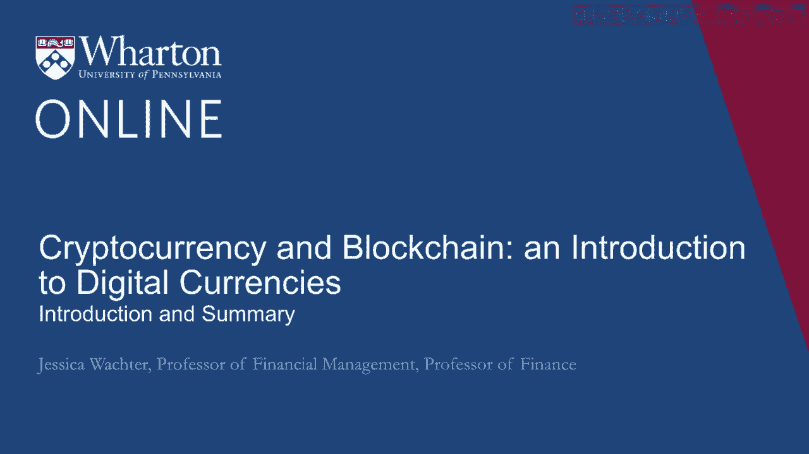
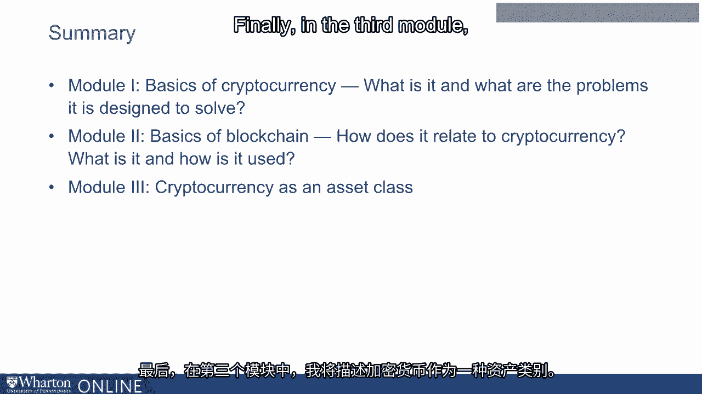
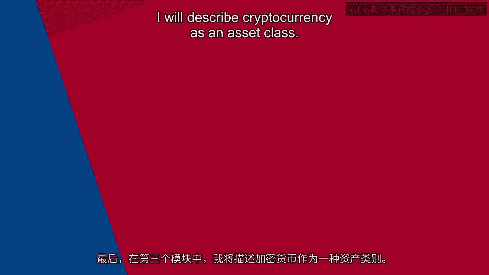

# 沃顿商学院《金融科技（加密货币／区块链／AI）｜wharton-fintech》（中英字幕） - P37：0_介绍和总结.zh_en - GPT中英字幕课程资源 - BV1yj411W7Dd

 Hello， I'm Professor Jessica Walker。

 First， I'm going to describe the goal of the next three modules。

 So the subject of cryptocurrency has attracted considerable attention。

 Now some of this attention has been positive， focusing on the potential for cryptocurrency。

 to disrupt existing monopolies and give power to consumers， but some has been highly negative。

 No currency has been referred to as a fraud or worse。

 So there have been wild and misleading claims both on the positive and on the negative side。

 Nonetheless， more than 11 years after the distribution of Satoshi Nakamoto's famous， white paper。

 some things are clear。 The first is that cryptocurrency and the associate technology of blockchain and distributed consensus。

 has staying power and cryptocurrency is inherently a hard subject as it combines knowledge from。

 computer science， cryptography， finance， economics， even probability， law and philosophy。

 So in other words， the barrier to entry to cryptocurrency is understanding。

 So this set of modules is intended to serve as an introduction。

 The references I will provide can serve as a guide if you decide further investment。

 in understanding cryptos for currency is right for you。

 Now these lectures are designed for a listener with a background in finance， which is where。

 I'm coming from。 No background in computer science is necessary。

 though some of the concepts in the second module， may be challenging。

 But the most important requirement is a strong interest in the subject。

 So here's a summary of the modules。 The first module is about the basics of cryptocurrency。

 What is it and what are the problems it is designed to solve？

 The second module covers blockchain and distributed consensus protocols。

 How do these relate to cryptocurrencies？ What are they and how are they used？ Finally。

 in the third module， I will describe cryptocurrency as an asset class。

 [BLANK_AUDIO]。

