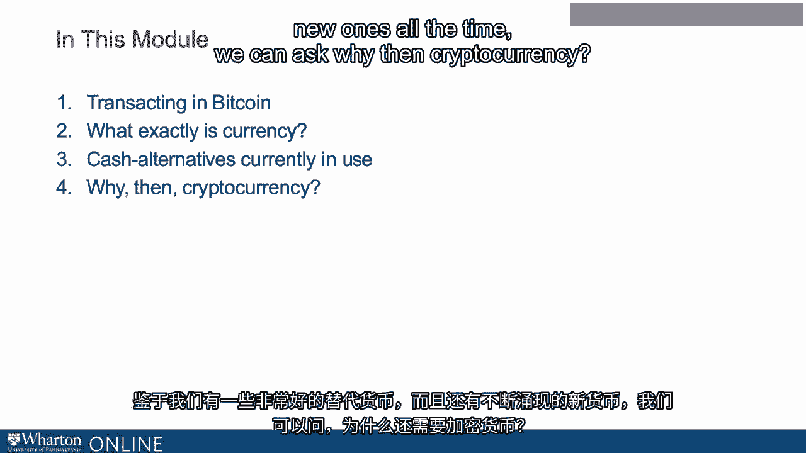

# 沃顿商学院《金融科技（加密货币／区块链／AI）｜wharton-fintech》（中英字幕） - P38：1_介绍加密货币.zh_en - GPT中英字幕课程资源 - BV1yj411W7Dd

 So what is cryptocurrency？ There are differing opinions。 So Jamie Dimon of JP Morgan says。

 cryptocurrency is a fraud worse than tulip bulbs。 Warren Buffett says cryptocurrency is。

 probably rat poison squared。 And he goes on to say if I could buy a five year put on。

 every one of the cryptocurrencies I'd be glad to do it but I would never short a dime's， worth。

 Interesting。 So what is cryptocurrency？ So the title of Nouriel Rubini's congressional。

 testimony answers the question as follows。 Crypto is the mother of all scams and now。

 busted bubbles while blockchain is the most over hype technology ever no better than a。

 spreadsheet slash database or is cryptocurrency the future of money as a FinTech crazed fellow。

 finance professor once said to me will our grandchildren or great grandchildren be asking。

 us what were you doing when money was being created。 So let's consider Bitcoin probably。

 the biggest myth about Bitcoin is that it's an actual coin well it's not it's not an。

 actual coin it's a unit of exchange at the moment bitcoins are trading at $3，772。38 per。

 one Bitcoin but fortunately it's not necessary to buy a whole Bitcoin the smallest unit to。

 trade bitcoins is one Satoshi or 100 millionth of a Bitcoin here's the outline of this lecture。

 first I will discuss transacting in Bitcoin so if we want to understand why Bitcoin might。

 be popular we need to ask what exactly is currency。 Bitcoin is a cash alternative to。

 currency so we're going to talk about cash alternatives currently in use given that。

 we have some pretty good cash alternatives and new ones all the time we can ask why then。

 cryptocurrency and then finally concluding thoughts。

 Thank you。 [BLANK_AUDIO]。

