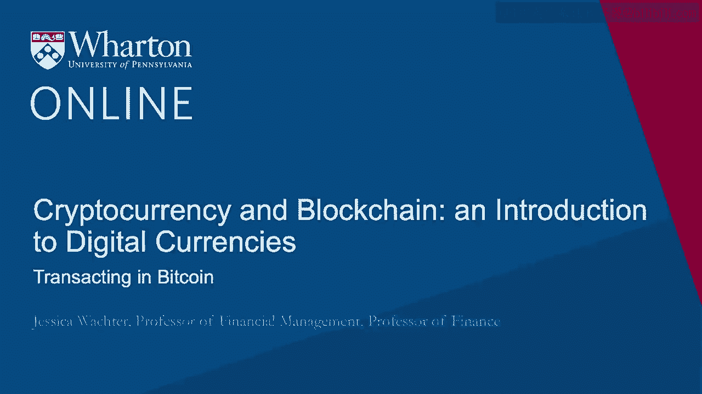
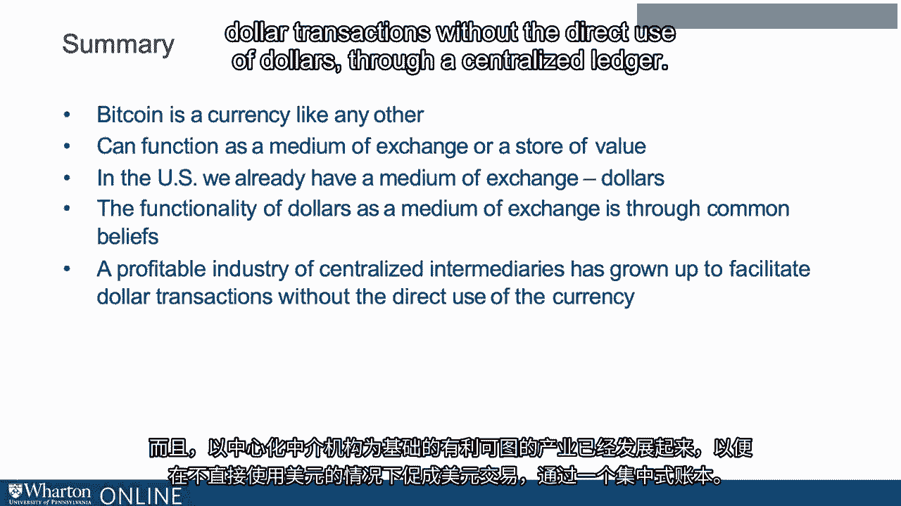

# 沃顿商学院《金融科技（加密货币／区块链／AI）｜wharton-fintech》（中英字幕） - P39：2_比特币交易.zh_en - GPT中英字幕课程资源 - BV1yj411W7Dd

 So first of all， transacting in Bitcoin。 At this present time， it's actually quite easy。

 So， ironically， even though Bitcoin is not an actual coin， what you need is a wallet。 And your。

 wallet can even be a physical wallet， though that's probably not ideal。 What your wallet is。

 it's a place to store your Bitcoin credentials， which means your private key。 Now， what exactly。

 is a private key？ It's a 256-bit number expressed as a hexadecimal。 So here on the slides is an。

 example。 Now， this key is generating using cryptography。 So if you lose your key， there's no way to。

 get it back。 So when people say they've lost their Bitcoin。

 it's their private key that they've lost。 So there's simply no way without the private key to access Bitcoin。

 On the other hand， if someone， somehow obtains your private key， then they have your Bitcoin。

 You have no recourse。 Using your private key， you can generate your unique address， which is public。

 And this allows， you to sign off on transactions。 So with all that as background。

 current third-party software， such as Coinbase， for example。

 which can be simply downloaded to your phone， does all of this for you and stores your private key within its created digital wallet。

 and then also accesses for you a Bitcoin exchange。 You can separately， however， choose a wallet and。

 an exchange。 And in the spirit of Bitcoin， the wallet doesn't need to be a third-party， it can be。

 peer-to-peer。 Interestingly， you can also buy Bitcoin with cash using an ATM。 And there are several。

 even on Lancaster Avenue here in Philadelphia。 What the Bitcoin ATM will then give you is a hard。

 copy of your private key， which you can then keep in an actual wallet。

 But you probably should transfer， to a digital wallet for security and ease of transactions。

 Once you own Bitcoin， you can purchase， goods or services from other users using Bitcoin or merchants。

 There's no distinction in Bitcoin， between users and merchants。

 You can trade Bitcoin back to dollars and again to Bitcoin。

 you can trade it for other cryptocurrencies。 In other words， Bitcoin is a currency like any other。

 However， while Bitcoin is a currency， it is nothing but a currency。 It is not like， say， a stock。

 which is a claim to ownership in a company or a treasury bill， which you can think of as a claim。

 to the income of US taxpayers， which is to say that as a currency。

 it has value as a medium of exchange。 Now， it doesn't need to have value as a medium of exchange at the moment。

 but unless people believe， that it can eventually function as a medium of exchange in some states of the world。

 Bitcoin has， no inherent value。 So as we think about those opening quotes。

 the idea that Bitcoin is a fraud or， a rat poison squared。

 there is some truth to that because one possible value to Bitcoin is always zero。 However。

 might Bitcoin function someday as a generalized medium of exchange？

 So some people clearly think this is impossible。 Thus， the fraud， that's the bubble。 But to really。

 answer this question， we need to consider what we actually mean by a currency。

 So here's the currency， that we normally think of， the US dollar。 So the US dollar is fiat money。

 It's not linked to say， anything like gold。 Now in the US， the US dollar is legal tender。 Now。

 what exactly does that mean？ Many people think that merchants are required to take US dollars。

 but that's not true。 What it， actually means is that the treasury is required to take dollars as payment for taxes。

 And if someone， owes you money， you are required to take dollars as payment。

 So legal tender is short for legal tender， for all debts， public and private。

 So the requirement to accept dollars for private debt is by fiat。

 It is backed by the power of the sovereign， in this case， the US government。 Now， ultimately。

 the authority of the sovereign rests with the ability to enforce the law and all the enforcement。

 mechanisms。 We are familiar with the courts， the police， possibly even the army。 So that's what's。

 lying behind this fiat money。 The fact that it's payment for debts， public and private。

 and that we can enforce the fact that it's payment for debts， public and private。 But of course。

 that's not the only use for dollars。 So the fiat of the US government does not extend to。

 private businesses accepting dollars for payment。 And of course it does not extend to all of the。

 transactions all over the world， both legal and illegal that take place using dollars。

 But these transactions do occur， and apparently more frequently than ever， in that the demand for。

 dollars is the paper currency is actually growing。

 So these transactions occur because we are in what。

 economists call a self-fulfilling equilibrium when it comes to US currency。 Everyone agrees to take。

 US dollars because they believe that everyone will take US dollars。 Now， what is this rest on？ Well。

 ultimately it rests on the fact that dollars can pay taxes and discharge debt， and to the rule of。

 law there's really nothing else other than the beliefs of all individuals that everyone will。

 take dollars。 So this is what we mean by self-fulfilling equilibrium。

 So the bottom line is what makes a， currency a currency， namely a medium of exchange。

 are the common beliefs of the individual users。 Now， that's dollars。

 but apparently using physical dollars is efficiently cumbersome that a profitable。

 industry has arisen to allow us to avoid it。 For example。

 nearly all merchants accept Visa and Mastercard。 Most merchants accept four major credit cards。

 Visa and Mastercard plus Discover and American Express。

 But these cards are very costly for merchants。 They need to pay a fee that can be over 2% of the。

 transactions。 Interestingly enough， by law， merchants are not allowed to offer a discount for cash。

 which means these cards are very profitable for the credit card companies。 And they are nice for。

 consumers because consumers receive tax-free benefits。 Because customers demand the use of。

 these cards， merchants have to use them despite the fees， otherwise they risk losing business。

 And they're not， the fact that they're not allowed to price discriminate means that these card。

 companies form an oligopoly that may be under threat in various ways by FinTech。

 That's discussed in， other modules。 But at the moment。

 the oligopoly still seems to be pretty strong， seeing as the fees， have recently been raised。 Now。

 technically using these cards implies that one is taking on debt。

 which is an alternative form of payment other than currency。 But in practice。

 the distinction between， debt and say a bank account is perhaps not very important。

 Both credit card companies and your bank， which you may access with a debit card or potentially with PayPal。

 are what's known as centralized， intermediaries。 All the transactions are still done in terms of dollars。

 but the credit card， company or the bank keeps track of the accounts and verifies the legitimacy of the transaction。

 The intermediary， in other words， maintains a centralized ledger。 This is why stores take。

 credit cards and debit cards instead of money。 They do not have to worry that they will not。

 receive their funds because the intermediary ensures that the centralized ledger is accurate。

 So the credit cards are costly， yes， but it does avoid what used to happen a long time ago in which。

 merchants had to keep their own ledgers and had to keep track of which customers' checks were not。

 balanced。 And of course， a big application is that it allows anonymous transactions。

 internet transactions， when you have no idea who you're transacting with。 So to briefly recap。

 Bitcoin is a currency， like any other。 As a currency， it can function as a medium of exchange。

 or a store of value。 Now， in the yet US， we have a great medium of exchange dollars。 The。

 functionality of dollars is a medium of exchange is through common beliefs and a profitable industry。

 of centralized intermediaries has grown up to facilitate dollar transactions without the direct。

 use of dollars through a centralized ledger。 So given this landscape。

 where does cryptocurrency come in？

 [BLANK_AUDIO]。

