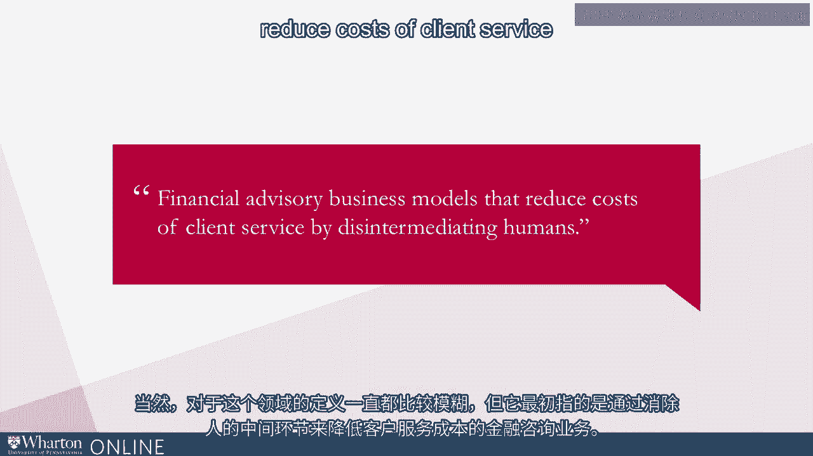
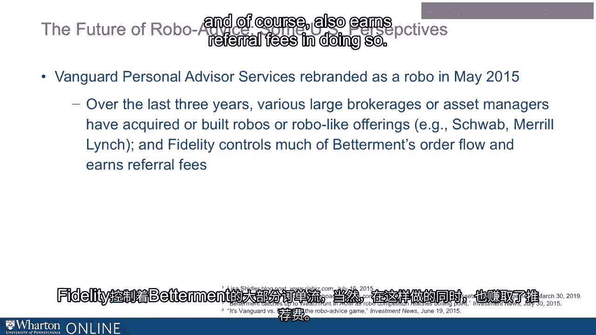

# 沃顿商学院《金融科技（加密货币／区块链／AI）｜wharton-fintech》（中英字幕） - P3：2_机器人投资建议.zh_en - GPT中英字幕课程资源 - BV1yj411W7Dd

 One of the more popular areas， although perhaps not the largest by way of aggregate gross。

 valuation， is the area of robo-advisory。 Many will ultimately come to know FinTech through that channel。

 The definition， of course， once again is fuzzy， but it originally meant financially。

 advisory businesses that reduce costs of client service by disintermediating humans。

 Now， multiple models have evolved over time， including what we call a bionic model that。

 incorporates both technology and websites and enablement from the tech part of FinTech。

 with or coupled with or grouped with human interactions。

 But we do see a very broad spectrum ranging from pure machine to just slightly enabled。

 bionic approaches。 Today， a loose definition is a financial advisory firm。

 a practice that uses some kind of algorithm， in some way to build an allocation for customers。

 to build an investment strategy approach。 These approaches usually provide automated capture of client information that would include。

 potentially know your client elements that are so important in a regulated space like。

 financial advisory arenas。 Financial goals， illiquidity preferences。

 risk capacity to risk tolerance， or risk aversion， it's inverse。

 Recommended allocations of individual investments， asset classes and so on， automated rebalancing。

 tax loss harvesting and progress reporting on the way to financial plans， ultimately。

 resulting in some kind of output to investors or clients automated or otherwise。

 This polemic notion of a pure technologically enabled non-interactive robo-advisor really。

 does not exist in practice to my knowledge。 I don't think there at this point is anything that is purely a robo。

 Two of the largest independent robo's well-fronted betterment both do have the ability for clients。

 to get in touch with them。 They have client service representatives and expanding business models that you might。

 ultimately call bionic， although they may wait them significantly different from， say， a broker。

 dealer or a financial advisory firm that specifically blends the human and non-human。

 Sometimes we call it the clinical and actuarial approaches to advisory。

 The pure vision of robo-advisory has not yet purely been achieved in part because it is。

 so important for humans to touch humans and we'll have more to say on that in just a moment。

 From the perspective broadly from industry， the robo model is also very important because。

 it makes clients with potentially low levels of investable assets economically viable to， service。

 This is a very interesting and important theme throughout much of financial technologically。

 enabled advisory in part because of recent pushes toward a fiduciary standard in the investment。

 advisory space that would apply to brokers as well as investment advisors alike。

 Inducing a kind of pressure or impetus or motivation for certain players to segment their books。

 as the cost of advice is expected to arise。 This notion of cost increasing may。

 although it's yet to be entirely settled， push higher。

 cost per dollar clients more toward technologically enabled platforms where scale as possible as。

 opposed to taking them on in person。 One example， which has grown dramatically recently。

 is the Vanguard Personal Advisor Services， which was rebranded after being around for a long time a couple years ago。

 As a robo。 By June of 2015， it had $21 billion of assets。 As of the first quarter of 2019。

 it had almost $116 billion and by all accounts is the largest， financial robo。 Wealthfront。

 which is another top 10 firm， has about $11 billion of assets as of the first， quarter of 2019。

 Betterment overtook Wealthfront's AUM back in 2015 and we'll discuss that in a second。

 having about $16 billion as of the same market。 90% of Wealthfront's assets have been placed in Vanguard funds as part of the underlying。

 strategy across asset allocation categories。 Betterment in some sense is viewed to have caught up with Wealthfront by pivoting its。

 business model to emphasize defined contribution plan sales in smaller companies。

 which historically， has not been the bailiwick of Wealthfront。 Over the last several years。

 certain large brokerages and asset managers have acquired， built or developed robolike offerings。

 firms like BlackRock， Schwab， Merrill。 Infidelity controls much of Betterment's order flow and of course also earns referral。

 fees in doing so。 [BLANK_AUDIO]。

