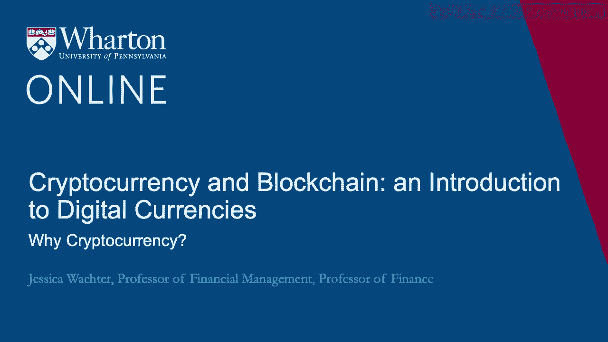
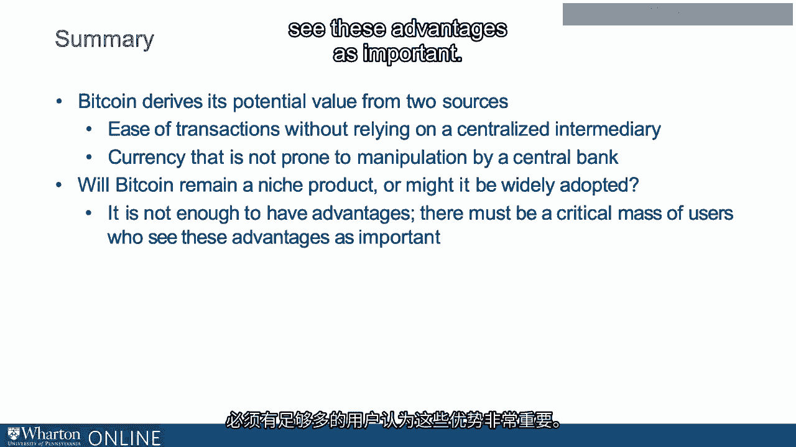

# 沃顿商学院《金融科技（加密货币／区块链／AI）｜wharton-fintech》（中英字幕） - P40：3_为什么是加密货币.zh_en - GPT中英字幕课程资源 - BV1yj411W7Dd

 Why then cryptocurrency？

 So perhaps we can start to see the appeal of Bitcoin and other cryptocurrency。

 So what Bitcoin allows one to do is to perform online transactions and， for that matter。

 offline transactions that do not require physical cash because that's very difficult to deal with online。

 So potentially any transaction for which a credit card is used or a debit card or PayPal could be a Bitcoin transaction。

 But it accomplishes this while being decentralized。 So there is no centralized intermediary。

 There is no centralized ledger。 But why would we want an alternative to credit cards or other intermediaries？

 So let's go through some possible reasons。 So reason one。

 a centralized intermediary has a lot of power。 For instance， it can charge fees。

 Should we worry about the potential for abuse given the near monopoly power of intermediaries？

 For example， perhaps the credit card company might be tempted to tamper with its centralized ledger。

 Might it say， you know， remove some funds for enemies or reward friends？

 So that's certainly a possibility， but probably this would not happen。

 Any credit card company or bank that was caught doing something like this would not last very long。

 And it is very profitable to be a centralized intermediary。

 Centralized intermediaries have what is known as franchise value。

 It's because of these fees that they can charge。 So part of what we don't like about centralized intermediaries。

 namely their high fees， which for credit card companies。

 take the form of the fees charged to the merchants。 And for banks， take the form of those annoying。

 low deposit rates that get paid to customers。 Well， we might not like those。

 They make it very profitable to be a centralized intermediary and they create franchise value。

 And once a company has franchise value， it has a built-in incentive to behave in a trustworthy fashion。

 because it would be very， very stupid to lose this high， amazing franchise value。

 So the current system is in a sense ensures its own safety by allowing intermediaries to have this high franchise value。

 So I don't think reason one is really a good reason for cryptocurrency。

 So let's explore some other reasons。 Reason two is you do not like centralized intermediaries for philosophical reasons。

 Perhaps you are an extreme libertarian or an anarchist。 So this describes some people。

 but it's probably not universal。 So if we're looking for why Bitcoin might have， say。

 widespread adoption， reason two is not very good either。 Reason three。

 So reason three is you don't want to use the centralized intermediary。

 because you don't want anybody to know what you're up to。

 The centralized intermediary keeps records。 Those records could be accessed by the government under certain conditions。

 Perhaps you do not trust the government for some reason。

 Maybe you are doing something specifically against the law。

 perhaps trading with someone you're not supposed to be trading with according to the law。

 perhaps trading in substances that shouldn't be traded in according to the law。

 So whatever one thinks about this from a moral standpoint。

 it actually is a pretty good reason to use Bitcoin。 To summarize。

 where does this leave us in terms of Bitcoin？ So for Bitcoin。

 there are what we could call multiple equilibria in terms of its value。

 So one equilibrium for Bitcoin and the one that our commentators at the beginning seem to think is going to persist。

 is that no one uses it。 If this is the case， then actually it's true worth really is zero。

 This is possible for a currency， but not safe for stocks。

 A currency that nobody uses has no intrinsic worth。

 Now a potential other equilibrium is that it is used by a narrow group of people。

 And this is what seems to prevail more or less at the moment。

 Now the future of money argument suggests that perhaps it is a dominant。

 it will become a dominant medium of exchange。 Now what's interesting is that there's really little middle ground between two and three。

 No matter how much we may think Bitcoin is cool and exciting。

 we really won't want to bother with a currency that so few people use。

 So whereas some people might have specific reasons to use Bitcoin。

 it won't be dominantly used unless a critical mass of people have a reason to use Bitcoin。

 Now we went through some reasons just now about why Bitcoin could replace the current centralized intermediaries。

 that allow us to transact without actually using dollars。

 But none of those reasons were really that convincing。

 Does this mean we should conclude that Bitcoin will forever be a niche product？

 Well some people clearly think so， but it's not really so clear。

 Because there's another reason that people might want to use cryptocurrency。

 And that is cryptocurrency really is a currency alternative to dollars。

 Now at the moment that's somewhat of a disadvantage because the value of Bitcoin is very volatile。

 But that's at the moment。 So what if dollars themselves were to somehow become untrustworthy？

 Well we're far away from that at the moment， but the value of the dollar does rest in the hands of the Federal Reserve。

 The Federal Reserve is in principle independent。 It should be but the President of the United States is also the Commander in Chief。

 who for that matter controls the Army。 And even if everything is working well。

 the value of the dollar depends on everyone's expectations。

 It is not entirely in the hands of the Federal Reserve。

 So what could go wrong that would make cryptocurrency an appealing alternative？ Well two things。

 Currently we are in a very low inflation regime。 But that might change。

 What if we had some level say let's say 5% inflation？ So 5% inflation doesn't sound so bad。

 but it is in effect attacks on everybody who has to use the currency。 So because of the fiat。

 namely because investors have to hold dollars to pay off debts and to pay off taxes。

 you have to hold some dollars。 But if the sovereign。

 the US government in this case freely elected decides to allow for inflation。

 those dollars that you hold will erode in value。 So in effect it's like a tax because the government gets to spend the new dollars that it's printing。

 but your dollars that you hold are worth less。 And because of the fiat you really do have to hold the dollars。

 So in that sense having a competitor to dollars means that perhaps for the first time in history。

 residents of a country are not trapped by the senior ash is what this is called。

 Now of course there's a scarier alternative which is the currency truly becoming unstable。

 And there are of course famous examples of this like the Weimar Republic from 1921 to 1923。

 and Venezuela starting in 2016。 So Bitcoin is specifically designed with protection against these。

 So these events， especially the second are remote。

 but it's their possibility that fuels interest in Bitcoin， at least in part。 So to summarize。

 from the point of view of the end-user， Bitcoin is a currency like any other。

 Because Bitcoin is not recognized as legal tender by any sovereign at the moment。

 zero is always a possible answer to the question， what is its value？

 So ultimately its value will depend on whether it can be used as a medium of exchange。

 or in fact whether people believe it can be used as a medium of exchange。

 or actually whether people believe that people believe it can be used as a medium of exchange and so on。

 So you can see that actually beliefs play a role here and so even if Bitcoin does not have a major role as a medium of exchange。

 if some people think that some people think it could be used in the future as a medium of exchange。

 that is a reason for it to have a value。 Now why would it be appealing as a medium of exchange？

 Well， the ease of transactions without relying on a centralized intermediary。

 and it's a currency that's not prone to manipulation or instability due to a central bank。

 So the key question is will Bitcoin remain a niche product or might it be widely adopted？

 It is not enough for Bitcoin to have some advantages。

 there must be a critical mass of users who see these advantages as important。

 [BLANK_AUDIO]。

