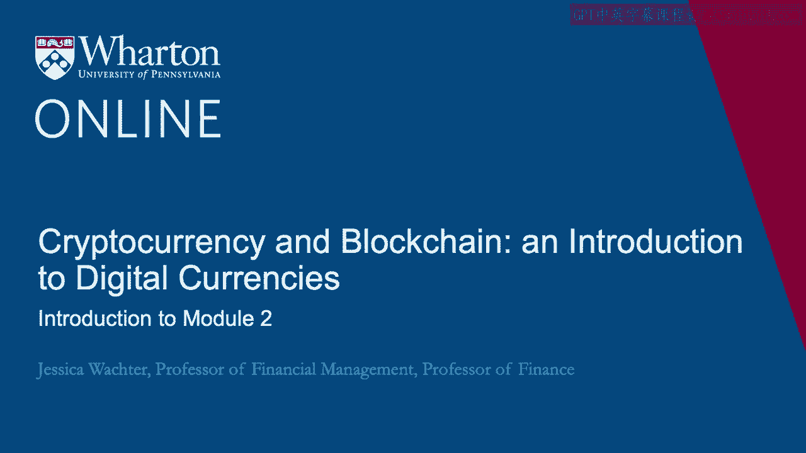
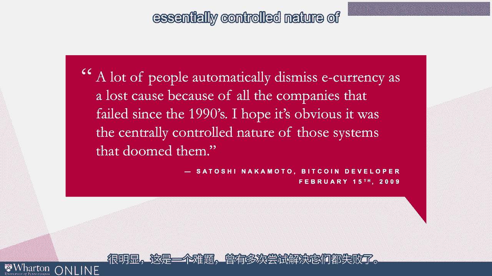
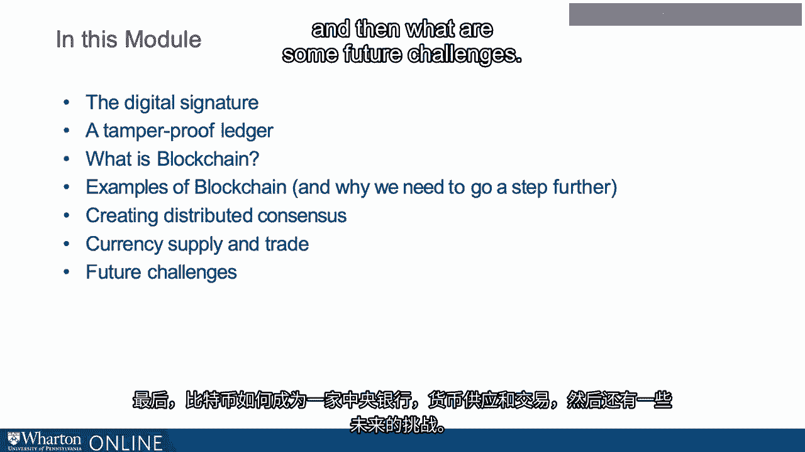

# 沃顿商学院《金融科技（加密货币／区块链／AI）｜wharton-fintech》（中英字幕） - P41：4_模块2介绍.zh_en - GPT中英字幕课程资源 - BV1yj411W7Dd

 In the last module， we explored why cryptocurrency might be useful。

 Here we delve more deeply into the rules and structures that enable Bitcoin to operate。

 Note that blockchain was the technological innovation that allowed digital currencies。

 to take off when previously so many had failed。 So let's first take a little bit of a trip through the graveyard of failed online currencies。

 Does anyone remember Cyber Cash？ So Cyber Cash was a company in the 1990s that pioneered an online currency called Cybercoin。

 Now one of the features of Cybercoin is that every user needed to obtain a certificate。

 to verify their identity and apparently nobody really wanted to do this。

 So Cyber Cash eventually filed for bankruptcy in 2001。

 The technology that was part of Cyber Cash was eventually acquired through several steps。

 by what is now known as PayPal。 Does anyone remember Digi Cash？

 So Digi Cash also had an online currency called Cyberbox。

 Here clients were anonymous so there was no cumbersome verification system。

 So Digi Cash patented a blind signature scheme that has some similarity to Bitcoin's protocol。

 Now there was a divide between merchants and clients which is very unlike Bitcoin。

 Merchants were not anonymous。 They needed to register with a bank so it was not cumbersome for customers but it was cumbersome。

 for merchants and there was no user-to-user transactions。

 So Cyberbox failed when merchants did not want to register and then there were no clients。

 that could trade among themselves。 Digi Cash filed for bankruptcy in 1998。

 The technology again through several steps was acquired by Infospace。

 Now the creators of Digi Cash caused some consternation when they patented the technology。

 So the mailing list CypherPunks which was a predecessor of the mailing list from which。

 Satoshi Nakamoto wrote some of his earliest comments on what became Bitcoin。

 The participants in CypherPunks decided that they wanted to create an online currency。

 They weren't so worried about the patent。 They created something called Magic Money。

 Another currency around this time was something called Lucra。

 Lucra was Digi Cash but with the attempt to get around the patent。

 So neither of these were associated with for-profit companies but we don't really think about them。

 anymore。 It's safe to say that these currencies did not take off。

 So these are only four of many attempts to create a digital currency。 So enter Satoshi Nakamoto。

 In a Bitcoin forum he writes， "A lot of people automatically dismiss e-currency as a lost。

 cost because of all the companies that failed since the 1990s。

 I hope it's obvious it was the centrally controlled nature of those systems that doomed them。"。

 So what's interesting here is we had a problem for which there had been multiple attempts。

 to solve it and they had all failed。 And that was probably pretty discouraging for the participants involved。

 And of course one could draw the lesson of， "Well， if it's a hard problem keep working， on it。"。

 But what's also interesting is that sometimes there's insight from all of these failed attempts。

 into what specifically went wrong and that seems to be the case here。

 But actually let's discuss why this is such a hard problem。

 So if you have a truly decentralized currency， what that decentralized currency must achieve。

 is a system of ownership rights。 And that system has to be self enforcing because it can't rely on a state。

 We discussed this in the previous lecture。 There's no sovereign， there's no police department。

 So this decentralized currency must also maintain a ledger of transactions that is secure and。

 accurate。 And this maintenance must also be self enforcing because there's no profit making intermediary。

 behind the scenes。 In the last module we also discussed the role of the centralized intermediary。

 So we need to somehow have a currency that avoids the sovereign and the centralized intermediary。

 Now if that were not enough， it also must maintain trading in the currency because currencies。

 do trade and it has to have rules governing the supply of the currency。 So we need a sovereign。

 we need a centralized intermediary and we need a central bank。

 And all of this has to be decentralized。 So it is a pretty difficult problem。

 So I'm going to discuss in this module how Bitcoin meets these challenges using cryptography。

 and using blockchain。 So here are the topics that we will be covering。

 First I will discuss the digital signature and then how Bitcoin creates a tamper proof， ledger。

 So these two points are important for the definition of property rights within the system。

 They are not sufficient however， that ledger needs to be maintained and updated。

 That's where blockchain comes in。 But even blockchain is really by itself not quite enough because of this notion of how。

 do you decide what is the correct set of transactions。

 That's where we need to talk about distributed consensus。

 Finally how does Bitcoin become a central bank？ Currency。

 supply and trade and then what are some future challenges？ [BLANK_AUDIO]。

