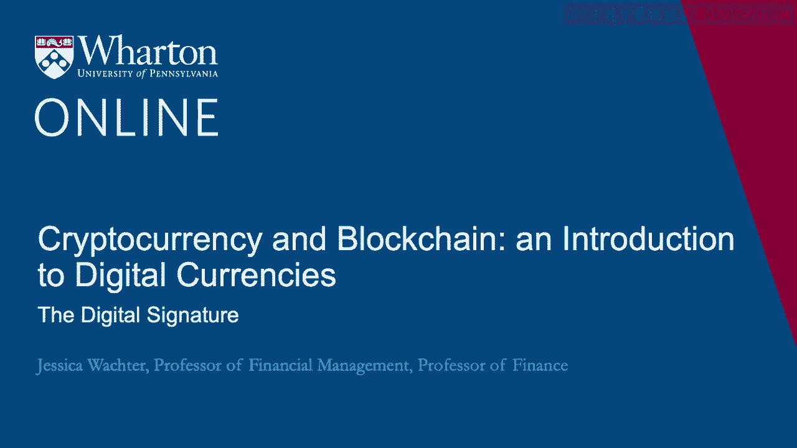
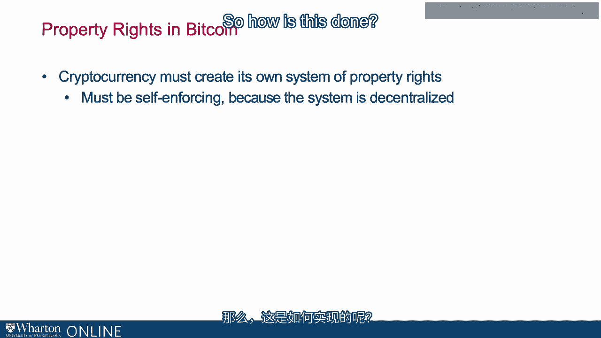

# 沃顿商学院《金融科技（加密货币／区块链／AI）｜wharton-fintech》（中英字幕） - P42：5_数字签名.zh_en - GPT中英字幕课程资源 - BV1yj411W7Dd

 So， as I discussed in the introduction to this module， the first problem a cryptocurrency。

 must solve is it must develop a system of property rights。 So。

 previous digital currencies establish property rights in a somewhat cumbersome way。

 and this is perhaps why they failed。 Now， governments establish a system of property rights for their citizens。

 and for this reason， transferring assets between jurisdictions is difficult。 So let's。

 as an experiment， let's say I want to send $3，000 to a friend in Turkey。

 So I can do this very easily using Western Union， so I can type in the amount I want。

 to send and where I want to send it to， but whoa， what kind of fees do I have to pay？

 Either I can do it practically for free， maybe for $6， but I have to wait for four days。

 or if I want to do it quickly， I have to spend nearly $50。

 So it's actually quite expensive to send some money to Turkey。 Now why is it so expensive？ Well。

 it comes down to the institutions clearly， but ultimately， because institutions arise for。

 specific reasons， it is because we're dealing with two different sovereigns here， and thus。

 two different definitions of property rights。 Something between two systems of property rights is inherently difficult。

 It's like you have to go through a no-man's land， and that's why it's expensive。

 So in Bitcoin and other cryptocurrencies， the system of property rights must somehow。

 arise on its own， and they must be self-enforcing。 So how is this done？

 So the first question is， who is it that possesses the property rights anyway？

 So when it comes to us as citizens of a country， we know who we are， but it's different when。

 we think about our participation in an online network。 And in particular， if we want to say。

 link our participation in an online network to ourselves， as human beings。

 this might be pretty cumbersome。 Recall what happened to， say， DigiCache。

 So Bitcoin has quite an elegant answer。 It just dispenses with the notion of the human being in the background entirely。

 As far as Bitcoin is concerned， you are your signature。 And by a signature。

 I mean something quite precise that I'm going to explain shortly。

 And you can have as many signatures， and hence as many identities as you want， there's nothing。

 wrong with that。 The signature has a private component。

 sometimes called the private key and a public component。 And this public component。

 the public signature， is synonymous with another term that's often， used in Bitcoin。

 which is the address。 So one key ingredient is one's ability to authenticate transactions。

 And this is why linking identity with a signature is so powerful。

 Now this authentication is especially important when there's no physical cache or a checkbook。

 as in an online currency。 So our first question， thus。

 is how is authentication enforced in a decentralized system？ In other words。

 what is the digital signature？ Well， what is a signature？ Of course。

 we all have an intuition for what a signature is。 But what is a signature when you boil it down to its essentials？

 Well， a signature is an object with the following properties。 First， only you can make it。

 It's not forgeable。 Second， anyone can verify it。 And third， it's permanent。 That's a signature。

 So what's a digital signature？ It takes these properties and makes them digital。

 So the first aspect of the digital signature is something called a private key。

 What this literally is is a 256-bit number that's often expressed as a hexadecimal。

 We'll see some examples of this。 This private key is generated at random。

 That's just assumed for a moment that we can generate a private key at random。

 You can think about this as some abstract notion of your signature。

 So you have a sense of what your signature is even before it's not， it's written down。

 on a particular piece of paper。 So that's part one of a digital signature。

 Part two is a protocol for affixing this private key to an electronic message。

 Think about this as the actual written signature。 And finally。

 there needs to be a protocol for verifying that the signature is valid。 In this protocol。

 you have to be pretty careful with it because it can't reveal the private， key underneath。

 You can think about this as people looking at your signature。

 And all of this has to happen automatically。 So we talked about the Bitcoin wallet， say Coinbase。

 in the previous lecture。 So when you transact with Bitcoin。

 your wallet automatically fixes the signature。 And then the Bitcoin exchange automatically verifies the signature。

 So as I said， it's very important that no one can forge your signature。

 And this really needs to be impossible here because there's no police department or courts。

 that can come in and say， "Well， this was a forged signature。 It really needs to be impossible。"。

 And it was also very important that no one can replicate your signature after reading， a message。

 Thus， the creation of the signature must truly be random or as close to random as possible。

 Otherwise， somebody could reverse engineer the signature creation algorithm， say from， your wallet。

 and then obtain your signature。 And fixing the signature to the message must also be a process involving encryption because。

 it must be impossible to back out your signature from looking at the signed message。

 And that also involves randomness。 And this is actually a challenge。

 So think about for a moment what makes physical signatures so difficult to forge。

 A physical signature is created by a human being。 And as we all know。

 there's a lot of built-in randomness to being a human being。

 No two humans are alike and thus no two signatures are alike。 And moreover。

 no person is the same on every day。 So your signature is not the same on every day。

 So there's randomness at both steps of signature creation。

 Notice this abstract signature that you've created that you attempt to replicate every。

 time you sign something。 And second， the actual signing， both of those involve true randomness。

 Now one might think that producing randomness is easy， but actually it's not。

 So this randomness that we as humans possess must be produced by the Bitcoin protocols。

 Now those familiar with coding will have heard of a concept known as a random number generators。

 This is very， very useful as a coding concept。 And many programs have in them random number generators。

 This is software that produces a string of random numbers。 Hmm。

 It's software that produces a string of random numbers really？ No， of course not， right？

 How could anything， how could it actually be random？ It's not random， right？

 It is an algorithm for producing a series of numbers that look random but really are not。

 random at all， right？ How could a deterministic process， which is what software is。

 produce randomness？ Answer， it can't。 So in fact， there is no such thing as a random number generator when applied to coding。

 So the more correct name for a random number generator is a pseudo random number generator。

 There is a computer algorithm created by a human could potentially be discovered。

 So Bitcoin uses a very good source of randomness for generating signatures but no computer generated。

 randomness is perfect。 Now， this is not proven to be a problem so far。 So just to summarize。

 Bitcoin is a decentralized system of property rights and key to this。

 notion of property rights is a notion of identity。

 Now the way we verify our identities is through the use of a signature。

 That's in the real non-digital world and what Bitcoin does is it makes a signature and the。

 identity one and the same。 So a digital signature defines each Bitcoin transactions。

 These signatures at the core of Bitcoin require randomness and the randomness is imperfect。

 But so far， this imperfection has not proved to be problematic。 [BLANK_AUDIO]。

