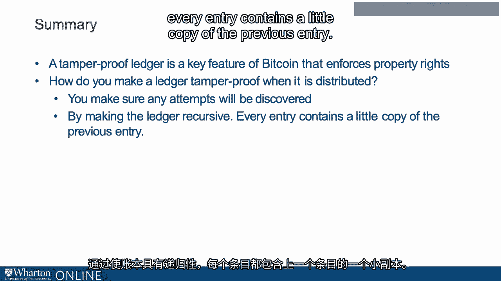

# 沃顿商学院《金融科技（加密货币／区块链／AI）｜wharton-fintech》（中英字幕） - P43：6_防篡改账本.zh_en - GPT中英字幕课程资源 - BV1yj411W7Dd

 So， the ledger contains a record of all Bitcoin transactions。

 So it's a memory system。 And in fact， this equivalence between money and memory was proposed by the macroeconomist。

 Narayana Kacharla Koda back in 1998。 And his point is that money and memory are the same。

 If you had perfect memory， you could implement any system that you could implement with money。

 So along with the digital signature， the accurate ledger is required for the existence of property。

 rights in Bitcoin。 Now credit card companies， banks and other intermediaries essentially are ledgers and。

 they enforce the accuracy of the ledger and hence enable property rights。

 And it's in their interest to enforce the accuracy of the ledger。 But Bitcoin is decentralized。

 So who is the keeper of this collective memory and who ensures that it is accurate？

 So in his Bitcoin white paper Satoshi Nakamoto realizes the problem with previous decentralized。

 ledgers and proposes a solution。 In previous attempts to decentralize。

 creators focused on making it impossible to tamper， with a ledger。

 Now this is really hard because the ledger is decentralized。 It's on everybody's computer。

 So how are you going to make it tamper proof？ What Satoshi realized is that it was sufficient to have incentives not to tamper with a ledger。

 And it was potentially much easier to create incentives not to tamper than to forbid tampering。

 per se。 And I think this is a nice example of how from the very beginning Bitcoin combined computer。

 science with economic reasoning。 So how to disincentivize participants from tampering with the ledger？

 Well， the answer is we make it easy to detect that the ledger had been tampered with。

 And thus any dishonest participant would be dissuaded from even trying。

 So not only would any attempt be detected， there would actually be no attempts。

 Now of course we wouldn't want to get complacent。 The absence of attempts would not mean that the detection system was unnecessary。

 So tampering with the ledger in Bitcoin is what in economics we call a quote "off。

 the equilibrium path。"， Nobody's going to do it but we still need to design incentives so that it remains off。

 the equilibrium as a not equilibrium behavior。 So let's consider an example of how we make it observable that the ledger has been tampered。

 with。 So I'm going to write down a very simple ledger。 So let's say Maria creates a simple coin。

 We'll call it Maria coin。 And Maria is just going to have this one coin and she's going to use it for her friends。

 We're going to not discuss why this would be useful at the moment。 Let's just assume it exists。

 So Maria creates Maria coin。 Then Maria sells Maria coin to Sophie。

 Presumably Sophie gives Maria some money dollars perhaps in exchange。

 Then Sophie turns around and sells the Maria coin to Jeff。

 So from this description it is clear that at the end Jeff is the rightful owner of the， Maria coin。

 But here's a problem。 What if Bob say were to come in and attempt to change the second stage？

 What if that second item were erased and rewritten to read that Maria sells Maria coin to Bob。

 not Sophie？ So that would invalidate Sophie's ownership and Jeff's ownership because Sophie had no。

 right to sell it to Jeff。 So we do not want this to happen。

 So not only do we need to detect tampering at the last stage but at the intermediate stages。

 as well。 So here's the solution。 We make the ledger recursive。 So Maria creates a single Maria coin。

 The second stage， Maria sells the Maria coin to Sophie。

 Now what I've done here is I've appended the initials of the previous transactions。 Transaction， M。

 C， S， M。 So think of that as kind of a digest of the previous transaction。

 Now the third stage is Sophie sells the Maria coin to Jeff。

 So what I do now is I not only have the digest from the previous stage but the first digest。

 as well。 So M， S， M， S is Maria sells the Maria coin to Sophie and then you also have within that。

 digest M， C， S， M creates a single Maria coin。 And then finally we digest the whole thing。

 We have SSMG， Sophie sells the Maria coin to Jeff and then the other previous two entries。

 are also embedded in that last digest。 So to summarize， alongside each entry I've put a digest。

 a kind of shorthand to the previous， entry。 In creating this shorthand I followed a simple algorithm。

 I used the first letter of each of the words。 Now in principle we could use this to detect tampering。

 right？ Because what we could do is we could check if the initials matched the words in the previous。

 step。 So let's just see an example of how this would work。

 Let's say Bob were to tamper with the second item on the ledger。

 Instead of reading Maria sells the Maria coin to Sophie， he tambors with it to read Maria。

 sells the Maria coin to Bob。 Well at that point the digest would not match。 M， S， M。

 S at the next stage would not be the right initials。

 So you could detect the tampering by comparing the second stage with the digest that appears。

 of the second stage and the third stage。 Now of course if Bob were really determined he could tamper with the digest that appears。

 in the third stage。 He could tamper both with item two。

 having it read Maria sells the Maria coin to Bob and， he could then take M， S， M。

 S and change it to the appropriate initials。 However。

 then the overall digest would not match the stage three message。

 So in order to truly tamper with a ledger in a way that could not be detected， Bob would。

 have to first tamper with the entry at stage two， then the digest at stage three， then the。

 digest of the digest at stage four。 Now in this example this digest technique is pretty easy to work around。

 All Bob would have to do would be to find a friend whose name begins with an S and he。

 could then tamper with it and give the money to his friend。

 But this really is the idea that Bitcoin uses but there's a crucial difference。

 The digest that I've created here is created using cryptography， not say just the first。

 initial of the names。 And what that means is it's virtually impossible to change the transaction in such a way that。

 it still matches the digest。 So to summarize， along with the digital signature a tamper proof ledger is a key feature of Bitcoin。

 that enforces property rights。 Now how do you make a ledger tamper proof when it is distributed？

 Answer， you make sure any attempts will be discovered。

 So how do you do that by making the ledger recursive？

 Every entry contains a little copy of the previous entry。

 Thank you。 [BLANK_AUDIO]。

