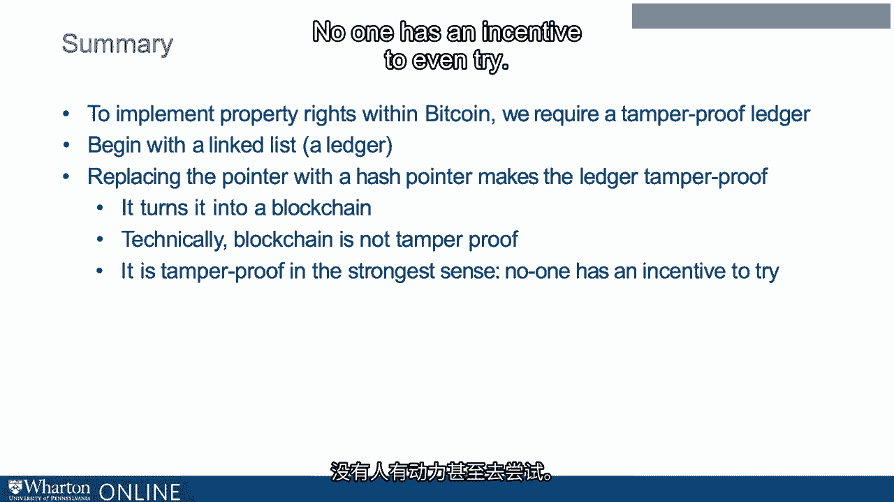

# 沃顿商学院《金融科技（加密货币／区块链／AI）｜wharton-fintech》（中英字幕） - P44：7_什么是区块链.zh_en - GPT中英字幕课程资源 - BV1yj411W7Dd

 So a tamper proof ledger is crucial for creating a system of property rights。

 So in my example in the previous lecture， I created such a ledger recursively。

 And the key trick is that every entry contains a little copy of the previous entry in the form of a digest。

 But my simple method is pretty easy to work around。 Now here's the thing。

 blockchain is the same idea， but with cryptography so that it is hard to work around。 Also。

 another key difference， instead of transactions appearing one at a time。

 blockchain stores transactions into blocks。 That's important for efficiency。

 Now to understand how blockchain works， we do need some concepts from cryptography and from computer science。

 So here is an outline of this lecture。 First I'm going to discuss something called the linked list。

 Then the hash function， the hash pointer， putting it together， which is blockchain。

 And then back to my example， how blockchain creates a truly tamper proof ledger。 Well。

 so first we're going to talk about a linked list。 And important to this idea of a linked list is something called a pointer。

 So a pointer in computer science is a language object that stores the memory address of another value located in the computer memory。

 So the idea is not the object itself， but it tells you where to find the object。

 It's like an index entry。 So then if that's a pointer， what's a linked list？

 A linked list is a linear collection of data elements such that each element contains a pointer that points to the next。

 So the elements might be in entirely different places， but they are connected by pointers。

 So what these pointers do is they turn what is sort of a random collection of objects into an ordered list。

 Now the list could be anything。 For example， it could be a list of financial transactions。

 in which case， a list of financial transactions with a system of pointers is a ledger。

 So let's go back to my example from the previous lecture。 Maria creates a single Maria coin。

 Maria sells the Maria coin to Sophie， Sophie sells the Maria coin to Jeff。

 We could digitally implement this list by turning each description into an object and then creating a link through a pointer to the previous object。

 So just to summarize， a pointer indexes an object in computer memory。

 Using a system of objects connected by pointers， one can represent a ledger。

 Now how can we make that ledger tamper proof？ Well。

 we replaced the pointer with something called a hash pointer。

 Now what this hash pointer does is turn the linked list into a blockchain。 So what's a hash pointer？

 Well， first we have to understand a hash function。 Now a hash function is something amazing。 Well。

 a function is simply something that takes an input and returns an output。

 Now what makes a function a function is that you can't have more than one output per input。 Namely。

 if you put in the same input， however many times you put in that input， you get the same output。

 That's the defining characteristic of a function。 However。

 you can have more than one input per output。 Now imagine a function that maps an enormous space into a very small space。

 That's what a hash function is。 It takes an input of virtually any size and returns an output of a fixed size。

 And we will be interested in particular kind of hash function， a cryptographic hash function。

 And in this case the hash function will return a 256-bit number。 And what are the possible inputs？

 Really almost anything。 So now let's go back to my example from before。

 Maria creates a single Maria coin， Maria sells the Maria coin to Sophie。

 and then we have the digest of the previous entry， MCSM。 Sophie sells the Maria coin to Jeff。

 and then we have the digest of the previous entry， MSMS， and then MCSM。

 and then we have the digest of the whole thing。 So there was a mapping from the digest to the previous element that made this tampering difficult。

 But actually in this example the tampering was not actually difficult at all。

 because you just needed to match the names with the initials。 So here I created the digest。

 It wasn't a very clever digest。 But what's going to happen now is that the hash function is going to create the digest。

 So let's see very specifically how this works。 We're going to replace my digest method with one using hash functions。

 I'm actually going to use the same hash function as used in Bitcoin， which is called SHA256。

 It will take almost anything that you can type up and turn it into a 256-bit number。

 And I would encourage you to just stop for a moment and try it。

 You can simply Google SHA256 to find many examples on the web。 Here is one。 Okay。

 So here is what I've done。 So here's my ledger with hashes using SHA256 of the previous entry。

 First we have Maria creates a single Maria coin。 Then Maria sells the Maria coin to Sophie。

 Now if you go to the hash function and you type in precisely Maria creates a single Maria coin with the spaces。

 with no leading space and no following space， you should get out the 256-bit number that I have printed here。

 So now we have the second entry。 Maria sells the Maria coin to Sophie along with the digest produced by the hash function of the first entry。

 Now if you go to that hash program and type in Maria sells the Maria coin to Sophie。

 press carriage return， and then paste in perfectly this number。

 which you should get out is a 256-bit number that you see in item three。

 That's the hash of Maria sells the Maria coin to Sophie return and then the 256-bit number printed in two。

 Now the final step。 Sophie sells the Maria coin to Jeff along with the hash of step two。

 If you type that in， you get the hash that I printed in four。

 So SHA 256 is a cryptographic hash function。 And we can kind of get a feel for how it worked in the previous slide。

 It really produces very random looking output。 If we can make this precise。

 The fact that it's a cryptographic hash function means two inputs are very unlikely to produce the same output。

 Now it must be theoretically possible to find inputs that produce the same output because the input space is much bigger than the output space。

 The output space is all 256-bit numbers。 The input space is virtually anything you could type in a computer。

 So it must not， it must be possible to find inputs that produce the same output。

 but all we need is that it's very hard。 And just to get a sense of how hard it is。

 any two random inputs will have the same output。 The chance that any two random inputs would have the same output is two to the power 256。

 Which is an enormous number to put in perspective there and estimated two to the power of 259 atoms in the known universe。

 Okay， so SHA 256 is a cryptographic hash function。 It satisfies collision resistance。

 That's what I discussed on the previous slide。 Namely。

 the chance of any two values producing the same hash， the same output is very， very small。

 It also satisfies a property called hiding。 Meaning that given an output it's virtually impossible to reverse engineer the input。

 And finally it satisfies a mysterious sounding property called puzzle friendliness。

 Which actually means what it says。 You can use it to make good puzzles。

 So that's something that we're going to discuss later。

 So using my previous example you can get the sense that even a tiny amount of tampering will produce an enormous inconsistency between the statement and the hash。

 So try it。 Type in different， very small modifications of a statement and you can see you get a very。

 very different output。 So unlike my trivial digest method where I used the first letters of the name。

 collision resistance and hiding means that one cannot cleverly tamper to produce the same hash。

 And recursivity means that one has to tamper all along the chain to not be discovered。

 So just to go back here， if any one of these hashes are wrong all the rest of the hashes will not match。

 So this makes it extremely difficult to tamper with this type of ledger。

 So what then is a blockchain？ It is a linked list。

 But instead of a pointer it has what's called a hash pointer。

 Now the objects are not individual transactions but they are blocks。

 And the hash pointer is simply the hash function applied to the previous entry where it was created combined with the pointer to the previous element。

 So it's just pointer plus hash function。 So to summarize。

 to implement property rights within Bitcoin we require a tamper proof ledger。

 We begin with a linked list。 That's just a ledger。

 Replacing the pointer with a hash pointer makes a ledger tamper proof。

 It turns it into a blockchain。 Now technically blockchain is not tamper proof。

 However any tamper is extremely likely to be detected because to create a tamper that's not detected you have to tamper with it。

 You have to tamper with every stage along the chain。

 So thus it really is tamper proof in the strongest sense。 No one has an incentive to even try。

 [BLANK_AUDIO]。

