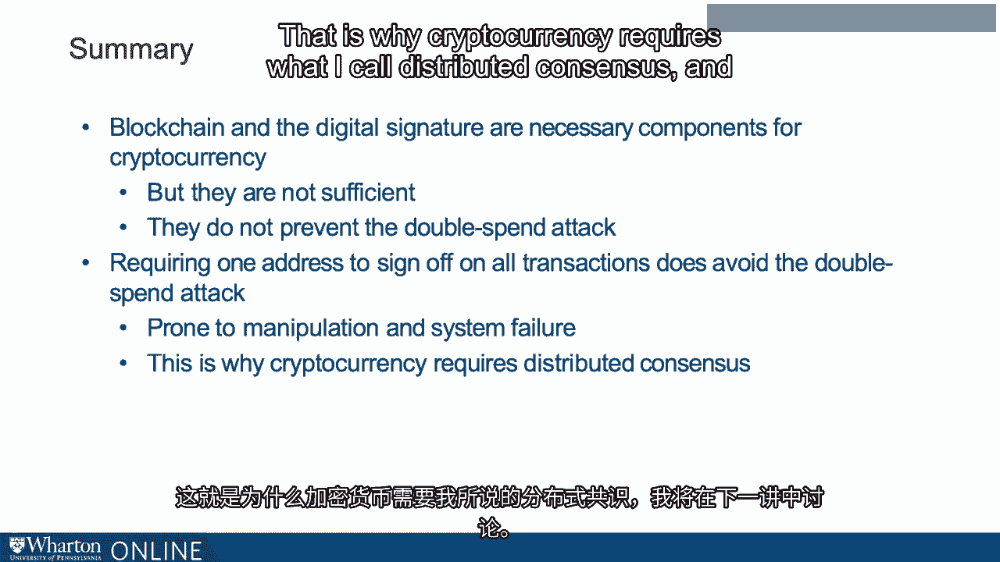

# 沃顿商学院《金融科技（加密货币／区块链／AI）｜wharton-fintech》（中英字幕） - P45：8_例子.zh_en - GPT中英字幕课程资源 - BV1yj411W7Dd

 So in the previous example， we saw how important blockchain is to Bitcoin。

 Blockchain ensures a tamper-proof ledger。 Together with a digital signature。

 this forms a system of property rights。 But blockchain is not enough。 In this lecture。

 we will see why。 Let's go back to MariaCoin。 Now with the background from the previous lecture。

 we can be a little bit more specific about how MariaCoin might work。

 So let's think about transacting with MariaCoin。 Maria creates MariaCoin。

 What exactly does this mean？ It means she creates a unique digital ID representing the coin。

 and she signs it with her private key as we discussed with the digital signature。 Now in stage two。

 Maria writes a message， "Pay Sophie with this coin。"， By "Sophie" in Bitcoin terminology。

 we actually mean just Sophie's public signature。 And by this coin， we mean a hash pointer。

 which is to say a pointer along with a hash function of the coin。

 Then Maria signs the message with her private key。

 So we talked about how that works also with digital signatures。 Now using Maria's public key。

 any user can view this series of operations and verify that Sophie is the valid owner of the coin。

 Along with the hash pointers， the ledger is secure， property rights are valid。

 and Sophie can repeat steps two and three to transfer the coin where she likes。

 So while this MariaCoin technically preserves property rights， it's actually not a viable system。

 Let's see why。 So once Sophie is the valid owner of the coin。

 she can repeat the sell the coin protocol to pay another user with the coin。

 and she can repeat the protocol again to pay yet another user with the coin。

 So there are no safeguards in this system to prevent Sophie from taking the coin and spending it twice。

 So we know based on the ledger that Sophie is the valid owner of the coin and everybody might maintain the ledger and accept that。

 But what happens if Sophie then tries to sell the coin twice？

 Some people will have a copy of the ledger with Jeff and some people will have a copy of the ledger with Mike。

 and it will look like the coin simply been minted again。 Now you might think， well。

 why don't we just figure out which one occurred first？ But in a distributed network。

 it might not be so clear which one occurred first。

 It takes time for the message to get to all the nodes。

 This is what's known as the double spend attack。 The complicated name for a very simple concept。

 which is when you've got an online coin， what is to prevent somebody from simply spending the coin as many times as they want？

 And it sounds sort of simple and trivial， but actually it's a real problem。

 Now there's a pretty straightforward workaround for the double spend attack。 So okay。

 that idea with Maria coin didn't work。 Let's try again， let's consider something called James coin。

 So James coin is a lot like Maria coin in that people can use signatures to transfer it between one and another。

 but it's got one key difference。 All transactions in the ledger must be signed by a person named James。

 let's assume it's a very specific person， to be valid。

 So the first transaction is James creates James coin。 James now writes a message。

 pays Sophie with his coin and signs it。 Sophie can then write a message。

 pay Jeff with his coin and then sign it。 However， both Sophie and James sign off on this last message。

 and then we can also require that James broadcast the ledger。 Now James has signed the message。

 pay Jeff with this coin。 So whatever software he's running knows that Jeff is the valid owner of the coin。

 even if James wanted to sign off on a contradictory message， pay Mike with this coin。

 it wouldn't let him。 You could easily write something like that。

 So now we have a system that avoids the double spend attack。 It's actually a pretty good system。

 So for one thing， this ledger can be widely distributed and it's tamper proof。

 due to the blockchain technology that I described in the previous lecture。

 which means that even James himself who needs to sign off on every message。

 cannot manipulate the ledger without detection。 So for these reasons。

 while in some sense it seems centralized， it's actually a pretty decentralized system。

 James cannot act badly in an obvious way because everybody would detect it。

 But there are some problems。 I mean， James does sound a little bit like a centralized intermediary。

 He's not quite a centralized intermediary， but it's not as decentralized as one might want。

 For example， James might decide to sign off on his friend's transactions， but not on others。 Also。

 it's a little unstable， right？ We'd better hope that nothing happens to James。

 If something happens to James， we don't have a currency anymore。

 So this is not something that Bitcoin wants。 So with Bitcoin。

 we seek a more decentralized system to avoid the double spend attack。 So to summarize thus far。

 blockchain and the digital signature are necessary components， for cryptocurrency。

 but they're not sufficient。 They do not， for instance， prevent the double spend attack。

 Requiring one address to sign off on all transaction does avoid the double spend attack。

 but it is prone to manipulation and system failure。

 That is why cryptocurrency requires what I call distributed consensus and what I'll discuss in the next lecture。

 [ Silence ]。

