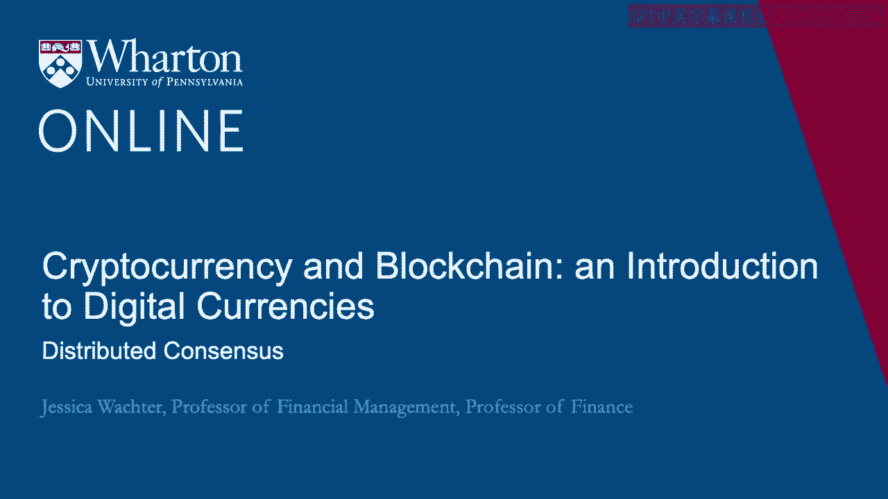
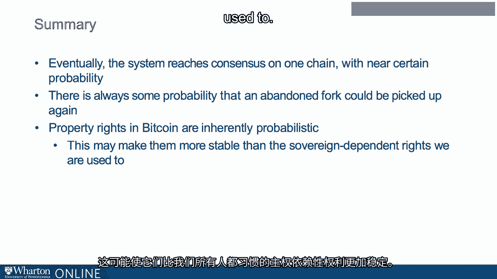

# 沃顿商学院《金融科技（加密货币／区块链／AI）｜wharton-fintech》（中英字幕） - P46：9_分布式共识.zh_en - GPT中英字幕课程资源 - BV1yj411W7Dd

 In the last lectures， I introduced the digital signature and the blockchain。

 Together， these form the beginnings of a system of property rights that depend only on computer protocols。

 not on a sovereign authority。 However， they are not sufficient。 For a currency to be valid。

 it must avoid the double-spend attack。 So one solution that we discussed last time is having authority rest with one entity。

 That's this James Coyne idea。 However， the entire idea of cryptocurrency is to avoid this type of centralization。

 however effective it might be。 So what is distributed consensus？ So first of all。

 let's think about the Bitcoin network。 All the Bitcoin network is a bunch of nodes， just computers。

 that run the reference version of Bitcoin software。 These nodes are independent。

 They are all connected through potentially multiple steps， not necessarily directly to each other。

 It's a system that has no built-in central authority。 It's fully peer-to-peer。

 All of these nodes are equal in principle to one another。 Now。

 one goal is to create a protocol that allows all nodes to agree。 But is that sufficient？ No。

 it is not， because we want the nodes to agree on something called the truth。

 We want them to agree on some version of the right thing。 Now。

 in creating a concept of distributed consensus， we will assume that nodes can be honest or that they can be malicious。

 In other words， we do not require honesty on the part of the nodes。

 So here's a definition of a distributed consensus protocol。

 Consider a network of nodes each receiving a value。 Some are malicious， some honest。

 A distributed consensus protocol must terminate with all honest nodes in agreement on the value。

 and that this value must have been generated by an honest node。 So with this definition。

 we can see how distributed consensus applies to the blockchain。 As with the blockchain itself。

 we will reason recursively。 That is， we're going to assume that the system starts off in distributed consensus。

 namely all honest nodes are in agreement on what the blockchain should look like。

 So we have a set of transactions that have occurred in the past that form the blockchain。

 All honest nodes are in agreement on that blockchain。 Now。

 assume a bunch of new transactions come in， and some might be contradictory。

 We want to end with a new block added to the ledger。

 consisting of valid transactions on which all nodes agree。 That's where we're trying to get。 Now。

 if we could assume that even one node were honest。

 and if we could assign that node a stable identity。

 we could just write software to send all transactions through that node。

 Then the transactions could be verified by all the other nodes。

 This is like James Coyne in the previous lecture。 However。

 the Bitcoin protocol avoids assuming that any one node is honest， and it goes a step further。

 It avoids assigning stable identities to the nodes at all。 So clearly。

 we cannot prefer any node over any other node。 So here's an idea。 We use randomness。

 Randomness is going to be key to getting to the distributed consensus。 Now。

 before going any further， I want to review the concept of a hash pointer。

 because it's so important for what I'm going to say next。

 So remember that a hash pointer to a block is two things， really。

 The first is the output of a hash function applied to that block。 It's called the hash。

 and a pointer to that block。 So remember what defines a blockchain。

 Each block in the blockchain includes a hash pointer to the previous block。

 So I'm going to take a first pass at the Bitcoin distributed consensus algorithm。

 So here's the steps。 First of all， new transactions are broadcast to all the nodes in the system。

 Second， each node collects these transactions into a block。 Third， at a fixed interval。

 a random node gets to propose the block it's created。 Now， what does proposing a block mean。

 actually？ Well， it means， as I said in step two， collecting the transactions into a block。

 but it also means something else。 It also means including a hash pointer to the previous block。

 Then finally， all nodes check the block to make sure the transactions are valid。

 So now this algorithm is going to repeat itself again and again。

 Now let's see how this algorithm avoids some problems， first some obvious problems。

 and then the double spend attack。 First of all， it's not possible to spend bitcoins not belonging to you according to this algorithm。

 even though it's decentralized， because your signature will not match the valid signature on the coins。

 And it's not possible to deny service to a certain user whom you don't like。

 So if you are a malicious node， you can say， well， I'm not going to include the transactions。

 of a whole group of people say that I don't want to do any business with in my block。 That's fine。

 all these people out there just need to wait for an honest node to get their chance。

 So this also avoids some more subtle problems like the double spend attack that I introduced in the last lecture。

 So let's review the double spend attack。 Remember Maria coin。

 Remember that Maria transferred the coin to Sophie。 That was a valid transaction。

 Sophie transfers the coin to Jeff， but she also creates a message to transfer the coin to Mike。 Now。

 how does this work in the previous system I just outlined？

 So Sophie's transfer to Jeff is broadcast to the network of nodes。

 and Sophie's transfer to Mike is broadcast to the network of nodes。

 Some nodes will receive the transfer to Jeff message first。

 some will receive the transfer to Mike message first。

 Now it's usually the policy of honest nodes to include in their block the message received first。

 but that's a norm。 It doesn't have to be that way。 Now。

 some nodes might actually be a friend of Jeff or a friend of Mike， and those nodes will be biased。

 However， as long as the nodes are running the reference software。

 they will not be able to include both， because that will not be a chain of valid ownership。

 Now it's possible that some node could be completely off the reservation and try and include both。

 and that's a situation that I'm going to deal with in the next lecture。 So for now。

 assume that the nodes are sufficiently honest， that they include one or the other。

 So now suppose that the randomization algorithm chooses a node with a Jeff transaction in its block。

 The block then gets added to the chain with a Jeff transaction。

 Now suppose in the next round the random algorithm chooses a node with a Mike transaction in the block。

 What we see is a fork in the chain， because those two transactions are inconsistent。

 It's as if we have a long chain with two prongs at the end。 So now what happens at the next step？

 So another node is randomly chosen。 That node has to pick which block to accept。

 Now what does it mean to accept a block？ It means that it includes a hash pointer to the previous block in its block。

 So it's going to include a hash pointer either to the Jeff block or the Mike block。

 and that's going to now define the chain。 So which will it pick？ We don't know， and what's more。

 we don't care because it can only pick one。 This means the double spend attack is avoided。

 So at that point one fork in the chain is longer than the other。

 Now it is the policy of honest nodes on Bitcoin to extend the longest fork。

 This is a norm of Bitcoin， but nothing in the software requires it。

 So let's say that the block with the Jeff transaction has been chosen in the last round。

 That is the block that gets to be continued and the other block， the other fork is orphaned。 Okay。

 so now we have a chain and one of the， with two prongs， one of them longer than the other。

 So if all nodes are honest， they will simply continue with the longest fork and the other fork will be orphaned。

 But what if Mike's friends all get together and build on the orphaned fork containing the transfer to Mike？

 Note that this would only require control of the nodes for posing new blocks。

 And then as long as a sufficient number of the nodes were controlled。

 the rest of the honest nodes would follow because it is the policy to extend the longest fork。

 This is why it is so important that the choice of node be random in this thought experiment。

 Because if the choice of node were not random， then any specific fork could be extended and one might not reach agreement。

 Of course， it is impossible for a random node to be chosen。 So this is a conundrum actually。

 This is not a feasible thought experiment。 And I will discuss the solution to this conundrum in the next lecture。

 For now， let's talk about a consequence of this distributed consensus protocol。

 Let's return to our example of the forking paths。 Recall that once the blockchain forks。

 we do not know which fork will be continued。 However， once the Jeff fork has won confirmation。

 the policy of honest nodes extending the longest fork suggests it is more likely to receive a second confirmation。

 And then it is still more likely to receive a third confirmation and so on。 As a practical matter。

 once there have been several confirmations， it is very likely that a long term consensus has formed on a block。

 And if one is exchanging goods or services for Bitcoin。

 one can wait until several confirmations before completing the exchange。 Interestingly though。

 as a theoretical matter， one does not know with 100% certainty that any block becomes part of the long term consensus。

 because one could always in principle extend a fork。 There is always some probability。

 however minute， that an orphaned fork will be picked up again。 So to summarize， in this lecture。

 I took a first pass through Bitcoin's distributed consensus protocol。

 Transactions are broadcast to the network。 Nodes collect the transactions into a block。

 Nodes are chosen at random to propose a block， recall this is a thought experiment。

 And in subsequent rounds， other nodes accept or reject that block。

 potentially by accepting other blocks。 Disagreements become forks in the blockchain。

 and short forks are usually abandoned。 It is the policy of honest nodes to extend the longest fork。

 Eventually， the system reaches consensus on one chain with near certain probability。

 There is always some probability， however minute， that an abandoned fork could be picked up again。

 Thus， property rights in Bitcoin are inherently probabilistic。 Yet ironically。

 this may make them more stable。 In the sovereign dependent rights， we are all used to。

 [ Silence ]。

