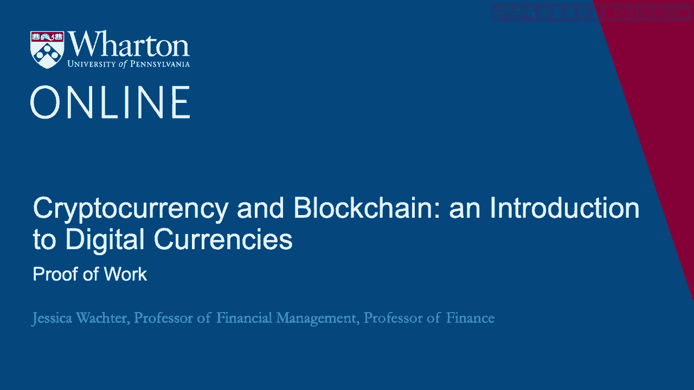
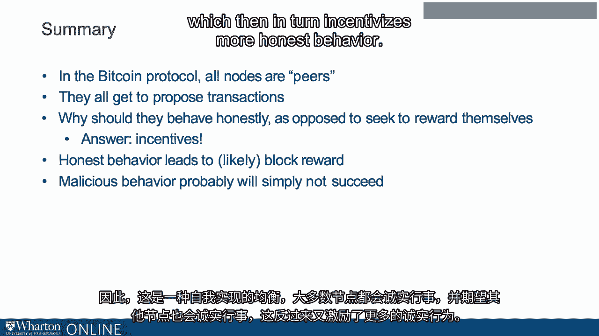

# 沃顿商学院《金融科技（加密货币／区块链／AI）｜wharton-fintech》（中英字幕） - P47：10_工作证明.zh_en - GPT中英字幕课程资源 - BV1yj411W7Dd

 Recall that to ensure a system of property rights。

 nodes need to reach a distributed consensus on what constitutes a correct set of transactions。

 Now also， Bitcoin must replace the need for central banks， so it must manage currency supply。

 Interestingly， these two problems turn out to be related。

 Recall the distributed consensus protocol from the previous lecture。

 Our initial digital consensus protocol， the thought experiment was to pick nodes at random。

 By picking nodes at random， we make it hard for any single node to control the blockchain。

 This automatically disincentivizes malicious behavior by making malicious behavior difficult。

 However， it does require picking a node at random。 Moreover。

 what you would really like to do is to only pick honest nodes and never pick malicious ones。

 Now this is not possible because not only can you not tell nodes do not even have identities。

 But what if you could somehow turn a node into an honest node？ Now。

 our first pass of distributed consensus required picking a node at random。

 We know that this is impossible for two reasons。 First of all。

 as I talked about in previous lectures， there's no such thing as computer-generated randomness。

 Recall a computer can only generate pseudo-random numbers。 Even if there were。

 it would require a centralized computer to generate the randomness。

 And everyone would need to agree on it， so there would be some degree of centralization。

 So really we have two problems to solve， generating randomness and incentivizing honest behavior。

 Solving one problem helps with the other。 If randomness is not good enough。

 it makes it more likely that a malicious node will take over the system。

 But if we incentivize honest behavior， then fewer nodes are malicious to begin with。 Therefore。

 decreasing the need for true randomness。 Bitcoin's proof of work proposed by Satoshi Nakamoto is a truly ingenious way of dealing with these problems。

 It also constitutes a vast experiment。 There is no theory， economic or otherwise。

 that tells us that proof of work should well work。 We just see that so far it does。 Side note。

 it's worth understanding proof of work pretty well for at least two reasons。 First。

 because it contains some genuinely new ideas。 Currently。

 many intermediaries profit off of information。 Now what if information could be stored accurately and maintained in a decentralized way？

 The blockchain helps with that， but it doesn't go far enough because it doesn't govern how new information gets added。

 So that's point number one。 There are some genuinely new ideas here。 Point number two。

 many believe that it is proof of work that contains the seeds of Bitcoin's downfall。

 So if we want to understand what some of the naysayers about Bitcoin have been saying。

 then we have to understand proof of work。 So proof of work concept one is block reward。

 Now let's continue with the thought experiment， assume for the moment that we can pick a note。

 at random to propose a block。 Now let's say that we give the note that proposes the block some extra bitcoins to transact with。

 More precisely， because remember a no doesn't have an identity， so it can't spend a bitcoin。

 As part of the block， the node gets to include a transaction with these bitcoins， presumably。

 to pay itself。 But we don't know that。 Now this is going to act to keep the blocks honest。 Why？

 It might seem strange because they get the block reward even if they behave dishonestly。 Well。

 here's how it works。 The only way they actually get to receive their reward is if future nodes accept their block。

 So recall that future nodes accept a proposed block by including a hash pointer to the block。

 in the next block they propose。 Now suppose you act dishonestly。

 extending perhaps an orphaned fork with transactions to， you or your friends。

 Now the next node is unlikely to accept your block。 If that node does not accept your block。

 your block is still less likely to become part of， the accepted chain in the long run。

 And if that's the case， the transaction with your new bitcoins is gone forever。

 And no block reward for you。 So you had better propose a block that will gain acceptance and be part of the long run。

 chain。 Let's play the devil's advocate for a moment。 Let's suppose that most nodes are not honest。

 but actually that most nodes are malicious。 Now let's say you behave maliciously。

 Is it possible that the next node might choose to reward your behavior by accepting your block？

 And suppose if you are honest that the next node might choose to punish you by accepting。

 a different block， then dishonest behavior would be rewarded。

 Is this something that could actually happen？ Actually no， that's the beauty of this system。

 So here's a fact about honesty and dishonesty that we're going to rely on。

 Whether it's a fact or not， it's not clear。 Let's call it a conjecture。

 Let's suppose that nodes behave honestly unless incentivized otherwise。

 So we will say that honest nodes are public spirited in that sense。

 They can still be out for their own self-interest， but if it's in their self-interest， they。

 will behave honestly and when in doubt they'll behave honestly。

 Now let's say malicious nodes are out for their own good。 So for example。

 here's what we're not assuming。 We're not assuming that the malicious nodes are specifically designed for the destruction。

 of the system。 We're simply assuming that the malicious nodes are self-interested。

 So let's continue this devil's advocate argument。 Suppose I， Jessica。

 propose a block that exhibits self-dealing for example。 It's a malicious block。

 Now consider the next node that's chosen to propose a block。 We'll say this node is Alice's node。

 Now let's think about Alice's decision to accept my block， potentially rewarding my。

 malicious behavior。 Now remember that Alice also wants to receive the block reward。

 Accepting my block makes it less likely that her block will be accepted than the next round。

 because the next node will see that my block was malicious。 So in other words。

 to accept my malicious block， Alice needs to not only be malicious。

 she also needs to be without self-interest。 So note in the background is a prevailing view that most nodes are acting honestly because。

 all incentives are for them to do so。 So just to summarize， in the Bitcoin protocol。

 all nodes are peers。 They all in principle get to propose transactions。

 Why should they behave honestly as opposed to seek to reward themselves？ The answer is incentives。

 Most behavior leads to likely block rewards and malicious behavior probably will not succeed。

 It is therefore a self-fulfilling equilibrium that most nodes act honestly and expect other。

 nodes to act honestly， which then in turn incentivizes more honest behavior。

 What's next？ So we were still in the thought experiment of assuming randomness。

 What determines which node gets to create a block？

 In real life there is no magic random number generator that allows us to implement the。

 thought experiment。 Or is there？ We'll see。 Thank you。 [ Silence ]。

