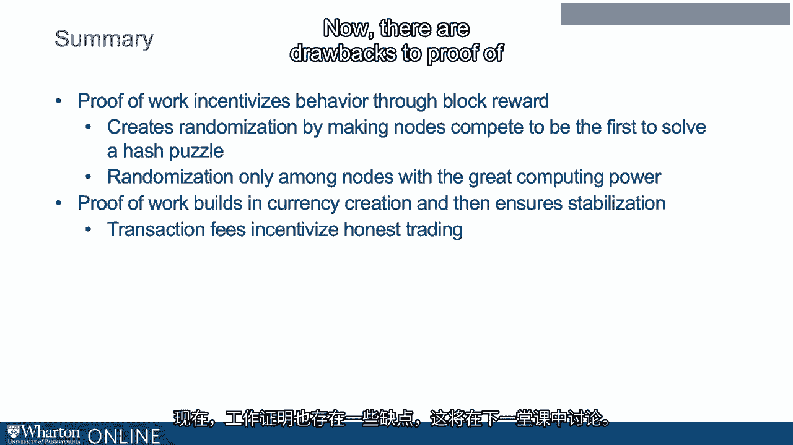

# 沃顿商学院《金融科技（加密货币／区块链／AI）｜wharton-fintech》（中英字幕） - P48：11_挖矿和货币供应.zh_en - GPT中英字幕课程资源 - BV1yj411W7Dd

 In the last two lectures， I discussed how Bitcoin reaches a distributed consensus。

 Nodes in a distributed network are chosen at random in the thought experiment to propose， a block。

 Nodes that propose a block receive bitcoins as a block reward。 More precisely。

 they get to choose an address to which to send the bitcoins， because the， nodes are not addresses。

 If the block is accepted by subsequent nodes and becomes part of the consensus， the chosen。

 address gets to keep the bitcoins。 This is a brilliant scheme for incentivizing honest behavior。

 but it does require randomization。 Otherwise， one node could potentially take over。

 And that works in a thought experiment。 But how can we make it work in the physical world？

 The answer is mining。 Well， Bitcoin mining is a resource-intensive activity that results in the discovery of。

 new coins。 Thus， the analogy to precious metals implicit in the word mining。 So here's how it works。

 Nodes compete to have a chance to propose the next block。

 They succeed if they are the first to solve what is called a hash puzzle。

 The hash puzzle is essentially a cryptographic puzzle。 Puzzle friendliness。

 which if you recall as a property of the hash function， implies， that such puzzles can be found。

 Now， the only way to solve the cryptographic puzzle is through trial and error。

 Lots and lots of trial and error。 Think perhaps of hacking into a system by choosing passwords at random。

 The greater the computing power of the node， the more likely it is to be able to solve the。

 hash puzzle because the faster it can do this trial and error。 When it solves the hash puzzle。

 it proposes the block with the potential to receive the， block reward if the block is accepted。 Now。

 the block reward means it has mined new bitcoins。 Now here's something that's important。

 All nodes can verify that a given node has solved the puzzle， so the system is truly decentralized。

 Proof of work is therefore the solving of a hash puzzle for which the node is rewarded。

 by being able to propose a block。 Well， that may not be much of a reward。

 The main reward is the block reward， which is given in bitcoins。

 There's also transaction cost reward that I'll discuss later。

 So notice that the proof of work creates the randomness that we were missing。

 For two competing nodes， let's say with roughly equal processing power， there is simply no。

 way to predict which node will solve the puzzle first and get to propose its block。

 Does this mean that block selection is random？ Well， if by random you mean unpredictable， then yes。

 Well， because the only way to predict which of the competing nodes will win is by having。

 as much computing power as the two nodes combined。

 Because the answer of which one solves the puzzle first can only be done by actually solving。

 the puzzle first。 That means that to us， which competing node will win is its unpredictable and hence random。

 Now， if by random you mean non-deterministic， then no。

 Because given a set of initial conditions of the competing nodes， the process of which。

 one gets to win is completely deterministic。 What this illustrates is actually a kind of deep point about randomness。

 The process can both be deterministic and random。 Henri Poincare made this point in the 19th century。

 And it's pretty useful for our purposes here。 Block rewards are the only way within the Bitcoin reference software for new coins to be mined。

 However， even block rewards are limited。 For every 210，000 blocks， the block reward is cut in half。

 Because the blocks are created at a deterministic rate， this occurs approximately every four years。

 So because the block reward is cut in half， there's an exponential rate of decay in the。

 growth rate of blocks。 And it means that the total number of bitcoins will converge to 21 million。

 So here's a graph that shows the total bitcoins as a function of the year。

 And so we've passed the first inflection point。 So the creation of new bitcoins allows the currency to be limited in limited supply at。

 the beginning and then the supply to grow and then to converge to a fixed amount。 By the way。

 this does not imply that bitcoin is subject to deflationary pressures as claimed， by Norio Rubini。

 Even if the economy grows， we can just buy more things with the current bitcoins。

 But what it does imply is that the bitcoins supply cannot be manipulated。

 Now the potential rewards to mine and go beyond the receipt of bitcoins。

 They also include the receipt of something called a transaction fee。

 The node proposes transactions in which the value of the bitcoins coming in exceed the。

 value of the bitcoins going out。 Their main error gets to be paid to an address of the nodes choosing。

 So what the transactions fees do is they ensure continuing incentives for trade and bitcoin。

 So here's a graph of the transaction fees。 Fees skyrocketed in late 2017 but are now back to being negligible。

 So to summarize， proof of work incentivizes behavior through block reward。

 It creates randomization by making nodes compete as to be the first to solve a hash， puzzle。

 Randomization that was only among nodes with the greatest computing power。

 Proof of work builds in currency creation and then ensures stabilization。

 Transaction fees can then step in to incentivize honest trading。

 Now there are drawbacks to proof of work that will be discussed in the next lecture。 Thank you。

 [BLANK_AUDIO]。