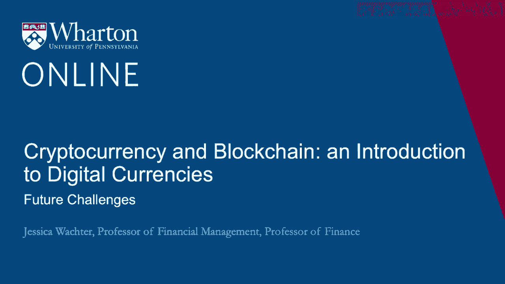
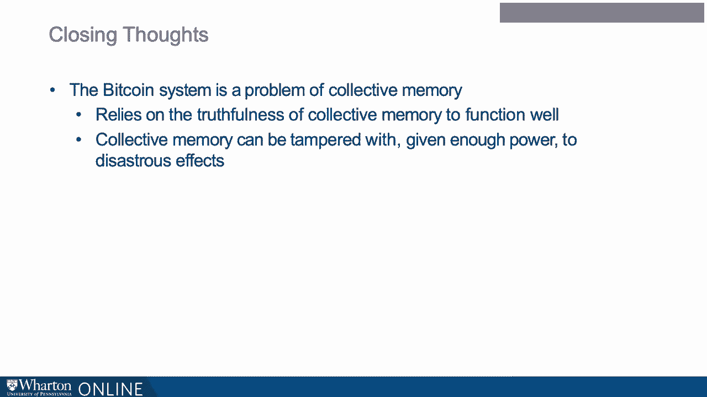

# 沃顿商学院《金融科技（加密货币／区块链／AI）｜wharton-fintech》（中英字幕） - P49：12_未来挑战.zh_en - GPT中英字幕课程资源 - BV1yj411W7Dd

 In the previous lecture， I discussed proof of work and how it enabled randomness in a decentralized way。

 But critical to proof of work is the solving of a hash puzzle。

 This process enables randomness only if no one node can accrue enough power to monopolize the network。

 And it also means that bitcoin trading in its current implementation is potentially slow and limited。

 So I'm going to discuss these issues， and at the end I will discuss some broader challenges and summarize the module。

 So here's the first challenge to proof of work called the 51% attack。

 What if a node succeeds in gaining a majority of the CPU power across all nodes？

 This node would then be the first to solve all the hash puzzles。

 And then this node could build the longest chain in the blockchain。

 So this system would then revert to being partially centralized。

 You could think about a little bit like James Coyne from a few lectures ago。

 So let's discuss this situation。 First note that if a node were able to obtain a majority of CPU power。

 it would have to act as a benevolent dictator。 Now this may not be much comfort to have a benevolent dictator。

 but let's first see why it would have to act as a benevolent dictator。

 The only possible reward to gaining CPU power and to proposing blocks is bitcoins。

 Now a malicious 51% attacker could include lots of bitcoin payments to him or herself through their address。

 But actually no other nodes would let this attacker spend the coin。

 so it would be a little bit pointless。 So any 51% attack is as limited as profitability and this will already reduce the incentives for such an attack。

 And key is the fact that any attacker is going to have a very large incentive to maintain trading in bitcoins。

 because probably this attacker has a lot of bitcoins through all the block rewards received over time。

 And that also disincentivizes this 51% attack in a broader sense。

 So we've already seen this in operation。 In 2014 a mining pool came close to the 51% mark and voluntarily capped their control at 39。

9%， calling on others to do the same。 So because the potential attackers already have a stake in the system。

 if they are behaving in a self-interested way， they have the reasons to not only avoid the attack。

 but avoid the circumstances that lead to the attack。 Thus this is unlikely to occur。

 Now a weaker version of the 51% attack is what would happen if a small number of nodes were to control all the mining power。

 As bitcoin mining has become industrialized， this has been occurring。

 So it appears that mining power is concentrated and perhaps a small number of nodes is hard to say for sure。

 So here's a worry。 These miners could form a cartel。

 Now I'm not saying that the credit card companies are like a cartel， but if they were。

 maybe the same thing could happen。 They could then charge high transaction fees。

 Because transaction fees are， as we discussed， part of the reward for creating blocks。

 This is also like senior edge， which is essentially the tax from the sovereign to inflation。

 Senior edge under another name。 Could this occur？ Yeah， it could occur。

 It hasn't yet occurred though， and perhaps one reason for that is that all involved have a stake in the system。

 They have a stake， a very large stake perhaps， and a continued success of bitcoin as a currency。

 Okay， so that's challenge one。 The 51% attack and related oligopoly power。

 It hasn't proven to be a big challenge yet。 We don't know for sure if it could become a big challenge。

 but there are reasons to suspect that it won't。 So proof of work challenge two， resource intensity。

 So bitcoin mining uses lots of electricity。 Maybe it uses too much electricity。 Well。

 actually it doesn't use that much。 At most at the moment it uses only 6% of the energy used in the global banking sector。

 And it's way， way， way tiny compared to the energy use of total consumption。 Now why is this？

 Mining takes place where energy is not a scarce resource， and it can continue to do so。

 So this is apparently a concern， but it turns out not really。

 Now perhaps one has a philosophical concern regarding the energy use。

 Here's a green and environmental critique of bitcoin。

 It appears that miners are using energy to basically solve a puzzle。 Now that seems a little silly。

 right？ I mean usually if we're using energy we are hoping to create something that people can use。

 But here all of this energy is going to waste， because it's all used for puzzle solving。

 So what's the point of that？ It seems wasteful。 Well， I think it depends how you look at it。

 I don't agree with this critique。 In fact， proof of work does something useful。

 It's a technology that enables trading in bitcoin。

 Now trading in bitcoin through proof of work is implemented as a zero-sum game。

 but as long as one believes bitcoin is a net benefit to society。

 there is a net benefit to society and mining。 It really is producing something。

 What is it producing？ Well， it's producing the working of bitcoin， the system。

 So I don't think this concern is valid。 Okay， so here's a third challenge。 Can the network scale？

 So blocks are limited in size， blocks are limited in how quickly they can be created。

 and this puts pretty much a hard upper limit on the number of transactions per second。

 and there are not very many。 This does not seem sufficient to be a large-scale medium of exchange。

 and this would really cap bitcoin's usefulness。 This is really， I think。

 the part of Nouriel Robini's critique， in his congressional testimony that carries the most weight。

 And it's safe to say that given this problem achieving scale。

 is the most discussed issue in cryptocurrency。 Blogs on cryptocurrency point out the following trilemma。

 that blockchain systems can have at most two of the three， the three being decentralization。

 scalability， and security。 But just by saying this trilemma， that this is a trilemma。

 doesn't mean that it's an impossibility result。 So just because within bitcoin there's no good answer。

 to whether the network can scale doesn't mean that there won't be an answer。 So Ethereum。

 for example， has a different version of proof of work。

 It uses many of the same underlying principles that I just described。

 but it seems perhaps to scale better。 I will now summarize the module and then give some further thoughts。

 So bitcoin and perhaps other established cryptocurrencies。

 create a system of property rights that does not depend on enforcement， by centralized authorities。

 These property rights can span jurisdictions， thus allowing for trades in ways that was previously expensive。

 or difficult or illegal。 Cryptocurrencies enabled this feat through technology， mathematics。

 and what I would call philosophical innovation。 Property rights need not hold with certainty。

 It is sufficient that they hold probabilistically。

 In this module I discussed how the digital signature。

 blockchain and proof of work enabled these property rights， and hence bitcoin to operate。

 Now some closing thoughts。 In one of the previous lectures I pointed out that a money system。

 is really a memory system。 The bitcoin system is a problem of collective memory。

 So like any society， the bitcoin society relies on the truthfulness。

 of this collective memory to function well。 Is it possible to tamper with collective memory？ Yes。

 it can be。 Given enough power and a willingness of people to behave maliciously。

 collective memory can be tampered with。 And in the 20th century actual collective memory has been tampered。

 with two disastrous effects， think Stalin or Hitler or Mao。 So bitcoin， like society。

 relies on this not happening。

 Now interestingly， bitcoin is actually not completely decentralized。

 It requires that nodes agree on what's called the reference software。

 Now when there is agreement about what should be the reference software。

 something called a hard fork is created。 So thus bitcoin can flexibly accommodate dissent without dissolution。

 But there does need to be widespread agreement about what bitcoin means。

 And there also must be some level of commitment to the continuation of the network。

 In other words malicious behavior for its own say could destroy bitcoin。

 Thus bitcoin and cryptocurrency is in general a vast experiment。

 We don't know exactly why bitcoin works， we only know that it does。 [BLANK_AUDIO]。

