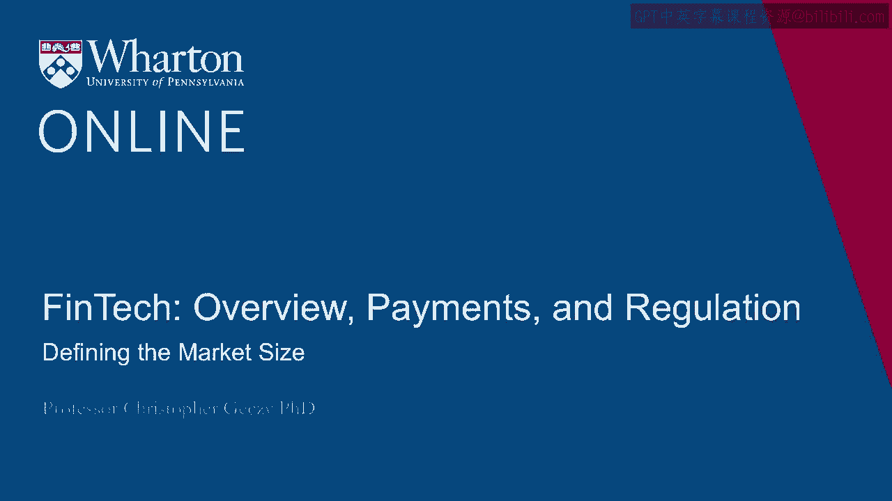
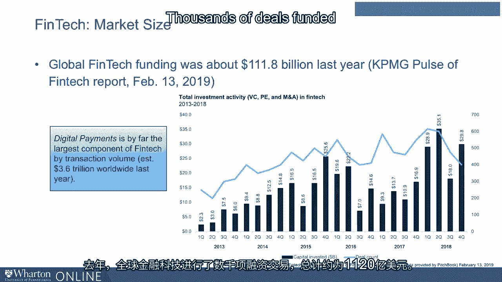

# 沃顿商学院《金融科技（加密货币／区块链／AI）｜wharton-fintech》（中英字幕） - P4：3_定义市场规模.zh_en - GPT中英字幕课程资源 - BV1yj411W7Dd

 Now defining the size of the FinTech market presents the usual challenge of defining sizes。

 of any kind of market。 What defines size？ Assays under management， flows of funds。

 valuations of businesses in a sector or sub-sector。 All of these would， of course。

 be legitimate ways of thinking about size of the industry。

 Numbers of players would also be relevant， for example。

 And so there are many estimates of size varying also by sector and sub-sector which technologies。

 or channels we're talking about。 Are we thinking about revenues？ Are we thinking about sales？

 And so on。 What is clear by a number of measures and data sources here from the KPMG Pulsa FinTech。

 report published in 2019 is that funding is highly aggressive， ongoing， active， M&A。

 mergers and acquisitions that is， in the FinTech space abound and money is flowing in from。

 the roughly $2 trillion of overhang in the venture and private equity industries into， this space。

 As a subclass， payments and remittances technologically enabled， which we call digital payments。

 was， the largest component of transaction volume in the FinTech subcategory with just under $4。

 trillion worldwide。 As you can see from the graph on the screen。

 total investment activity going back to 2013， here， expressed quarter by quarter。

 has been dramatically increasing。 And although we have seen some volatility in funding。

 which of course is related to funding， in general but also targeting this space in 2016。

 but generally， overwhelmingly， sees， an upward trend。 That's both in the capital invested。

 read off the left side of the graph or by deal count， on the far right。

 There has been in 2018 and 2019 a slight decrease in the number of deals in FinTech。 However。

 the general trend seems to have continued， although the space has gotten very filled。

 as you must imagine， with FinTech deals。 Remember， the aggregate number of companies。

 while not being exactly the sum of all total， investment activity counted by numbers using the blue line or the right access。

 But the number of deals funded is， and you can see it's on the order of thousands， thousands。

 of deals funded and FinTech globally around $112 billion last year。

 For more information， visit our website at www。myc。com/myc。com。

