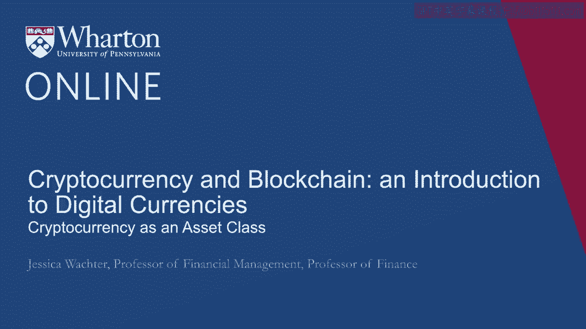
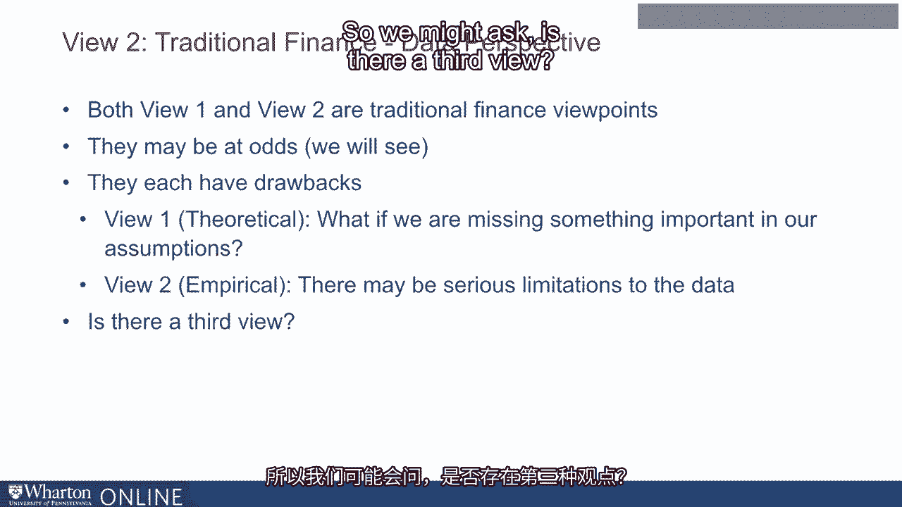

# 沃顿商学院《金融科技（加密货币／区块链／AI）｜wharton-fintech》（中英字幕） - P50：13_加密货币作为一类资产.zh_en - GPT中英字幕课程资源 - BV1yj411W7Dd

 Welcome to Module 3， Cryptocurrency as an Asset Class。

 So first I'm going to introduce the module。 Lecture 2 will discuss risk and return to cryptocurrency。

 Lecture 3 will be some background on asset allocation and finally Lecture 4 will be asset。

 allocation with cryptocurrency。 So does cryptocurrency have a place in the portfolio of an investor？

 Then we use the concepts we have developed in the previous modules to answer this question。

 Now recall the reactions to cryptocurrency in the first module。 Jamie Diamond says。

 "A fraud worse than tulip bulbs。"， Warren Buffett says， "Probably rat poison squared。"。

 And crypto is the mother of all scams and now busted bubbles as from the title of。

 Nouriel Rubini's Congressional Testimony。 So I'm going to discuss two views of cryptocurrency as part of a portfolio。

 Both of them use traditional finance。 So what would be one traditional finance view of cryptocurrency？

 Let's take the capital asset pricing model， one of the great achievements of finance and。

 still the benchmark theory for expected returns。 According to the capital asset pricing model。

 which I will discuss further in Lecture 3， investors should hold risky securities according to their market weighted values。

 Now the CAPM is a pretty good theory， witnessed the success of index funds。 In fact。

 you could say that the CAPM really created index funds。 What does the CAPM say about crypto？ Well。

 the most straightforward interpretation is that one should hold zero cryptocurrency。

 That's because cash or currency has transaction value but isn't connected to some asset that。

 creates underlying value。 They're simply mediums of exchange。

 So the idea that the CAPM would have about really all currency is that you really shouldn't hold。

 it in your portfolio。 It's what we in economics call a zero net supply security。

 You really just should hold as little as possible for transaction needs。

 That's a traditional view coming from the CAPM。 Now a related idea is something called the Gordon Growth Model。

 The Gordon Growth Model is a benchmark method for value in companies and what it does is。

 it values any asset based on its cash flows and you can connect it with the capital asset。

 pricing model but you don't need to。 So one idea is that perhaps one could value cryptocurrency using the Gordon Growth Model。

 and then you could decide is crypto over or undervalued。 However。

 the Gordon Growth Model values companies based on their dividends and obviously currency。

 pays no dividends。 We're going to discuss this further in lecture four。

 So thus the Gordon Growth Model and the CAPM are both in line with the views expressed at。

 the start of the lecture。 Cryptocurrency should be worth zero。 However。

 suppose we take a purely data driven perspective。 Let's construct returns on cryptocurrency and look at the empirical properties of these。

 returns。 Let's treat these returns as if they were returns on any traditional investment and ask。

 If we saw an investment with returns like these， would we want to hold it as part of， our portfolio？

 That's what I'm going to develop in lecture two。 So both of these views are traditional finance viewpoints and we will see that they are at。

 odds with each other。 Now they each have drawbacks。

 The first view that I described using the capital asset pricing model and the Gordon Growth。

 Model is a theory driven view and we might be missing something important in our assumptions。

 View two is a purely data driven view but there might be serious limitations to the， data。

 So we might ask is there a third view？

 Well we'll return to this a bit at the end。 [BLANK_AUDIO]。

