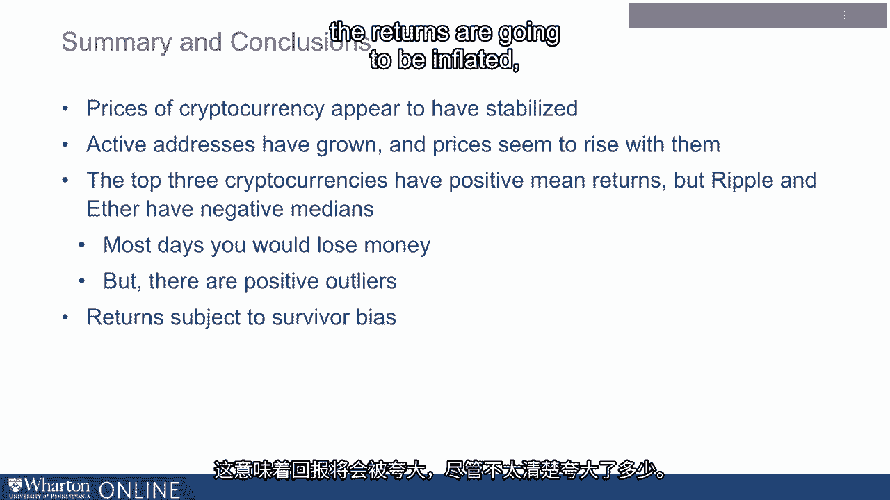

# 沃顿商学院《金融科技（加密货币／区块链／AI）｜wharton-fintech》（中英字幕） - P51：14_加密货币的风险和回报.zh_en - GPT中英字幕课程资源 - BV1yj411W7Dd

 In this lecture， I will take a data-driven approach to cryptocurrency。

 First we'll look at basic price patterns。 Then I'm going to define the return to investing in crypto。

 We'll ask， "What is the average return to investing in crypto？"， And then， "What are the risks？"。

 First， let's look at a chart of the dollar to Bitcoin exchange rate， basically starting。

 back from 2014。 The orange line shows how the price of one Bitcoin varies in terms of dollars。

 The blue line shows the volume， the transaction volume in Bitcoin。

 So what we can see from this chart is that Bitcoin has obviously increased substantially。

 since its very beginning。 We can see the rise at the end of 2017， beginning of 2018。

 and the subsequent crash at the start， of 2018。 We also see that Bitcoin has stabilized。

 so at the time of this recording， it's $4，000， to one Bitcoin。

 Notice how the price of Bitcoin tracks the volume pretty closely。

 You can also look at the number of active addresses of Bitcoin， which is some measure。

 of how it's used。 And what's interesting about active addresses is that they， in some ways。

 actually predict， the price of Bitcoin。 So active addresses started to go up way before the price of Bitcoin went up。

 This is an interesting fact that perhaps could be used in a valuation model。

 So here's the same charts for Ether。 So we see that Ether also experienced a run-up， then a crash。

 and it has subsequently stabilized。 We also find the volume of the transactions in Ether have continued to increase。

 Here's Ether along with its active addresses。 We see that active addresses and Ether seem to be going down。

 but they're still far， far， above what they used to be。

 This active address measure is useful because it tells us something about the number of。

 people who are using the coin。 Once somebody has established an active address。

 we might argue that they're likely to stay， with it， at least some of them。 Now here's Ripple。

 Ripple is even more dramatic in terms of an enormous run-up than a crash。

 We also see that the volume in Ripple and the active addresses in Ripple have， however， stabilized。

 Here's a graph of the log of the prices。 This is nice because we can see all the prices together on one graph if we put them in a log。

 scale。 What that does is it shrinks the outliers。 We can see that the currencies all more or less rose together with Ethereum。

 I mean， Ether， Ethereum being the platform， with Ether and Ripple leading Bitcoin。

 which was interesting。 Then they sold off together， but they did stabilize。

 We're going to talk about this incredible price increase in Ripple later in this lecture。

 Just to summarize from these simple plots， we see that currency prices have stabilized。

 at the time of this recording following the crash from early 2018。

 We see that prices track volume and that they also track active addresses。

 We see that active addresses appear to have stabilized， which is something we might expect。

 We see that currency prices for these three are very， very high relative to where they， began。

 However， we also know that many cryptocurrencies have failed。

 Now cryptocurrency is a store of value and as such， we can think of it as an asset。

 So we're going to refer to the price of Bitcoin as the number of dollars it takes to buy one。

 Bitcoin。 So the price of Bitcoin right now is about 4，000。

 So now let's consider the returns of the following strategy。 Purchase one Bitcoin today。

 tomorrow exchange that Bitcoin for dollars。 And we're going to ask what is the return on this strategy。

 Of course， this strategy will entail transaction costs if taken literally。

 So perhaps it was better to think about what you would get if you would sell， but it's。

 perhaps best not to trade cryptocurrency on a daily basis unless one has a very efficient。

 platform with which to do it。 So what do these returns look like？

 So let's just get some notation clear。 With one dollar。

 you can purchase one divided by PT units of Bitcoin where PT is the price。

 of Bitcoin today at time T。 That's what the T subscript means。 So wait， why？ Let's just be clear。

 With PT， you can purchase PT times one over PT units of Bitcoin。 So with PT。

 you can purchase one unit of Bitcoin。 So let's go back。 With one dollar。

 you purchase one over PT units of Bitcoin。 So let's just say you do this。 Now you wake up tomorrow。

 you look at Coinbase， how much is the Bitcoin worth？

 In your account are one over PT units of Bitcoin。 Each are worth PT plus one。

 That's the price today， one day after you purchase them。

 So the daily return using the Bitcoin symbol is PT plus one divided by PT minus one， or。

 the percent change in price。 That's the definition of return on the Bitcoin strategy。

 So it's the growth rate of your investment。 For example， if the price of Bitcoin went up by 3%。

 which would be an incredible daily， return， we can plug in 3%。 So PT plus one over PT is 1。03。

 That means the return is 0。03。 Now we could repeat this exercise with any of the cryptocurrencies。

 So this is our definition of return。 It's the rate of growth in your investment measured in terms of dollars。

 Now let's ask， what is the daily return over the sample for each cryptocurrency？ Well。

 here are the answers。 For Bitcoin， the average return per day is 0。254%。

 That means on average one dollar invested in Bitcoin became 1。00254。 For other， it's 0。

584% and for Ripple， it's 0。514%。 Now here's an important piece of information to keep in mind when you think about those。

 returns。 What I reported are statistical averages known as means。 How are they calculated？

 What I did was I summed up the daily returns and divided by the length of the sample。

 So that's what statistics tells us is the best measure of what you can expect。 However。

 what's very interesting about cryptocurrency is your returns on a day-to-day basis might。

 look very different。 So what your returns on a day-to-day basis look like。

 that's best described by the daily， median return。 Now in all cases。

 the median return lies well below the mean return。 So for Bitcoin， it's 0。183%。 For other， it's -0。

092% way below the mean return。 And for Ripple， it's even further below the mean return， -0。278。

 What that means is that on most days you would have lost money on Ether and Ripple。

 Now in technical terms， when the median lies below the mean， what it means is that cryptocurrency。

 returns are positively skewed。 Most of the time you lose money， or you don't make much money。

 but you make it up on some， really big outliers。 Let's for example take the return distribution for Ripple。

 Notice - so what I've shown here is a histogram and notice that I've had to break the histogram。

 at the middle and report it in two different scales because there's some really wild returns。

 on Ripple。 Here's another graph that shows you what these wild returns look like。

 So what this histogram shows is only the tail and so what you see in the picture， the little。

 picture， is the full distribution。 What this reveals is that there was a day in Ripple where you more than doubled your。

 money。 You earned a return of 160% in a single day。 Now if a return is normally distributed。

 volatility measures risk。 For example， returns on Ripple have a standard deviation of 8。

78% per day and a mean of 0。52%， per day。 So if Ripple returns were normally distributed。

 95% of the returns would fall between two standard， deviations above and below the mean。 Namely。

 if you compute the two standard deviations， 18% and minus 17%。

 Now that's a huge amount of daily volatility。 However。

 the normal distribution does not describe Ripple very well。

 So here's the histogram with the normal distribution plotted in front of it and we see that actually。

 most of the time Ripple returns lie well within the normal distribution which is to say that。

 that daily volatility is a little bit misleading。 In fact。

 your volatility is lower than that most of the time。 However。

 we compute such a high daily volatility because of the outliers。

 So you can see that the red line which corresponds to the normal distribution completely leaves。

 out both the negative and the positive outliers for Ripple。

 A normal distribution should say that a return of 160% well technically possible should never。

 occur in the entire history of the universe。 But in fact they did happen。 So here's some caveats。

 This discussion does not assume transaction costs which could be substantial。 So for example。

 $10 purchase of Bitcoin on Coinbase yields about $850 worth of the coin。

 One could probably easily improve on that though。 Another caveat is survivor bias because of course one way around the transaction costs。

 is maybe don't transact quite so frequently。 Now to illustrate survivor bias。

 let's think of a really simple problem。 Let's take 100 coins and flip each of them 10 times。

 Here's a histogram that describes the number of heads。

 I just tried this on the computer of course and then just computed one histogram。

 If you did this the second time you might get a slightly different histogram。

 Now suppose I look only at the number of heads for the top three。 They are 8， 8 and 10。

 Now should I conclude from looking at the top three coins that flipping a coin almost。

 always yields heads？ Of course not。 It's just an artifact。 I just decided to pick the top three。

 So one criticism is that the focus on three cryptocurrencies， those three that have done， well。

 has the same problem。 So the prices of cryptocurrency to some rise appear to have stabilized。

 Active addresses have grown and prices seem to rise with them。

 The top three cryptocurrencies have positive mean returns but ripple and ebb have negative， medians。

 Which means most days you would lose money but there are positive outliers。

 Finally returns are subject to survivor bias。 We really need to keep in mind that we're looking at the three survivors where as many。

 coins have failed。 And what this means is that the returns are going to be inflated though it's a little。

 bit unclear by how much。 [BLANK_AUDIO]。

