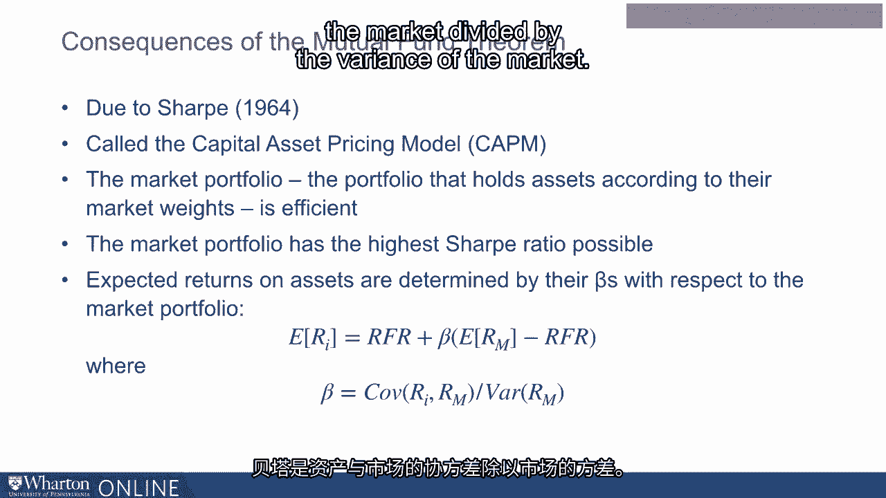

# 沃顿商学院《金融科技（加密货币／区块链／AI）｜wharton-fintech》（中英字幕） - P52：15_投资组合理论回顾.zh_en - GPT中英字幕课程资源 - BV1yj411W7Dd

 In this lecture， I'm going to review some concepts of portfolio theory。

 Specifically， we're going to talk about the portfolio theory developed by Markowitz in 1952。

 for which he was awarded the Nobel Prize。 This is still the benchmark portfolio theory used in finance and taught in finance classes。

 Now， it does require an approximation。 The approximation is that returns are normally distributed。

 In the last lecture， we talked about how cryptocurrency returns are definitely not normally distributed。

 However， the most important insight from this theory， that there are gains from diversification。

 transcends the assumption of normally distributed returns。

 It's just a little more complicated to do this theory when returns are not normally distributed。

 I will then review the main consequence of this theory， which is the capital asset pricing model。

 So both are going to be very useful in the results that follow。

 So here are the assumptions of portfolio theory。 The first is that investors prefer more to less。

 The second is that investors are risk-averse。 And finally， strictly speaking。

 we do assume the normal distribution for returns。 Now。

 what this gives us is that investors care about the mean and the standard deviation of returns。

 but they don't care about higher order moments。 So what we want to think about are the trade-offs between means and standard deviations。

 And our basic tool for thinking about this trade-off is the mean standard deviation diagram。

 So consider this diagram。 There are two assets， asset a and asset b。

 Asset a and asset b are on the same horizontal line。

 That means that they have the same expected return or the same mean return。 However。

 notice that asset a is plotted more to the left than asset b。

 That means that a has a lower standard deviation than asset b。 Now。

 we said that investors prefer more to less and are risk-averse。 So a has the same mean as b。

 but a has a lower standard deviation。 What that means is that a dominates b。

 So according to our assumptions， which is investors prefer more to less。

 they are risk-averse and we have a normal distribution。 Every investor will like a over b。

 We don't really need to know anything else about their preferences。 So we say a dominates b。

 Now consider a and c。 a and c are on the same vertical line， but on different horizontal lines。

 This means a and c have the same standard deviation， namely the same level of risk。

 but a has a higher expected return。 So a dominates c。 Again。

 we don't need to know anything about investor preferences other than what we specified to say that every investor is going to prefer a to c。

 Now let's consider a， b and c together。 So if we compare b and c。

 we will see that neither dominates the other。 Some investors will prefer b and some investors will prefer c。

 An investor who cares more about risk， so it's more risk-averse， will prefer c。

 but the problem is this investor is going to get a lower return。

 So the investor who prefers b is still risk-averse， but can tolerate more risk。

 That investor will be rewarded with a higher expected return。 Now。

 Markowitz showed that if we take all the risky assets， these lie inside of what is a sideways u。

 This sideways u is called the risky asset frontier。

 And his point is that by combining risky assets cleverly。

 you can get to the top part of the frontier。 That's called the efficient frontier。

 where you get the best trade-off between risk and return。

 So let's think about the mean standard deviation diagram。 Here we have the mean。

 and here we have sigma for the standard deviation。 So here's what Markowitz showed。

 If you take a whole bunch of risky assets， each of these dots represent a risky asset。

 So notice that they're over here， they're not over here。

 which means that the standard deviation is positive。

 They have all different standard deviations and all different means。

 Now what you can do is you can ask， what is the lowest standard deviation for any mean？

 Now if you ask that， the answer to that question traces out a curve that looks like this。

 So we can say， "Alright， here's a mean。 What's the lowest possible standard deviation？

 It's this point right here。"， Well here's a mean。 What's the lowest possible standard deviation？

 Well it's this point right here。 So this curve here is called the minimum variance frontier。

 It's like， what's a frontier？ A frontier is the furthest you could go， like the western frontier。

 space， the final frontier。 Well here， notice there's nothing beyond the minimum variance frontier。

 All the portfolios are within the frontier。 Now there's a special part of the frontier， this part。

 That's where investors want to be， right？ Because there's a higher mean given the standard deviation。

 And that part is called the efficient frontier。 Now we're still talking about the case where there's risky assets and no riskless asset。

 So what we're going to do next is see what happens when we add in something like a treasury bill represented by a point on the y-axis。

 the risk free rate。 Now let's introduce a riskless asset like a treasury bill。

 The tangency line from the riskless asset to the frontier tells you the best possible risky asset portfolio。

 So consider this following graph。 So here we see mean on the y-axis and standard deviation on the x-axis。

 We see the sideways U that represents the frontier of all the risky assets。

 So all the risky assets lie inside of the frontier。

 And the frontier represents the minimum standard deviation you can get for each mean。

 Now we put on the y-axis the risk free rate and we draw a tangency from the risk free rate to the frontier。

 That tangency hits the frontier at one point by definition and that point we're going to call it M。

 we can call it M for mutual fund。 Now notice that that line。

 the line connecting the risk free rate to M， that's tangent to the risky asset frontier。

 dominates every other point in the space。 So for every point in the space or however much risk you want。

 you want to be on that line and that is the result for which Markowitz won the Nobel Prize。

 So the tangency portfolio， the M， what's so special about it？

 Well it has the highest possible slope。 Any portfolio that has a slower slope will be suboptimal。

 namely you can get a better mean for the same level of risk by going to the tangency portfolio line。

 Now portfolios with a higher slope would be wonderful but they cannot be attained because you need some connection to the risky asset frontier。

 So this slope which is the expected return minus the risk free rate divided by the standard deviation has a name。

 It's called the sharp ratio after Bill Sharp， whom we're going to discuss in a moment。

 Now the line from the risk free rate to the tangency portfolio is called the capital allocation line。

 And just to review what makes the capital allocation line so special is it's the line that has the highest sharp ratio。

 So the consequence of this is something called the mutual fund theorem。

 And what it means is that the portfolio allocation problem can be divided into two parts。

 The first part is the same for any investor and it says you should determine the tangency portfolio。

 It's the optimal combination of risky assets。 It's the mutual fund。

 And then you determine based on how risk averse you are where you want to be on the capital allocation line。

 So if you're very risk averse you want to hold a little bit of the mutual fund and a lot of the risk free asset。

 If you're not as risk averse you might want to put all your wealth in the mutual fund then you'll be at the tangency part。

 If you're not that risk averse at all you might even want to borrow and invest the proceeds in the mutual fund。

 So that's the mutual fund theorem。 Now Bill Sharp in the 1960s realized an amazing consequence of the mutual fund theorem。

 If all investors hold the same risky asset portfolio then the market portfolio which is the weighted average of everyone's portfolio is the best possible portfolio。

 Namely the market portfolio is the tangency and the market portfolio is the efficient portfolio。

 So in other words you don't even need to do statistical analysis to find the tangency。

 You can find the tangency just by looking at the market weights of all assets relying on the wisdom of crowds to have found the tangency for you。

 So what are the consequences of this insight which is called the capital asset pricing model？

 Well the first is that the market portfolio， the portfolio that holds assets according to their market weights is an efficient portfolio。

 Namely all investors should combine the market portfolio and the risk free rate。

 The second closely related is that the market portfolio has the highest sharp ratio possible。

 Finally and not so obviously but this would be taught in a finance class。

 Expected returns on assets are determined by their betas with respect to the market portfolio and they're determined by the following equation which is called the security market line。

 The expected return on any asset is equal to the risk free rate plus the beta times the difference between the expected return on the market portfolio and the risk free rate。

 Now what's the beta？ The beta is the covariance of the asset with the market divided by the variance of the market。

 So where we are going with this is we're going to use these concepts to describe how crypto might function as part of an optimal portfolio。

 [BLANK_AUDIO]。