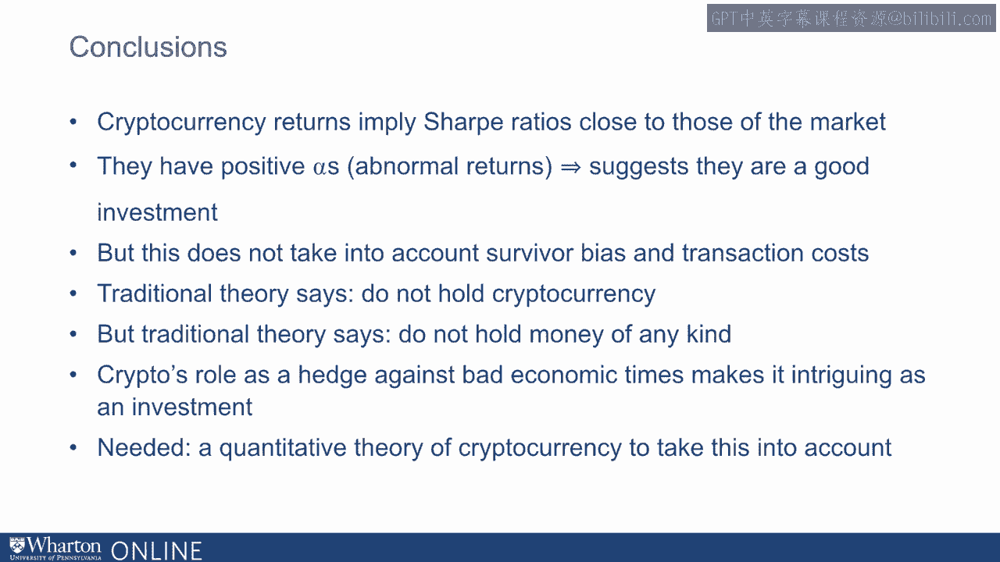

# 沃顿商学院《金融科技（加密货币／区块链／AI）｜wharton-fintech》（中英字幕） - P53：16_使用加密货币进行资产配置.zh_en - GPT中英字幕课程资源 - BV1yj411W7Dd

 So in this lecture， I will discuss how one might want to think about cryptocurrency's。

 possible place in an optimal portfolio。 So in the introduction。

 I laid out two traditional finance views。 One was more theoretical， one empirical。

 The theoretical view is very simple and corresponds to some of the quotes that I mentioned at。

 the beginning of this set of lectures。 Thus cryptocurrency has no intrinsic value and pays no dividends。

 it should not be part， of the optimal portfolio period。

 Here I'm going to develop the empirical view。 So in lecture two。

 we saw that cryptocurrency has high average returns。 However。

 we saw that the standard deviation on those returns is also very high。

 And we found that returns are positively skewed。 Now another fact about cryptocurrency is that they have relatively low betas。

 So now we're going to use these statistical results and combine them with the portfolio。

 theory to think about crypto as an asset class。 So one way to adjust for the risk of the portfolio is to use something called the sharp ratio。

 which is something that I introduced in the last lecture。 It's named for Bill Sharp。

 the Nobel Prize winning economist and inventor of the CAPM。

 Now the sharp ratio is the slope of the capital allocation line。 So what does that mean？

 Well it's the expected return minus the risk free rate divided by the standard deviation， of return。

 What it does is it tells you the extra return you receive for the asset per unit of standard。

 deviation。 So it's telling you how good is the risk return trade-off of this asset。

 So now we're going to use the statistics that I showed you last time to compute the。

 sharp ratio on the three major cryptocurrencies。 Now because these are daily returns and because the interest rate is basically zero anyway。

 we will use a risk free rate of zero。 Thus we just will compute the expected return divided by the standard deviation。

 Now recall that these returns tell you a percent gain on a strategy that exchanges dollars。

 for cryptocurrency and then converts this cryptocurrency back to dollars。

 It does assume no trading costs。 Now it's going to use average returns so on most days you will lose money perhaps even。

 if the sharp ratio is positive and then a big worry is the survivor bias。

 We are looking at the three best cryptocurrencies and just by definition they're going to represent。

 the ones that have X post the highest returns。 Okay so with all of those caveats let's look at some sharp ratios。

 So on Bitcoin the average daily return is 0。2 percent whereas the standard deviation is， 4。

3 percent giving us a daily sharp ratio on Bitcoin of 0。06。 On other the average return is about 0。

6 percent and a standard deviation of 7。2 percent giving， us a sharp ratio of 0。08。

 On Ripple the average daily return is 0。5 percent with a standard deviation of 8。8 percent giving。

 us a sharp ratio of 0。06 about the same as Bitcoin。

 Now as a comparison the sharp ratio on the S&P 500 is 0。056。

 So Bitcoin and Ripple have about the same sharp ratio as the S&P 500 and Ether has a。

 slightly higher sharp ratio。 So if we are going to base our asset allocation on the sharp ratio comparison I would say this。

 argues against investing in cryptocurrency。 So whereas it's true that these cryptocurrency returns are high if we look at the risk the。

 return per unit standard deviation is not very high。

 So once we take issues of survivor bias and trading costs into account the sharp ratio。

 analysis argues against investing in cryptocurrency。

 Now remember as we discussed in the last class we might expect based on the capital asset。

 pricing model for the market portfolio to have the highest sharp ratio anyway。

 And in fact we do see that compared to cryptocurrency the sharp ratio on the S&P 500 does not look。

 so bad。 And basically reflects the fact that the S&P 500 offers a very good risk return tradeoff。

 So if we are going to base the analysis on sharp ratio perhaps we should not invest in。

 cryptocurrency。 I would argue though that we don't want to base the analysis on the sharp ratio comparison。

 Instead we want to use another measure we should use the alpha。 What is the alpha on an asset？

 Alpha measures something called the abnormal return and to understand abnormal return we。

 need to think about the capital asset pricing model which was introduced in the last lecture。

 The capital asset pricing model is the most popular theory in financial markets。

 And what it says is that for any asset with return R the expected return on the asset。

 equals the risk free rate plus the beta multiplied by the market risk premium namely。

 the expected return on the market minus the risk free rate。

 For the risk free rate you could take the treasury bill return。

 The market is the return on the agrit stock market we can consider the S&P 500。

 And the beta is the covariance of the market with R divided by the variance of the market。

 In short the beta measures how much an asset moves when the market moves。

 Now the way we can measure the beta is by taking a scatter plot of the returns on say。

 ripple the cryptocurrency or any cryptocurrency and on the market。

 So here's a scatter plot where we have points that correspond to daily returns on the S&P。

 500 and on ripple。 Ripple returns are on the y axis S&P 500 returns are on the x axis we can see the enormous。

 one day ripple return that we discussed in lecture two。

 Based on this we can see that there really is not that much of a relation between market。

 returns and ripple returns。 Mainly it's one big cloud。 So now let's talk about the alpha。

 So the alpha is the part of the return that the capital asset pricing model does not explain。

 That's why we call it the abnormal return。 So we take the return that we would expect the return and we subtract the part of the。

 return that we would expect from the capital asset pricing model。 That's the normal return。

 Now according to the capital asset pricing model namely if the theory is true all alphas。

 should be zero。 So in any one sample we might measure a positive alpha but that should simply be statistical。

 noise or survivor bias。 So recall the traditional view that I mentioned before according to the capital asset pricing。

 model cryptocurrency has no place in the optimal portfolio。

 But let's take a purely statistical view。 These cryptocurrencies actually do have positive alphas。

 They do exhibit abnormal returns on bitcoin at 0。24% on other at 0。57% and on ripple at， 0。50%。

 So these alphas， these daily alphas are actually pretty high compared to other strategies that。

 investors pursue。 So which measure should we use？ Alpha or sharp ratio？ It makes a difference。

 Crypto looks better as an asset class if we think in terms of alpha and I would argue。

 alpha is better。 Now why is alpha better？ Recall portfolio theory。

 What portfolio theory says is that investors should seek out the highest sharp ratio。

 But the highest sharp ratio of what？ The highest sharp ratio of the total portfolio。

 The sharp ratio is an intuitive measure of the tradeoff between risk and return。

 And it's tempting to use it for any assets but it is not the most useful measure when。

 applied asset by asset because it does not take into account covariance。 Whereas alpha does。

 Crypto as we saw with the ripple plot has a low covariance with the market and that makes。

 the returns more impressive because it can be used to diversify the market portfolio。

 So in other words if we're talking about a specific asset we don't want to look at。

 the sharp ratio which is the measure for the overall portfolio。 We want to look at the alpha。

 Now these are closely related because if you have a high sharp ratio portfolio and if you。

 include an asset that has a positive alpha in that portfolio what that does is it pushes。

 the investment opportunity set outward and increases the slope as shown in this diagram。

 So in other words the two measures are linked。 What you want is the highest sharp ratio portfolio。

 How do you get there？ Well if you start with the highest sharp ratio portfolio you can find and then if you include。

 an asset that has a positive alpha what that asset does is it will make your sharp ratio。

 even higher。 So by this discussion what should happen is that if you include cryptocurrency along。

 with the S&P 500 you can actually get a higher sharp ratio portfolio by combining these cleverly。

 together。 Now caveats。 It is certainly not the purpose of this lecture to advocate for investing in cryptocurrency。

 These are just principles for how to think about the problem。 Survivor bias。

 transaction costs and mismeasurement especially due to the short sample all might。

 argue against investing and taking these expected returns seriously。

 So let's go back to this issue of covariance。 We see that the return on the top three crypto currencies has been high。

 Now this may in part reflect a resolution of the risk of these currencies so in that sense。

 they might be unlikely to be repeated。 Who knows。 But of course they're still risky so there may still be more high expected returns to。

 come。 But it's hard to measure expected returns in a small sample。

 Perhaps we've mismeasured the expected returns。 However the covariance with the market and the associated beta is less likely to be。

 mismeasured。 So the beta on crypto currencies is about 0。5。 It's not very high。

 This beta is important。 If the beta is low and 0。5 is a pretty low beta then cryptocurrency has a value as a。

 hedge。 So how can we think about this beta？ Well if we want to really get to what's driving beta we have to think about what's driving。

 the price of cryptocurrency。 So let's for a moment go with some sense a simpler and more basic benchmark theory called。

 the Gordon Growth Model。 What the Gordon Growth Model says is that if an asset pays dividends that grow every。

 year at a rate G and the expected return on the asset is R then the price of the asset。

 if we take next year's dividend D is very simple。 It's D divided by R minus G。

 This comes from an infinite series formula。 Now of course strictly speaking according to this formula crypto's price should be zero。

 all of the time because there's no dividends to cryptocurrency。

 That's the theoretical view I mentioned before。 However if Bitcoin might be useful someday as a medium of exchange then maybe we can。

 think about the dividend a little bit differently。

 The dividend reflects the convenience of exchange。 Now this is not such a crazy concept。

 For example it is typical to have a bank account even though the rate paid by a bank is often。

 below that of the treasury bill rate and the treasury bill rate itself is often below the。

 rate paid on say AAA corporate bonds which are very safe。

 So it's pretty well established empirically that there's something called a convenience。

 yield for cash like assets。 So one way to think about this dividend is it's a convenience yield should Bitcoin ever。

 become a cash like asset。 So if this is the case what does the price inform you'll tell us about the covariance。

 Well there are two offsetting effects。 On the one hand the greater economic activity the greater the demand for cash of all kinds。

 and thus the greater demand for currency。 Also both cryptocurrency and the aggregate market depend positively on technological。

 innovation。 Both of these would argue for positive covariance and high betas。

 The better the economy does the more the demand there's likely to be for cryptocurrency and。

 the more likely crypto will be used as a medium of exchange。 This should drive up the price。

 On the other hand when is it likely that cryptocurrency would become a medium of exchange。

 Related when might people really consider cryptocurrency as a store of value。

 I would argue that the times when those things might occur are likely to be times that are。

 not very good。 They might be times of disruption， times of high risk。

 times when governments are not， reliable namely bad economic times when the market is doing poorly。

 This is going to be what pushes the covariance and the beta lower。

 Thus it is likely that the beta of 0。5 reflects these two forces。

 And what it means is that cryptocurrency possibly has a role in a portfolio as a hedging security。

 Thus to conclude cryptocurrency returns imply sharp ratios close to those of the market。

 They have positive alphas of normal returns which suggest that they are good investment。

 No this is not taken to account survivor bias。 Now the traditional theory says do not hold cryptocurrency no matter what。

 It pays no dividends。 It has no role in the market portfolio。

 But traditional theory says don't hold money of any kind。

 So crypto's role as a hedge against bad economic times makes it intriguing as an investment。

 But what's needed is a quantitative theory of cryptocurrency to take this into account。

 [BLANK_AUDIO]。

