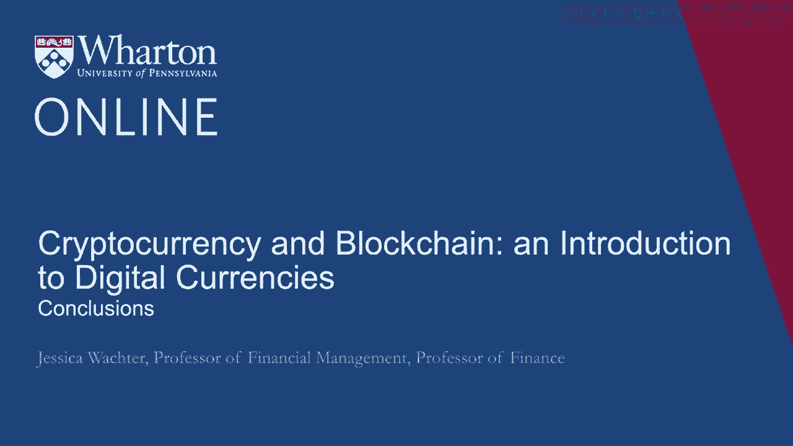
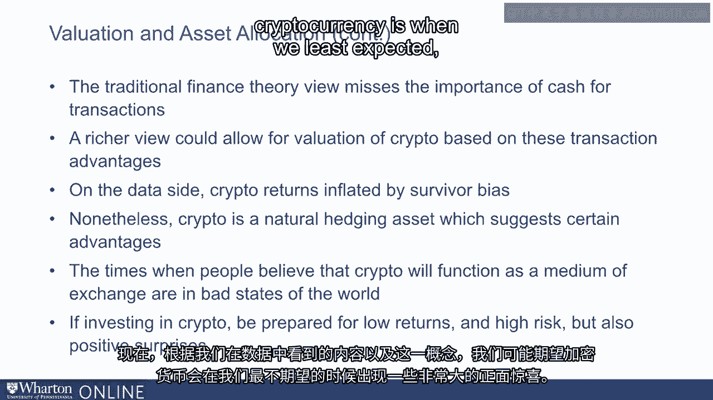

# 沃顿商学院《金融科技（加密货币／区块链／AI）｜wharton-fintech》（中英字幕） - P54：17_总结.zh_en - GPT中英字幕课程资源 - BV1yj411W7Dd

 So， to summarize， cryptocurrency is a highly controversial and very risky new asset class。

 Now， the big question that many focus on is will cryptocurrency someday function as a。

 medium of exchange？ But actually， that's not quite right。 Here's a more nuanced and correct version。

 Will enough people believe that enough people believe that enough people believe， etc。 that。

 cryptocurrency will someday function as a medium of exchange？ If this is the case。

 then beliefs can be self-fulfilling。 And without cryptocurrency ever really being a medium of exchange。

 it can function as a， store of value。 Note， however。

 that the potential for multiple equilibria can make prices unstable。

 So let's talk about why people might think cryptocurrency could be a medium of exchange。

 because that's the key to its value。 Cryptocurrency detractors focus on the disadvantages。 Namely。

 relative to fiat money， cryptocurrency has no sovereign to declare it is legal tender。 In fact。

 some sovereigns are actively hostile to crypto。 However。

 perhaps the distributed consensus that crypto brings is more trustworthy than， any single sovereign。

 That would be the advantage。 Now， what are the main advances that has made crypto possible？

 So many focus on the technological advance of blockchain。 However。

 blockchain is fundamentally an advance based on economics， not computer science。

 So the breakthrough is one of an idea。 The idea is that rather than make tampering impossible。

 create incentives so that tampering， is unprofitable。 In fact， at all levels， Bitcoin， for example。

 employs incentives so that all players work， for the good of the system。

 as we discussed in the second module。 However， I would argue that the main advance even goes beyond this fundamental change in。

 understanding。 Beyond incentives， crypto relies on probabilistic thinking。 So previously。

 the notion of transaction validity， say the non-crypto world， requires， a hundred percent certainty。

 If you make a transaction with your credit card， that transaction is verified with a。

 hundred percent certainty。 But crypto replaces this with near but not a hundred percent certainty。

 So thus， crypto creates probabilistic property rights that are decentralized。 And in some sense。

 a version of probabilistic truth。 So this requires a new way of thinking。

 So it's not as if you own something， you just own something with near certain probability。

 So it's a really， really big change in the way we think about property rights and the。

 way we might think about， say， transactions and how we interact with each other。

 Now how does this come into valuation asset allocation？ So in the third module。

 I made the point that it's easy to argue based on traditional finance。

 that the value of cryptocurrencies should be exactly zero。 They pay no dividends after all。

 and they're only cash。 And the traditional view of cash is that you should hold as little as possible just what。

 you need for transaction benefits。 So likewise， it is easy to argue based on traditional finance that there's no room at all for cryptocurrency。

 in an optimal investment portfolio。 I would say that it's a little bit too easy to argue these things。

 On the other hand， if you take the data on cryptocurrency returns at face value， they。

 look like they're a pretty good investment。 However， there are serious problems with both views。

 So the traditional finance view understates the importance of cash for transactions and。

 is a store of value。 So a rich review could allow for valuation of crypto based on transaction advantages。

 On the other data side， crypto returns we have to acknowledge are inflated by survivor， bias。

 So how can we put all of this together to build potentially a new finance view that would allow。

 for crypto？ One thing to keep in mind that's important is that crypto is a natural hedging asset that。

 suggests certain advantages。 So the times when people believe that crypto is going to function as a medium of exchange。

 are likely to not be the most stable states of the world。

 So this tells us a little bit about what we might expect from investing in crypto。 First of all。

 it's going to be very volatile because of the potential for multiple equilibria。

 We're relying on the beliefs of everybody as opposed to a stream of dividends。

 We also should think about the returns as likely to not be very high。 Even so far。

 on most days one would lose money by investing in Ether or in Ripple。 But on a deeper level。

 if cryptocurrency is a hedging assets， the returns should be low。

 So the high average returns that we've observed might be anomalous。 But that's okay。

 a hedging asset can have low returns because you are using it because。

 it pays off in not so good states of the world。 Now based on what we've seen in the data and based on this concept。

 one thing that we might， expect for cryptocurrency is when we least expect it。

 we might see some very large positive。

 surprises。 Thank you all for coming on this cryptocurrency journey with me。 [BLANK_AUDIO]。

