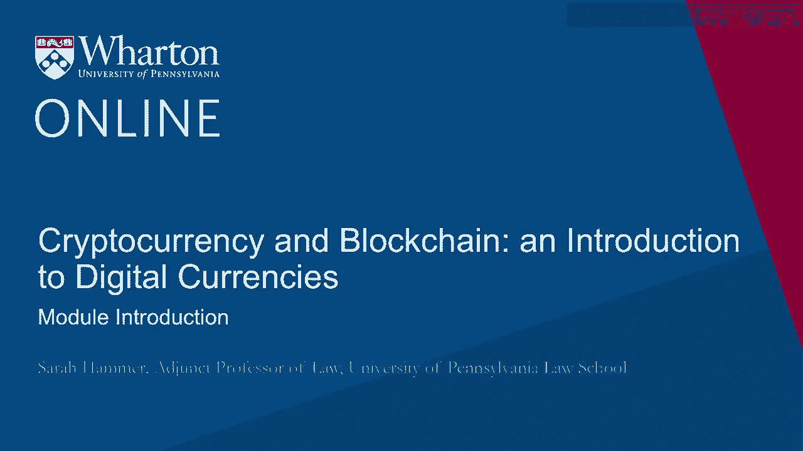
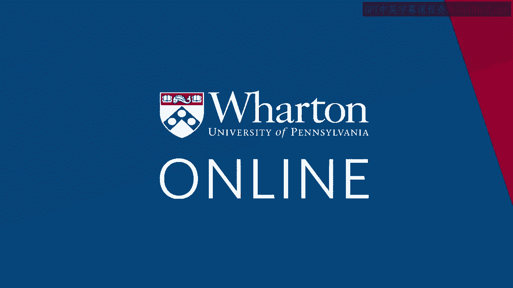

# 沃顿商学院《金融科技（加密货币／区块链／AI）｜wharton-fintech》（中英字幕） - P55：18_模块介绍.zh_en - GPT中英字幕课程资源 - BV1yj411W7Dd

 Hi， I'm Sarah Hammer， an adjunct professor of law at the University of Pennsylvania Law。

 School， also working with the Harris Program for Alternative Investments and the Stephen。

 Center for Innovation and Finance at the Wharton School at the University of Pennsylvania。

 My research focuses on financial regulation and the transformation of the financial sector。

 In this module， you will learn about blockchain technology and the blockchain ecosystem， that。

 community of developers， producers， suppliers and consumers that are changing and transforming。

 the way we do business。 [BLANK_AUDIO]。

