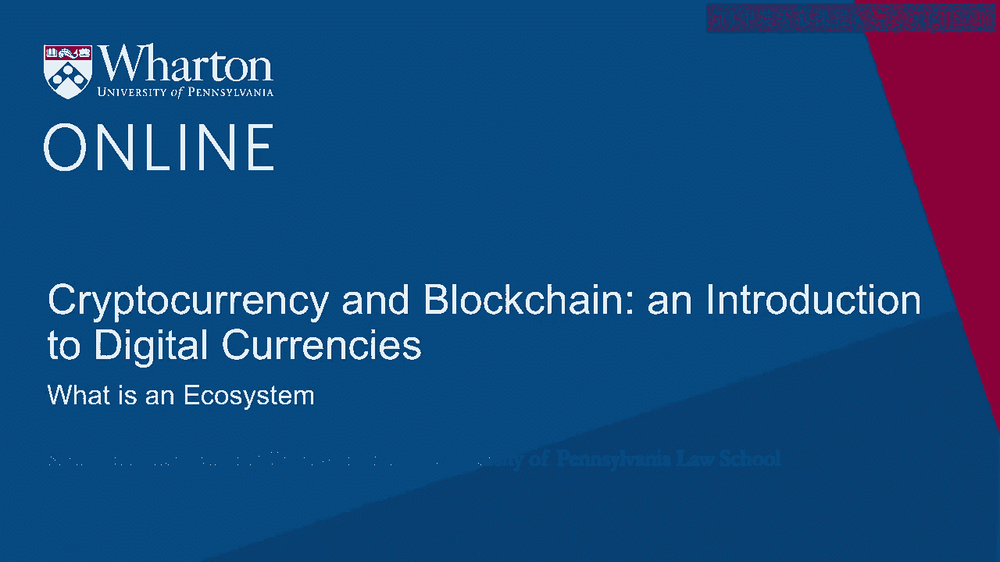
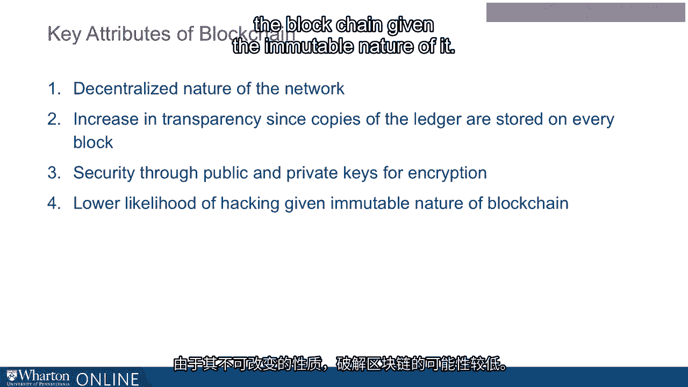
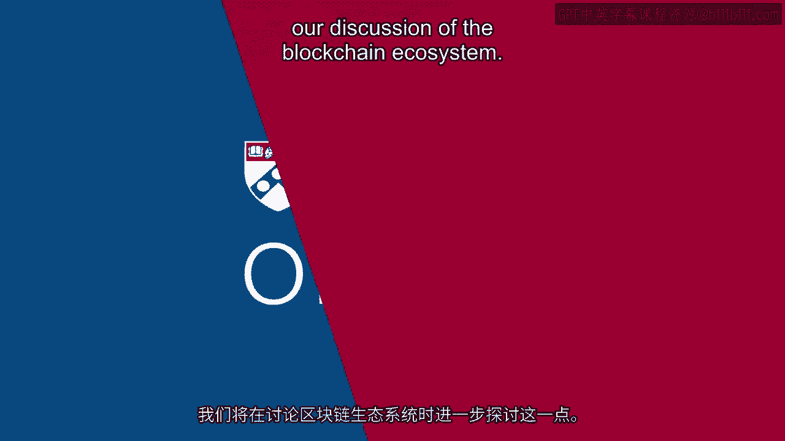

# 沃顿商学院《金融科技（加密货币／区块链／AI）｜wharton-fintech》（中英字幕） - P56：19_什么是生态系统.zh_en - GPT中英字幕课程资源 - BV1yj411W7Dd

 It's important to begin by understanding the blockchain ecosystem。

 The dynamics of the blockchain are rooted in its ecosystem。 That means the community of producers。

 suppliers， customers， stakeholders and competitors。

 But it's also important to note that many smaller ecosystems also comprise the blockchain。

 ecosystem。 In fact， many blockchain companies do not easily fit into one area of the ecosystem。

 They can， in fact， encompass more than one component of that community。

 The blockchain ecosystem is a living map that exhibits constant change。

 It's important for us to recognize that it will require our continued attention， study。

 and updating over time。 What is blockchain？ Blockchain is a technology that arose with the invention of the digital currency Bitcoin。

 in 2009。 It is a shared immutable ledger that facilitates the recording of transactions in a network。

 Blockchain provides the means for recording any transaction or track the movement of any， asset。

 not just digital currency。 The assets recorded on blockchain can be tangible， such as cash。

 gold or real estate， or they can be intangible， such as intellectual property。

 copyrights or even licenses。 Blockchain stores data in blocks that are linked together in a chain。

 hence the name， blockchain。 Thus， as the number of transactions grows， so too does the blockchain。

 Each block in the blockchain contains a hash or digital fingerprint， a time-stamped batch。

 of valid transactions， and the hash or digital fingerprint of the previous block in the chain。

 The previous block hash links the blocks together and prevents any block from being altered。

 or any change in the order of the blocks。 Blocks are added to the blockchain based on a set of rules that are agreed on by the participants。

 in that network。 As a result， each block in the blockchain strengthens the verification of the previous block。

 This very intricate structure of the blockchain results in several key attributes。 First。

 the network is decentralized， meaning it is spread across many different people， or parties。

 Secondly， blockchain results in an increase in transparency since copies of the ledger。

 or records are stored on every single block。 Security of the blockchain is considered very strong because of the use of both public。

 and private keys that are used to encrypt or secure the blockchain。

 And there's a lower likelihood of hacking the blockchain given the immutable nature of。

 it。 Because of these key attributes of the blockchain， it has a unique quality and the potential to。

 transform businesses over time。 We'll explore this further in our discussion of the blockchain ecosystem。

 [BLANK_AUDIO]。

