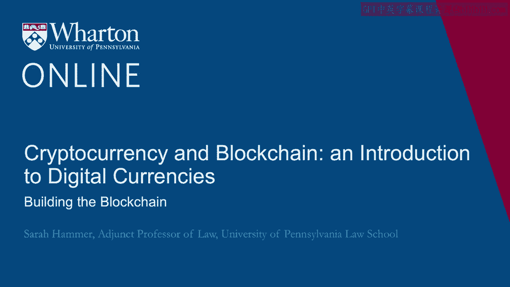
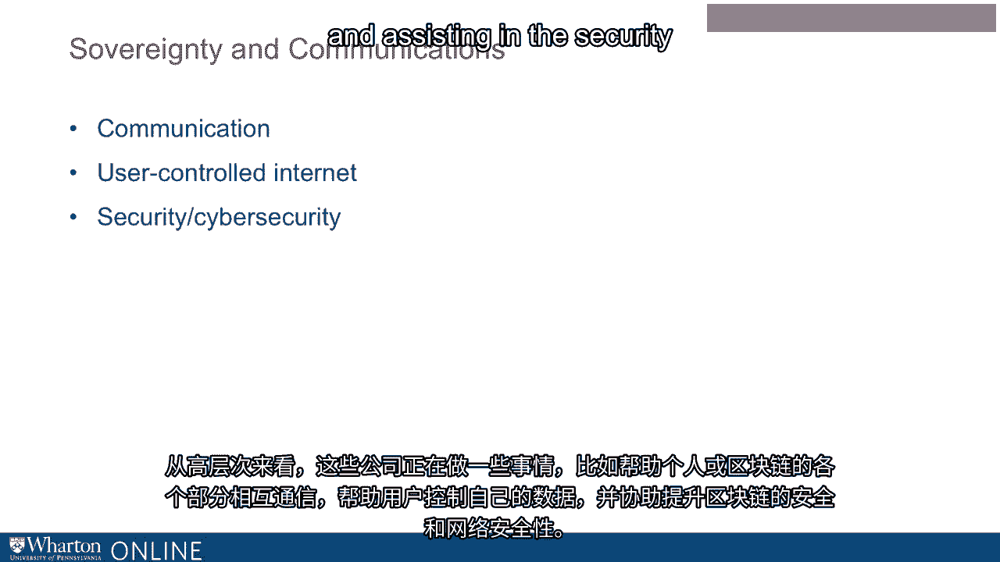
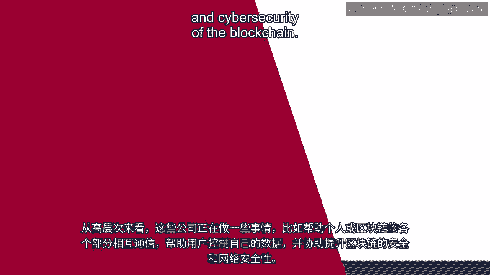

# 沃顿商学院《金融科技（加密货币／区块链／AI）｜wharton-fintech》（中英字幕） - P57：20_构建区块链.zh_en - GPT中英字幕课程资源 - BV1yj411W7Dd

 An understanding of the blockchain ecosystem begins with understanding how it is built。

 This begins with a discussion of the blockchain stack。

 The blockchain stack has projects with multiple layers of what are called protocols。

 The stack might begin with what's called a base layer followed by an application protocol。

 and then another application layer at the top of the stack。

 By replicating and storing user data across a decentralized network rather than individual。

 applications controlling access to silos of information， blockchain does two very important things。

 First， it reduces barriers to entry for those who are utilizing its benefits。 And secondly。

 it creates a potentially much more competitive ecosystem of products and services。

 Maybe you have heard about Bitcoin mining。 Bitcoin's process requires the continuous validation of new transactions and recording。

 of them on the blockchain。 This is the process that is called mining the blocks。

 Each block contains a timestamp， what's known as a "nons"， a reference to the previous。

 block and a list of all the transactions that have taken place since the previous block。 Currently。

 a new Bitcoin block is mined approximately every 10 minutes but it's important to note。

 that due to the rapid transformation of this technology， that timing will definitely change。

 To produce blocks， blockchain miners compete to solve difficult mathematical problems based。

 on what's called a cryptographic hash algorithm。 This process is called proof of work。

 Proof of work provides that the blockchain miner spends time and resources to solve a， problem。

 Once that block is solved， the transactions in it are considered confirmed。

 This is blockchain mining and there are several companies in the blockchain space that perform。

 this function。 Concerns have been expressed about the speed of this mining process in the blockchain。

 We're always looking for reduced time to process transactions。

 To address these concerns over the speed of mining， a process known as "proof of stake"。

 has been developed。 Proof of stake serves as an alternative to this proof of work process。

 Proof of stake is a process whereby the amount held in a particular cryptocurrency determines。

 the amount that can be mined by that holder of the cryptocurrency。 For example。

 if an individual holds 3% of a cryptocurrency， that individual can mine 3%。

 of the blocks in a proof of stake process。 Proof of stake is premised on the assumption that individuals with an economic stake in。

 the cryptocurrency would not want to devalue their holdings， so they will always act in。

 the best interests of the blockchain network。 In understanding the blockchain ecosystem and its development。

 it's very important to understand， a concept known as interoperability。

 Interoperability refers to standards that ensure that different blockchain implementations。

 can work with each other。 And there are many blockchain companies working in this space。 Currently。

 the only way to move value across blockchains is to move tokens into a centralized， token exchange。

 trade on the exchanges in-house records， and then withdraw the asset onto， a different blockchain。

 Interoperability standards could potentially speed up this process and drive the creation， of value。

 And mentally， there are two types of blockchain interoperability。

 The first is known as cross-chain messaging。 This process relays messages about the state of one blockchain to another blockchain。

 The second is known as cross-chain atomic swaps。 This process facilitates the exchange of tokens between users and across blockchains without。

 using a third party。 Companies are working to build bridges between blockchains and offer interoperability between。

 them。 There are many other efforts underway in the development of blockchain that are working。

 together to increase its effectiveness。 For example。

 scalability efforts led by blockchain companies are underway to increase the number。

 of transactions that can be processed in a period of time。

 Forks or changes in the procedures and processes of a blockchain and improvements to the efficiency。

 of how blockchains work。 These efforts combined together comprise an important part of the development of the。

 blockchain ecosystem。 In examining the blockchain ecosystem and its development。

 there are two very important， things that we should also talk about。 Smart contracts and oracles。

 Maybe you've heard of a smart contract。 A smart contract is actually a set of digital promises。

 including protocols within which the， parties perform on the promises of the contract。

 In other words， a smart contract is a computer algorithm which performs the contract。

 Smart contracts can be written to be executed both on and off of a blockchain。

 An oracle is an agent that finds and verifies real-world occurrences and submits the information。

 to a blockchain to be used by the smart contracts。 Essentially。

 an oracle is a data feed provided by a third-party data service。 There are many types of oracles。

 software oracles， hardware， inbound data， outbound， and consensus。

 based where multiple parties would have to agree in order to verify a real-world occurrence。

 Together， smart contracts and oracles comprise an exciting and dynamic part of the blockchain。

 ecosystem because working together they can help propel other parts of the development。

 of the blockchain ecosystem and businesses that operate using it。

 Several other types of companies are very important to the development of the blockchain， ecosystem。

 Among them are blockchain security， legal and audit， and privacy。 Blockchain security。

 It's important to understand the elements that make blockchain tamper-proof。

 We discussed them earlier。 First， the cryptographic fingerprint that's unique to each block known as the hash which。

 proves that the blockchain miner did the computational work to add the block to the chain。

 A second element also makes the blockchain tamper-proof。

 A consensus protocol which is the process by which the parts of the network agree on。

 the shared history。 Because of this process， in order to change an entry in the distributed ledger retroactively。

 a new hash would have to be created not only for the block that it's currently in but for。

 every subsequent block。 There are companies in the blockchain ecosystem that help ensure this process。

 Blockchain security companies。 Blockchain security companies conduct security audits of decentralized applications。

 For example， they might review a system's architecture and code and then provide a report。

 on action items for the issues that are discovered。

 Blockchain legal and audit companies also comprise an important part of its development。

 They audit the compliance of a company's use of the blockchain。

 Privacy is also an important consideration in the development of the blockchain。

 When privacy companies are distributed data privacy platforms， how do they work？

 If an individual stores data on the blockchain， encrypted with their own public key， they。

 can actually delegate access to another individual using a privacy company。

 That data is then re-keyed to the second individual's key in storage who can download。

 the data and decrypt it。 The development of the blockchain also includes several other types of companies that work。

 in the space of sovereignty and communications。 At a high level。

 these companies are doing things such as helping individuals or parts。

 of the blockchain communicate with each other， helping users control their own data， and。

 assisting in the security and cybersecurity of the blockchain。 [BLANK_AUDIO]。

