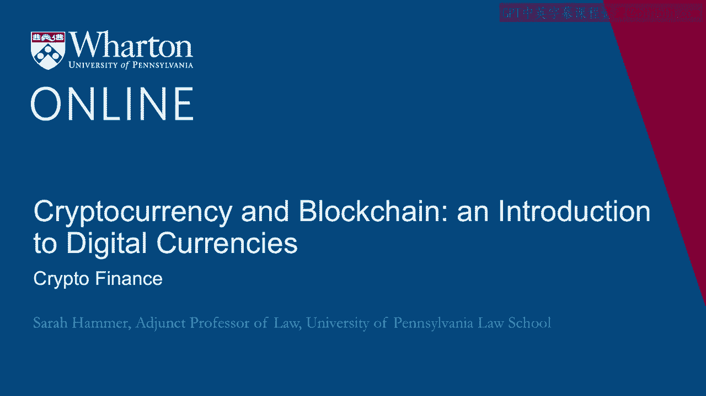
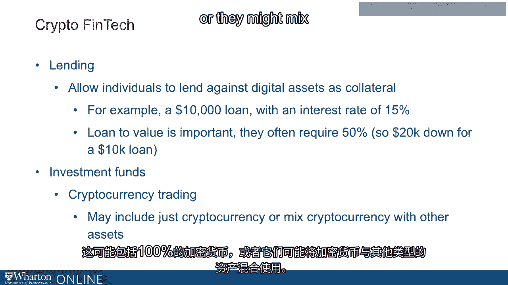

# 沃顿商学院《金融科技（加密货币／区块链／AI）｜wharton-fintech》（中英字幕） - P58：21_加密金融.zh_en - GPT中英字幕课程资源 - BV1yj411W7Dd

 If one were to picture the blockchain ecosystem， the next layer surrounding its development。

 would be crypto finance。 Crypto finance is a dynamic and developing area of the blockchain ecosystem that touches。

 all aspects of the businesses that operate within and around the blockchain。

 Crypto finance includes payments， privacy， wallets， exchanges， and other components。

 known as stablecoins， different types of storage， and merchants that use the cryptocurrency。

 to operate their businesses。 Cryptocurrency payments are an important part of crypto finance。

 Recall that the blockchain allows us to store and transfer value。

 Cryptocurrency payments allow us to manage the ownership and transfer of cryptocurrencies。

 These payments companies that work in the crypto space， effectuate real-time， non-cash。

 payments between entities。 blockchain technology is particularly attractive for this process because it is decentralized。

 and unlike other payments systems， avoids what's known as a single point of failure。

 Cryptocurrency payments eliminate the role of third parties and delays。

 Cryptocurrency privacy companies are another important part of crypto finance。

 These privacy companies create privacy by obscuring the identity of the sender of a， payment。

 They use what are known as ring signatures or digital signatures that can be performed。

 by any member of a group。 As a result， the transactions on cryptocurrency cannot be linked to a specific real identity。

 When most people think of money， they think of their wallet， which they use to keep it， safe。

 There are wallets in the cryptocurrency world as well， but they're very different。

 Within crypto finance， a cryptocurrency wallet serves an important function。

 A soft wallet is one of these items。 A soft wallet is actually a pseudonym。

 meaning nothing is in a physical wallet。 It is in fact a software program that stores the public and private keys。

 A soft wallet interacts with the blockchain to enable the holder to send and receive digital。

 currency。 A soft wallet can support a single currency or multiple currencies。

 Another important part of crypto finance is the exchange。

 Cryptocurrency exchanges are online trading platforms。

 They facilitate the exchange of a cryptocurrency for a fiat currency or a government-backed。

 currency。 Similar to a traditional stock exchange where buyers and sellers trade based on the current。

 marketplace， cryptocurrency exchanges perform the same function。

 It's important to remember that the security of a cryptocurrency exchange is vital。 In addition。

 the liquidity of the exchange is crucial。 The more transactions are performed on an exchange。

 the better。 Another important dynamic within the cryptocurrency finance world is stablecoins。

 A stablecoin is a cryptocurrency with price stable characteristics。

 The stablecoin is pegged to something else， like the US dollar。

 But it can also be linked to a basket of currencies or even an index like the consumer。

 price index in the United States。 Stablecoins are important because they can potentially avoid the price volatility that。

 many cryptocurrencies experience。 In addition to software wallets。

 blockchain also includes hardware wallets。 Again， these are very unlike the traditional wallet that we all use to carry our cash。

 Hardware wallets are physical devices that store private keys in a protected area within。

 an actual hardware device。 They are similar in some ways to a paper wallet。

 but they are intended to reduce incidents of， large-scale vulnerabilities and access to the private key。

 In addition， many hardware wallets provide some resistance to computer viruses。

 Within the blockchain ecosystem and crypto finance， the blockchain merchant is a last but。

 very important part of the ecosystem。 What is a blockchain merchant？

 A blockchain merchant is simply a merchant that accepts bitcoin or another cryptocurrency。

 as payment。 In fact， you may have noticed that now there are many blockchain merchants and many major。

 retailers now accept cryptocurrency。 Again， in thinking about the blockchain ecosystem。

 when we go beyond the base layer of development， the next important level is crypto finance and crypto FinTech。

 When we say crypto FinTech， we mean businesses that focus on the leveraging and use of crypto。

 assets。 We talked previously about trading。 These platforms for exchanging cryptocurrencies are also an important part of crypto FinTech。

 In addition， insurance companies operate in the crypto FinTech space。

 These businesses ensure against the theft of digital assets。

 But one of the challenges of operating in this space is that they don't actually know。

 much about their customers。 There's little data in this space as compared to traditional insurance。

 so it's much harder， for insurance companies ensuring against the theft of digital assets to do calculations。

 important to their businesses。 Thus， crypto insurance companies spend a lot of time scrutinizing the security and storage。

 procedures for digital assets。 And the types of coverage that they provide varies greatly。

 For example， they may ensure for theft of payments， but they may not cover issues of hacking。

 Crypto lending is another important and growing area of crypto FinTech。

 Crypto lenders allow individuals to lend against their digital assets as collateral。 For example。

 if one wanted to take out a $10，000 loan， they might pay an interest rate， for， example 15%。

 But in the crypto space， the ratio of assets to the loan is very important。

 These companies have to require a high amount of assets in order to make the loan。 Maybe 50%。

 So for example， for a $10，000 loan， $20，000 worth of digital assets might be required as。

 collateral。 Finally， an important area of crypto FinTech is investment。

 Crypto investment funds undertake cryptocurrency trading。

 This may include 100% cryptocurrency or they might mix cryptocurrency with other types of。

 assets。 These investment funds operate in a very diverse arena and continue to grow and change in their。

 dynamic over time。 [BLANK_AUDIO]。

