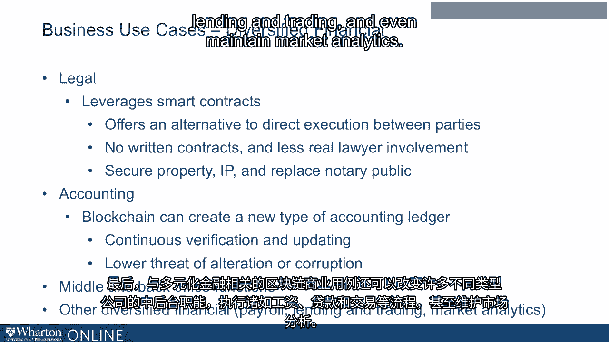

# 沃顿商学院《金融科技（加密货币／区块链／AI）｜wharton-fintech》（中英字幕） - P59：22_业务用例.zh_en - GPT中英字幕课程资源 - BV1yj411W7Dd

 In understanding the blockchain ecosystem， another very important component of that ecosystem。

 is the business use case。 Beyond development and finance， there are many。

 many business use cases for blockchain， technology。 Today。

 we're going to talk about just a few of them。 We divide the business use cases of the ecosystem into four different categories。

 value exchange， share data， authenticity， and diversifying financial。

 Value exchange is an important business use case for blockchain technology。 In of value exchange。

 the content industry is the one that is most primed for disruption。

 The content industry hasn't changed much over time。 It is very extensive and largely offline。

 Content involves creators， distributors， and many different formats， for example， content。

 on your mobile phone， television， cable TV， and movies。 Consumers of content are global。

 not just local， and the costs of distributing content， are very high。 In addition。

 the rights to content can be tied up for long periods of time。

 Blockchain offers a potential solution to improve the world of content。

 Blockchain can move more marketplaces onto a distributed ledger and derive content trading。

 between the producers and the buyers of content。 Blockchain facilitates the funding of creative ideas as well and potentially offers increased。

 transparency in the sharing of the rights of content。

 A second business use case for blockchain in the value exchange sphere is the marketplace。

 Blockchain marketplaces offer exchange of goods， services， and even jobs。 Currently。

 these types of marketplaces face challenges over trust， who is offering the， goods services or job。

 and who is operating the marketplace itself。 Blockchain technology offers a potential solution。

 It allows buyers and sellers to transfer their reputation from one marketplace to another。

 using the distributed ledger。 Another very significant business use case for blockchain in value exchange is energy。

 Blockchain energy companies are decentralized energy data exchange platforms。 In other words。

 they focus on data related to energy。 This may include， for example。

 what's known as smart grid management or managing energy。

 information through a highly technologized smart grid。

 These companies provide data transparency and integrity solutions to the use of energy。 In addition。

 blockchain energy companies can potentially enable the forecasting for these。

 smart grids and provide for trading and investment in the energy space。

 A second major component of blockchain business use cases is shared data。

 Some specific areas within shared data include Internet of Things， Supply Chain， or Logistics。

 What's known as attribution for collaboration， reputation systems， and the management of。

 healthcare information。 Internet of Things refers to how the myriad of devices that we have today leverage the。

 use of data and the Internet to help us get things done more quickly and effectively。

 The business use case of shared data focuses on the Internet of Things and combines it with。

 the use of blockchain technology。 Here， blockchain can potentially create secure and optimized IoT applications。

 These companies leverage blockchain to change how our devices， such as mobile phones， communicate。

 with each other。 Today， both new and existing companies operate within this area of the blockchain ecosystem。

 to focus on Internet of Things。 Another business use case for the blockchain in the shared data space is in the supply。

 chain and logistics world。 This area is ripe for disruption by blockchain technology。

 Think of how supply chain works today。 Today， the supply chain for any one product that you may buy can span hundreds of different。

 stages。 Multiple geographies as products move across the country and even around the world。

 Invoices for different components of production and payments from many different entities take。

 place。 Thousands of individuals may be involved and the whole process is very non-transparent。

 The use of blockchain technology can transform supply chain。 Here。

 every transaction in the supply chain can be recorded on a block and distributed。

 across many different nodes。 Blockchain can increase transparency and security of this process and importantly。

 it， is both efficient and scalable。 Examples of the types of supply chain or logistics processes that can benefit from the use of。

 blockchain technology include the production of cars， the production and distribution of。

 food and even the distribution and sale of diamonds。

 Another exciting and important business use case for blockchain in the shared data space。

 is known as attribution for collaboration。 This sounds complicated but it simply refers to things like music or writing and having。

 multiple entities work together to collaborate on a project。 Using blockchain。

 artists can generate immutable and time-stamped titles。

 We can register assets to a blockchain network and verify and authorize content。

 Blockchain can also be used to create terms for licensing thus transforming the way we。

 work together to create songs or scripts。 Another interesting and exciting area of blockchain is the reputation system。

 Reputation systems are another great example of the use of shared data as a business use， case。

 Reputation systems address a risk known as counterparty risk。 For example。

 if I'm conducting a transaction with someone else， I face the risk that that。

 person won't fulfill their obligations under that transaction。 That is counterparty risk。

 So for example， if we're lending money to one another， we face the risk that party A。

 might not lend the money or party B might not pay it back。

 The blockchain can be used to create a reputation system that encourages and rewards accurate。

 information about those parties。 Together， that data can be used to create what's known as a reputation score。

 Today， companies are using the blockchain to create these reputation systems and leverage。

 them within their business community。 Another very exciting potential use for the blockchain within the shared data space is。

 healthcare information。 Healthcare information is another area that is ripe for disruption。 Today。

 healthcare data is highly fragmented in the United States。 Our data spans across multiple entities。

 hospitals， clinics， insurance providers， and it can be。

 difficult to both gather and provide that information where it's necessary。

 Companies are working to use the blockchain to allow individuals to own and control their。

 own healthcare information。 Using blockchain technology。

 patients can potentially decide who would get access to， their information in a secure fashion。

 For example， the data on the blockchain could be used by patients to be sold to a drug。

 tile of their choice。 In this way， the blockchain can be used to transform the way we control and distribute。

 our healthcare information。 Another very exciting area of business use cases is known as authenticity。

 Integrity within the blockchain ecosystem refers to the integrity and validation of， data。

 Within authenticity， data and title is one very important business use case。 An example。

 real estate。 Currently， we face problems with the data and storage of real estate information。

 For example， title is stored on paper， sometimes in a town or county hall， and it can take， days。

 even weeks， to trace the use of a title over time。

 Blockchain can be used to facilitate the storage and the validation of this data。 In addition。

 in a real estate transaction， blockchain can be leveraged to secure the integrity。

 of the customer or the buyer of an asset。 Blockchain can also be used to create an audit trail for certain business processes or create。

 proof of an event or a transaction。 Another very exciting potential use case for blockchain in the authenticity space relates。

 to ticketing。 Today in the world of ticketing for concerts or events。

 there can be problems related to， counterfeit tickets。 Blockchain offers a potential solution。

 For example， using blockchain technology， we can facilitate the transfer of ownership。

 of a ticket from one entity or individual to another。 In fact。

 tickets can be created and validated on the blockchain itself and blockchain registration。

 can potentially prohibit fraud in this process。 Another very significant business use case for blockchain is in the diversified financial。

 space。 Here we're referring to blockchain companies within the ecosystem that perform services。

 related to legal， accounting， middle and back office， and other types of diversified financial。

 services。 The number of companies are growing in the legal space in business use cases。

 These blockchain companies leverage smart contracts to execute between parties。

 This offers an alternative to direct execution of paper contracts between parties or entities。

 And it can mean less involvement by actual lawyers。 In this space。

 the blockchain or smart contracts can be used to secure property， intellectual， property。

 and even replace a notary public。 Another very exciting business use case for blockchain is in the world of accounting。

 Blockchain can be used to transform accounting itself because the technology can constitute。

 a new type of accounting ledger。 This ledger can result in continuous verification and updating unlike current。

 paper heavy， labor， intensive processes。 In addition。

 because of the secure and immutable nature of blockchain technology， there may。

 be a lower threat of alteration or corruption of accounting records。 Finally。

 the blockchain business use cases related to diversified financial can also。

 transform middle and back office functions of many different types of companies and conduct。

 processes such as payroll， lending and trading， and even maintain market analytics。

 Thank you。

 Thanks for watching。 I appreciate it。 Thank you。 Thank you。

