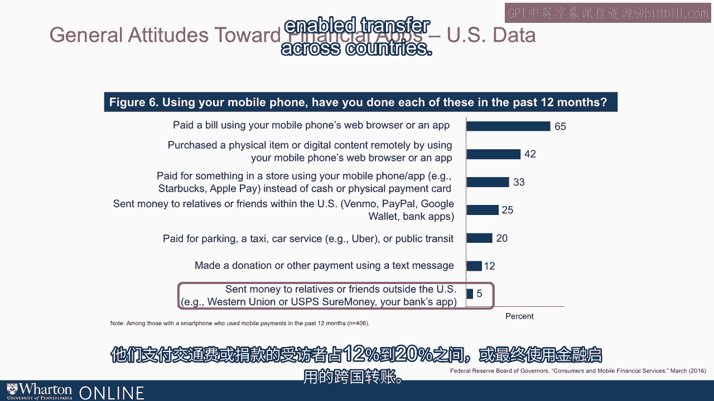

# 沃顿商学院《金融科技（加密货币／区块链／AI）｜wharton-fintech》（中英字幕） - P5：4_对金融应用的态度.zh_en - GPT中英字幕课程资源 - BV1yj411W7Dd

 It's interesting to trace where the demand is coming from。

 And of course， it's a bit of a challenge to see because we only see the intersection of。

 supply and demand。 However， because the supply of technology is motivating and enabling FinTech。

 the demand， side turns out to be key。 Having something new enabled by technology so that it's a better experience。

 it happens， more accurately。 It happens with greater scale。 It happens less expensively。

 It opens new markets， including not just among the wealthy in the United States， but all the。

 way down to the base of the pyramid in wealth distribution around the world。

 Really once again brings us back to what are attitudes。

 There are a lot of ways to look at attitudes toward adoption of FinTech。

 A recent Federal Reserve Board of Governors report on consumer and mobile financial services。

 was telling。 In the survey， something like this is for U。S。 respondents， over the last 12 months。

 65， percent of those surveyed in the United States paid a bill using a mobile phone or mobile。

 phone web browser。 So an app on a mobile phone or its web browser。

 Over 40 percent purchase an actual physical item using a browser。

 They paid for something in a store using a mobile phone。

 They were involved in remittances using FinTech companies like Venmo or PayPal or so on or。

 just commercial banking apps。 25 percent of respondents did。

 They paid for transportation or made a donation。 Between 12 and 20 percent did those or ultimately used financially enabled transfer across countries。

 Use of a mobile phone over just that recent 12 month period found that huge proportions。

 of respondents felt comfortable sending or interacting or allocating money using their， phones。

 As you'll see in just a bit， the adoption of these attitudes and the activities that。

 are involved has rapidly developed in just the last five years。 。 [BLANK_AUDIO]。

