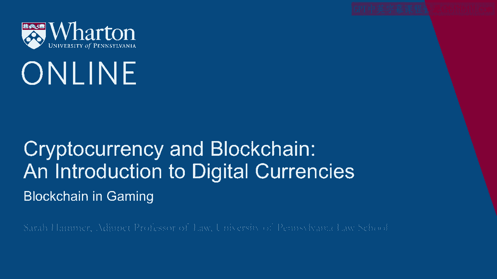
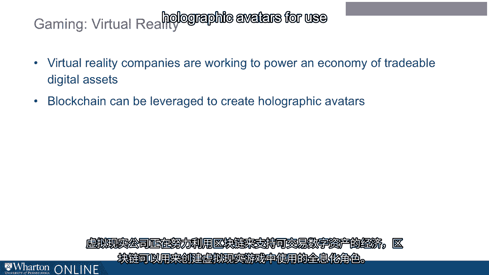

# 沃顿商学院《金融科技（加密货币／区块链／AI）｜wharton-fintech》（中英字幕） - P60：23_区块链游戏.zh_en - GPT中英字幕课程资源 - BV1yj411W7Dd

 [ Silence ]。

 >> Within the blockchain ecosystem， gaming is a very significant。

 and growing portion of the business。 Gaming and esports is a really important potential application。

 for blockchain technology。 In fact， gaming companies have been creating digital assets。

 for a very long time。 So one could argue that blockchain is just a natural step， in their evolution。

 Using blockchain， gamers can create their own virtual characters， profiles， items。

 or resources for use within the game。 This can transform the user experience。 In addition。

 blockchain and tokens give users a new way， to monetize as they play games。

 Players can also buy digital assets to use across games， using cryptocurrency。

 Within the gaming space of the blockchain ecosystem。

 gambling and prediction markets is another potentially， significant application。

 Blockchain casinos exist that allow anyone， to become a member of their casino。 Here。

 the users can potentially share funding of the casino， and shares of profits。 In fact。

 some blockchain companies even use oracles or predictors。

 to create what's known as a prediction market， about the outcome of an event。

 A final and very interesting potential application。

 for blockchain in the gaming world is in virtual reality。

 Virtual reality companies are working to use blockchain。

 to power an economy of tradable digital assets。 And blockchain can be leveraged to create holographic avatars。

 for use within the virtual reality game。 [BLANK_AUDIO]。

