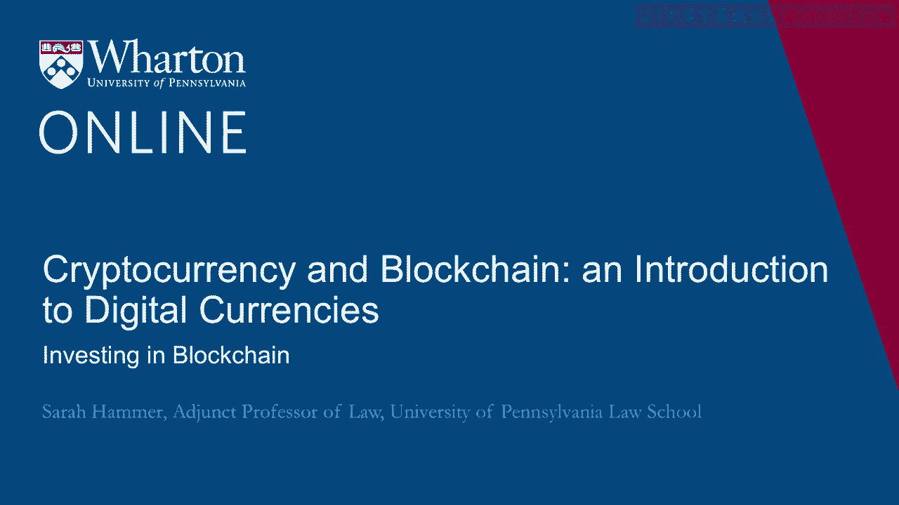
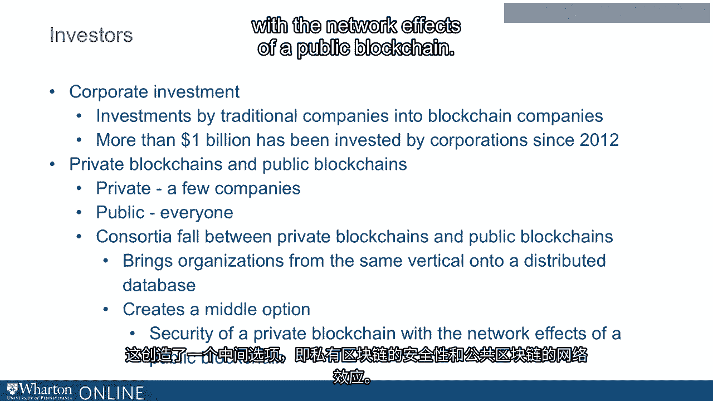

# 沃顿商学院《金融科技（加密货币／区块链／AI）｜wharton-fintech》（中英字幕） - P61：24_区块链投资.zh_en - GPT中英字幕课程资源 - BV1yj411W7Dd

 To recap， the blockchain ecosystem is a living， dynamic， ever-changing ecosystem， with many。

 different stakeholders。 To mention a few of them， we would include investors。

 the government and regulation， and media and advocates。 No ecosystem can exist without resources。

 and those are the investors that pour their resources。

 into different components of the blockchain community。 In addition。

 the government sets rules and regulations around the development and use。

 of blockchain technology and by different businesses。 And finally。

 the media and advocates in Washington DC and elsewhere have been important sources。

 of information and influence as the blockchain ecosystem develops。

 Investment in the blockchain is organic， spanning across multiple types of investors。

 These investments can come in many different forms， for example， Initial Coin Offerings， or ICOs。

 Venture capitalists are business people who have been pouring resources into the development。

 and use of the blockchain。 Corporations also serve as investors in this space。

 both for their own businesses and in， new businesses。

 And consortia of many different types also put resources into different components of the。

 blockchain business ecosystem。 In thinking about investment in the blockchain。

 it's important to talk about ICOs or Initial， Coin Offerings。

 An initial coin offering is simply a fundraising mechanism for new types of projects。

 Cryptocurrencies are sold in ICOs in the form of coins or tokens。

 These coins or tokens are sold to investors in exchange for some item or even another token。

 Today ICOs may serve as an important source of resources for the development of the blockchain。

 Venture capitalists have long served as important sources of resources for new businesses。

 The same is true for the blockchain。 Today， Venture Capital provides active investment in many different blockchain companies。

 Here， Venture capitalists support and incubate or grow new businesses。 In fact。

 there are many different ways that Venture capitalists can invest in blockchain。 For example。

 they could invest directly into Initial Coin Offerings。

 They may invest in cryptocurrency companies such as token exchanges。

 There are many Venture Capital companies that are exploring blockchain payments or Venture。

 capitalists may explore investments in other use cases for blockchain， many of which we've。

 talked about today。 Finally， Venture capitalists in private companies are building enterprise blockchain solutions。

 that can span across companies and leverage the use of blockchain technology。

 As the blockchain ecosystem grows and develops， we note that it affects not only new companies。

 but also existing companies， many of which are large corporations or even the Fortune 500。 Today。

 corporate investment in the blockchain is an important source of resources for development。

 Blockchain investments are investments by traditional companies into blockchain companies。

 Since 2012， more than $1 billion has been invested by corporations into blockchain technology。

 and that number is growing rapidly。 It's important to mention that there are different types of blockchains。

 private and， public。 Due to the nature of the technology and its distributed element。

 there are private， blockchains that are available to just a few companies or a group of companies rather than。

 to everyone。 Today， consortia or sources of investment that can fall between private and public blockchains。

 Today， investments from consortia into the blockchain bring organizations from the same。

 vertical onto a distributed database。 This creates a middle option。

 the security of a private blockchain with the network effects。

 of a public blockchain。 Thank you。 [BLANK_AUDIO]。

