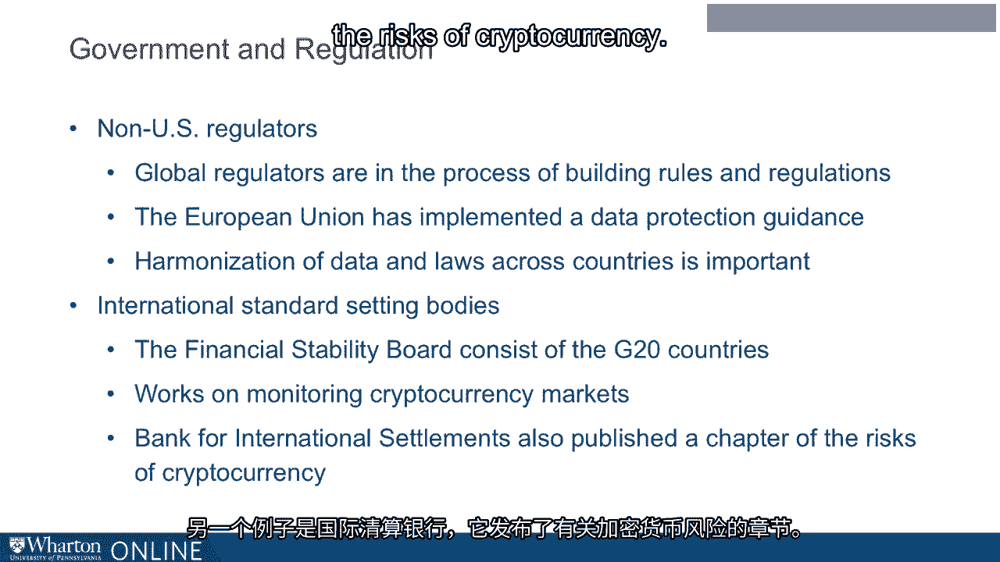

# 沃顿商学院《金融科技（加密货币／区块链／AI）｜wharton-fintech》（中英字幕） - P62：25_政府和监管.zh_en - GPT中英字幕课程资源 - BV1yj411W7Dd

 Over time， many industries and their ecosystems have been significantly affected by the role。

 of regulation。 The same is true in the blockchain ecosystem。

 Government and regulators play a very important role in the development and application of。

 this technology。 These regulators and entities include the Securities Exchange Commission。

 the Commodity， Futures Trading Commission， what's known as FinCEN and TFI。

 the Internal Revenue Service， and both state and international bodies。

 The Securities Exchange Commission has and continues to play a very significant role in。

 the development of blockchain and its application。

 The SEC governs the Offer and Sale of Securities as set forth in what's known as the Securities。

 Act of 1933。 Essentially， the SEC seeks to reduce risk to investors from poor or inadequate or even。

 false information。 Today， the SEC is very active in the blockchain space and has issued a number of reports and。

 guidances about the issue and sale of tokens。 The SEC also uses a test known as the Howie Test。

 which relates to whether or not something， is a security。 Moreover。

 because blockchain technology spans not only the financial services industry but。

 multiple industries and companies both in the US and globally， the use and leverage of。

 the SEC's cyber unit has become increasingly important when thinking about the application。

 of blockchain。 A second very important federal markets regulator is the Commodity Futures Trading Commission。

 for the CFTC。 The CFTC is charged with establishing a regulatory environment for investors and market participants。

 and there are very specific rules that separate the regulation of the SEC from the regulation。

 of the CFTC。 In 2014， the CFTC declared cryptocurrencies to be a commodity and thus subject to the oversight。

 of the CFTC。 The CFTC has within its purview the registration of futures exchanges。

 which is also important， to the use of blockchain technology and the trading of cryptocurrency。

 Finally， the CFTC has set forth an approach to responsible regulation and the promotion。

 of innovation to encourage the responsible and positive development of this technology。

 In understanding the rules and regulations related to blockchain and cryptocurrency。

 it's very important to recognize the role of what's known as FinCEN and TFI。

 FinCEN refers to the Financial Crimes Enforcement Network and TFI refers to the Office of Terrorism。

 and Financial Intelligence。 Both of these offices relate to and enforce the Bank Secrecy Act。 Thus。

 virtual currency exchanges and administrators may be subject to the rules and regulations。

 of the BSA， the Bank Secrecy Act。 Ultimately， what this means is that some of these businesses may have to register with。

 FinCEN as a money service business and be subject to its oversight。 Importantly。

 the IRS or the Internal Revenue Service also plays a role in the regulation， of the blockchain。

 As you know， the IRS collects and manages the revenue of the United States。 In the blockchain space。

 the IRS sets forth the principles that apply to transactions， using virtual currency。 In fact。

 it's possible that the IRS may treat virtual currency as property and therefore。

 it would be subject to tax principles that also apply to real property。

 As the blockchain ecosystem develops， state governments have increasingly taken note and。

 had the desire to play a role in its development。 State governments in fact recognize the potentially transformative power of blockchain and thus。

 they're involved not only in regulation but also in the promotion of innovation。

 Some states such as Delaware or Illinois or Wyoming have launched blockchain initiatives。

 designed to promote and enhance the development of this technology and its application to， business。

 Other states such as New York have specific laws that may apply if the blockchain company。

 is located within that state。 In the blockchain stakeholder space。

 two more entities are important globally in government， and regulation。 First。

 non-US regulators play an important role。 Secondly。

 international standard setting bodies which don't have the force of law but。

 do have the force of consensus。 Also， are very significantly involved in the development of standards related to this technology。

 Global regulators are in the process of building rules and regulations that relate to the application。

 of blockchain and the trading of cryptocurrency。 An example of this is the European Union which has implemented a data protection guidance。

 that touches on many different aspects of blockchain business。 As this dynamic progresses。

 the harmonization of data and laws across countries will be。

 important to the innovation of blockchain technology。

 Global standard setting bodies are also important in the development of blockchain。

 While these standard setting bodies do not have the force of law， they often have consensus。

 and therefore the countries that are involved in them take the standards and apply them within。

 their own jurisdictions。 For example， the Financial Stability Board consists of the G20 countries and is currently。

 working on monitoring cryptocurrency markets。 Another example is the BIS or Bank for International Settlements which has published a chapter on。

 the risks of cryptocurrency。

 Make no mistake as blockchain technology and its ecosystem continue to develop， international。

 standard setting bodies will continue to play an important role by studying， issuing guidance。

 and recommendations and playing a role on the country level as this technology continues。

 to develop and transform business。 [BLANK_AUDIO]。

