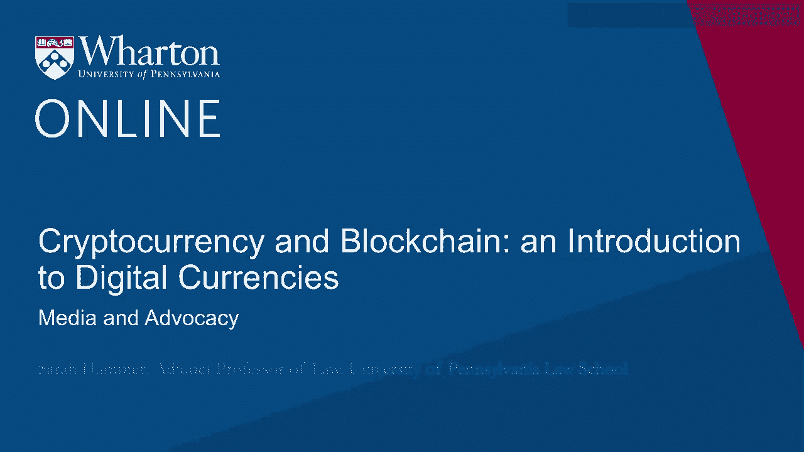
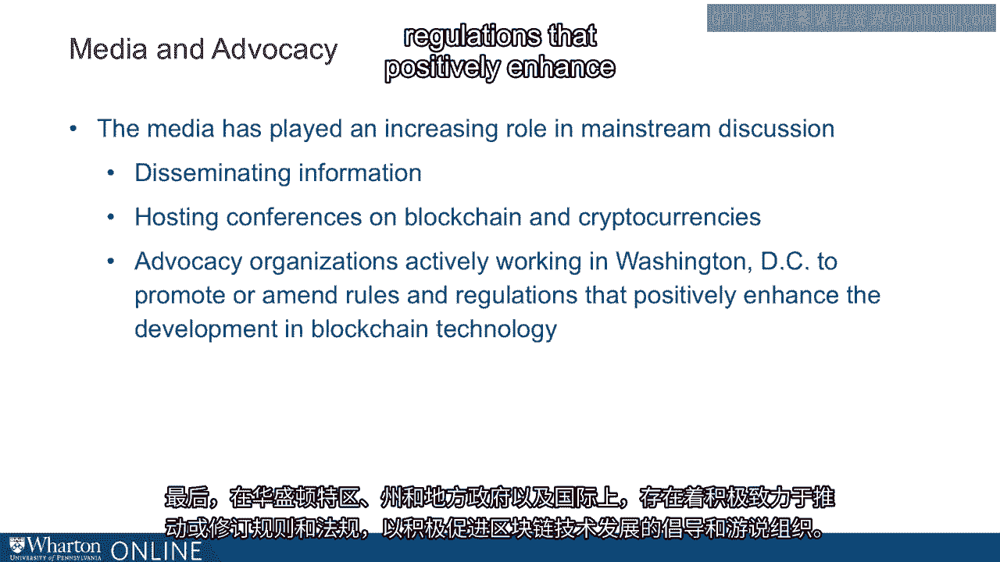
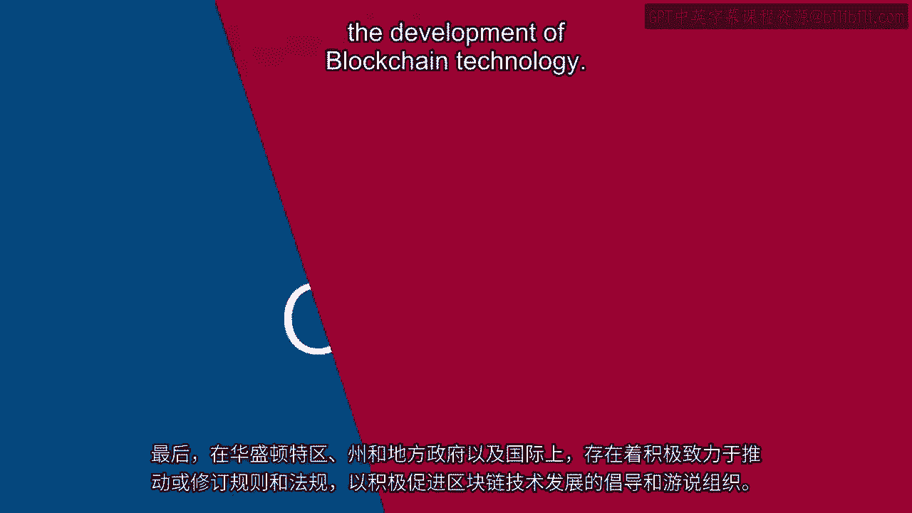

# 沃顿商学院《金融科技（加密货币／区块链／AI）｜wharton-fintech》（中英字幕） - P63：26_媒体和宣传.zh_en - GPT中英字幕课程资源 - BV1yj411W7Dd

 Media and advocacy also play an important role in the blockchain ecosystem through the development。

 and the dissemination of information。 As the blockchain ecosystem has grown and its infiltration into various industries has。

 developed， the media has played an increasing role in the discussion in the mainstream about。

 blockchain technology。 In addition， there are media companies and information companies that host large conferences。

 related to blockchain technology or cryptocurrency。 And finally。

 there are advocacy and lobby organizations in Washington， DC， state and。

 local governments and internationally that are actively working to promote or amend rules。

 and regulations that positively enhance the development of blockchain technology。

 。

 [BLANK_AUDIO]。