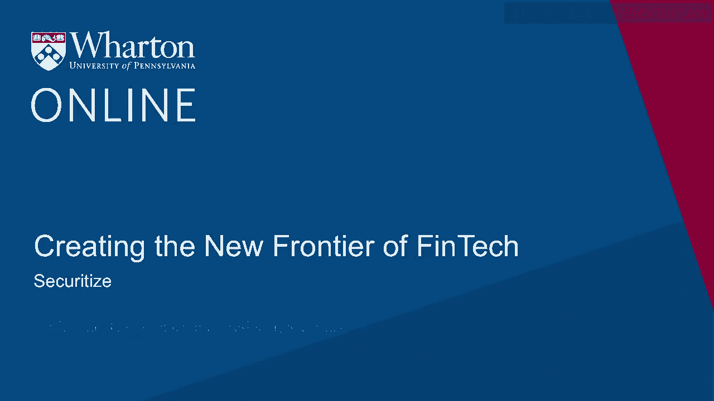
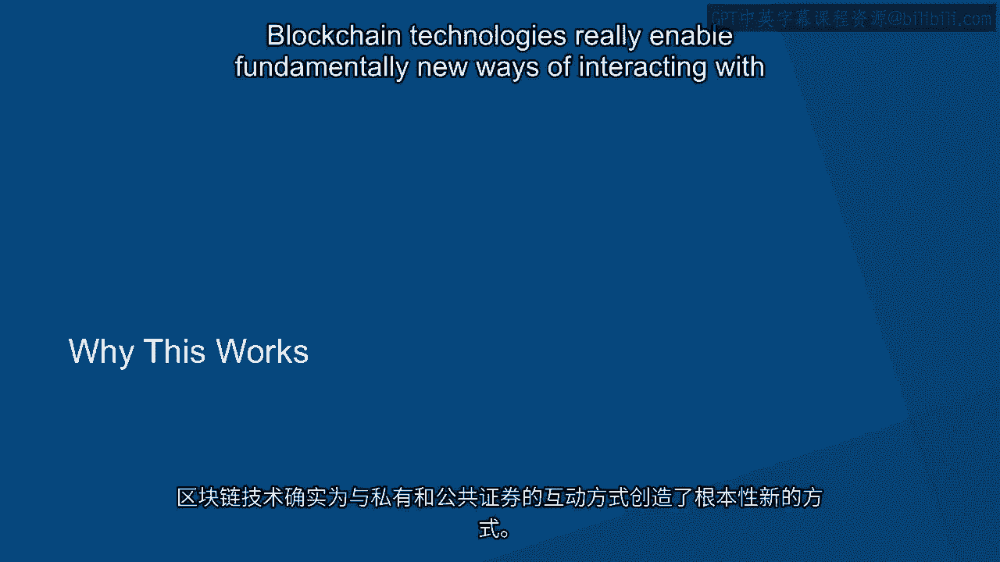
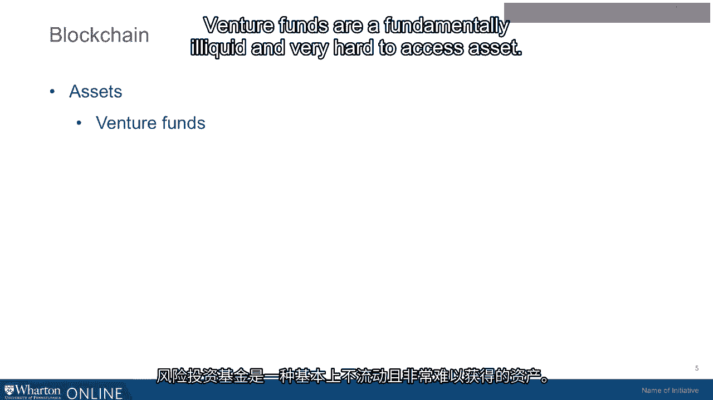
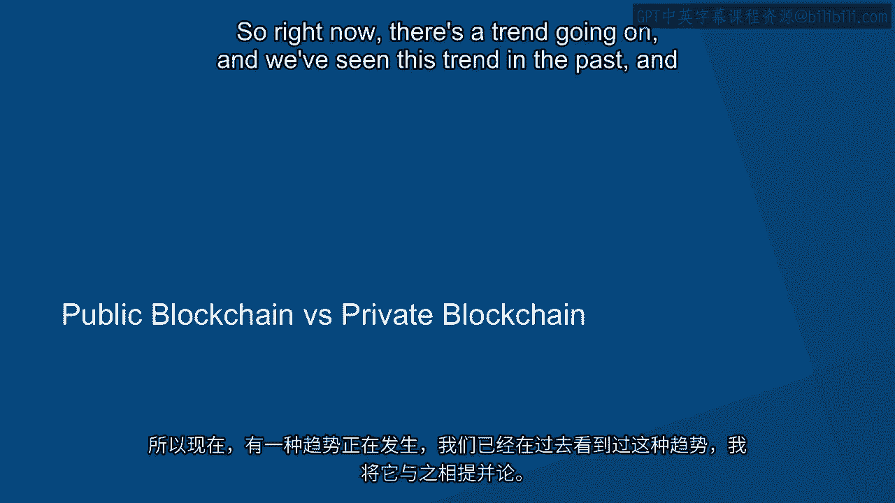
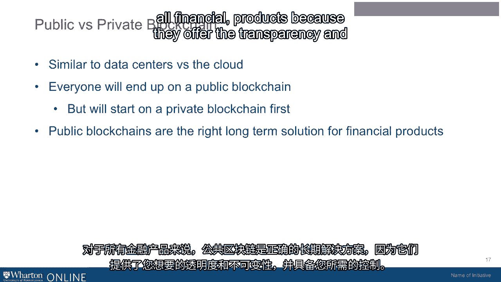

# 沃顿商学院《金融科技（加密货币／区块链／AI）｜wharton-fintech》（中英字幕） - P64：27_打造金融科技先锋-Securitize.zh_en - GPT中英字幕课程资源 - BV1yj411W7Dd

 So I'm Jamie Finn。 I'm the president and co-founder of Securitize。

 We are a startup that was founded。

 in 2017。 And we were founded based on the premise that there was a big gap in the technology。

 space around digital securities。 So as of today， almost every security in the world is。

 done based on a piece of paper that somebody signs。 We think that that's a pretty inefficient。

 model。 And so what we've created is a digital version of that leveraging blockchain technologies。

 both public and private blockchains， in order to create digital securities that are more。

 transparent， easier to trade， easier to use， and just fundamentally better。 I mean， at， this point。

 we're competing with paper， so we should be able to make a better product。

 Blockchain technologies really enable fundamentally new ways of interacting with both private。

 and public securities。 They enable all new ways of understanding who owns these securities。

 You can see trades happening live on a blockchain。 You can see the whole transaction happening。

 and to end。 And really， they create this environment of transparency that isn't available today。

 particularly around private securities。 So that is kind of where we started。 And really。

 one of the assets we started with was venture funds。 Venture funds are fundamentally illiquid。

 and very hard to access asset。 There's very little information known about them。 They。

 are notoriously secretive。 And so taking an asset like that and making it available broadly。

 to investors all over the world was something that we thought was a really powerful concept。

 and creates a really cool new financial product。 So that's really where we started。 And so。

 some of our customers or companies like Blockchain Capital or Spice VC and a number of other。

 kind of venture funds that we've worked with around that。 And that's been kind of the point。

 of entry for our business。 From there， we really moved into what most people feel is。

 one of the largest asset classes in the world that's almost totally non-traded， although。

 it is liquid and that is real estate。 So real estate is a new asset class that's also moving。

 onto the blockchain。 And we think it's actually a fantastic use case because you're taking。

 an asset that has all sorts of different components like debt or equity and putting it into a。

 token which represents ownership of this asset。 This makes it so that you can do something。

 really unique。 Where you can buy a piece of a property without actually taking the title。

 of that property as part of the transaction。 This is also an interesting problem on the， tax side。

 So one of our customers is the St。 Regis Hotel in Aspen， Colorado。 And Aspen。

 Coin was one of our first real estate projects。 It's a single asset read and it's a first。

 time that someone's tokenized a chunk of a hotel。 And now every investor in that project。

 really has access to all the financial information and everything about that hotel through this。

 dashboard that we give them。 And not only that， the asset's liquid and tradable。 So they。

 can go on a secondary marketplace and they could sell it to somebody else who would like。

 to be in owner of the St。 Regis， which is a fascinating business opportunity。

 So securitize was founded on the premise of having to create and deliver something that。

 worked from the very first day。 If you look at the heritage of securitize， we were really。

 born from a demand and a need from a customer。 And so from the very first day， we've been。

 totally focused on execution and delivering。 We haven't really spent a lot of time debating。

 things like standards and technologies and what's the best way you could do something。

 because we actually had to get it done。 And getting it done， we were able to kind of create。

 this track record of execution。 And that's what securitize is really best known for。

 We deliver product。 We've really done the first issuances of digital securitize on an Ethereum。

 blockchain。 There's a public blockchain。 We've enabled trading in secondary markets for。

 the first time ever of digital securitize with Ethereum。 And we're the first company。

 ever to have the same security trading on multiple exchanges。 This is a very big deal。

 A lot of people are interested in what's known as an ICO and you may have heard about it from。

 early in 2017。 These were really fantastic capital formation events that had happened。

 on a global basis in a way that nobody's ever seen before。 And it's really the fundamental。

 reason that STOs or security token offerings were created。 When you could have an idea。

 and have somebody give you a hundred million dollars for that idea for you to do whatever。

 you wanted with it， it's obviously going to attract a lot of attention。 And so that attention。

 is really what brought digital securitize to the mainstream。 And it's now kind of where。

 ICOs have now moved into the digital security realm。 We have a whole bunch of new products。

 that are coming along。 And for me personally as an investor， it never really made sense。

 in the old ICO days because it was simply you weren't getting anything for your money。

 Now you're actually getting equity or revenue share or some sort of distribution associated。

 with your investment。 So at securitize， we really believe that all securities will eventually become digital assets。

 and they'll be available on public blockchains。 So that's the future that we see。 And we've。

 seen that happen kind of with every product over time。 Things that start as physical products。

 be it a CD or even a record eventually ends up just being a stream you get on Spotify。

 Securitize have been the last thing to get there。 Right now most of these transactions。

 are still done on paper。 So that has to go away and we're leading the charge to get rid， of that。

 So right now there's a trend going on and we've seen this trend in the past and I'll。

 liken it to that。 So today in the blockchain space we have public blockchains such as Ethereum。

 or Bitcoin and then we have private blockchains such as Hyperledger or any number of other。

 kind of protocols that are out there。 And what's interesting about this space is that。

 we have a very similar thing to compare this to。 So if you look back maybe 10， 20 years， ago。

 everybody had a data center and that was what you ran in order to run your internet， products。

 You ran it in a data center。 Then flash forward to today everybody runs on cloud。

 If you're going to look at things today in the blockchain world what's happened is that。

 people have started and banks in particular because I believe banks will end up being。

 the biggest users of digital ledger technologies or blockchain and they will eventually all。

 end up on a public blockchain。 To get there they're going to start on a private blockchain。

 because just as in the past where everybody was uncomfortable you know with a server in。

 the cloud and today the CIA runs their servers on Amazon eventually even the financial institutions。

 will become comfortable with these public blockchains。 Public blockchains are the right。

 long-term solution for all financial products because they offer the transparency and immutability。

 that you're going to want and they have the controls that you need。 Today the banks aren't。

 comfortable with it。 In the future they definitely will be and that is the future of blockchain。

 The regulatory environment around blockchain is relatively murky。 Securitize has taken a。

 position where we feel that these are all securities。 They are not some sort of random。

 token format and we believe that as securities they have to be treated that way under the。

 securities laws which exist in the US。 In the US a regulatory framework is actually pretty。

 clear and pretty good when it comes to these types of things。 Most people don't realize。

 that digital securities were created and authorized to exist when hurricane Sandy wiped out almost。

 all the paper records in New York。 So after that you could actually just have a digital。

 entry without any paper to back it up。 That's a really big step and it's actually one of。

 the only countries in the world where you can do that。 So we think the US frameworks。

 actually are pretty good for issuing and managing digital securities。 We're working across a。

 number of other countries with them on this topic but just emphasizing the fact that you。

 can do this today on a blockchain in the US legally as long as you follow the rules that。

 have existed since 1933 and then were updated in early 2000s you're in a really good place。

 to be able to operate this type of business。 At Securitize we're looking always to find。

 people with true grit and people who are unwilling to give up。 When you're doing a startup the。

 easiest thing to do is to quit and to stop because actually what you're doing at a startup。

 is probably not going to succeed。 In fact in 99。99% of the time it's just not going to。

 work but the 10th of 1% of it works is an extremely massive opportunity。 So we really。

 look for people who have experience not only kind of creating their own business probably。

 when they were younger from a lemonade stand all the way through to delivering papers but。

 also generally if you're interested in marketing be really great at marketing。 Marketing is badly。

 needed in FENTech and all these different kind of components are things you should really。

 know about。 Obviously understanding numbers， understanding balance sheets， understanding。

 how cash flows work and all that's fundamental and really basic but at the end of the day what。

 we really are looking for is somebody who has the grit to not kind of give up in the face。

 of a pretty daunting task and that's something that you're going to find really rarely and。

 it takes a lot of effort and a lot of interviews to go through with someone and many times those。

 really great people are already at great companies so then you have to try and pull them out。

 of there and bring them into this highly risky environment which is a startup。 FENTech。

 today is really controlled by a few different very large entities and whether or not you。

 know it almost all of your money one way or another ends up in the hands of probably eight。

 or nine banks in the whole world。 This is not something that will last forever。 It is changing。

 and it's changing because people are becoming more empowered and more people need access。

 If you look at millennials today which I'm barely missing out on one of the most interesting。

 things is how unbanked they are and then again how comfortable they are with digital assets。

 and digital currencies。 I really see things like bitcoin and other digital currencies becoming。

 very mainstream in the long term particularly as a store of value and I think FENTech is going。

 to have to evolve to support this new generation of wealth that's coming up。 All these folks。

 who are coming in this next generation understand digital natively and if your FENTech products。

 aren't natively digital and you have to make a phone call to get something done they're not。

 going to be your customer。 [BLANK_AUDIO]。

