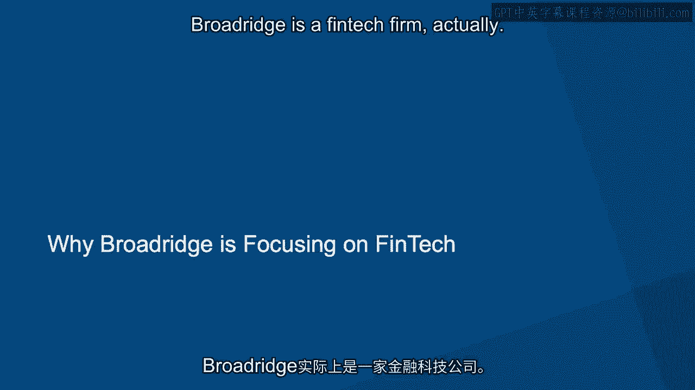

# 沃顿商学院《金融科技（加密货币／区块链／AI）｜wharton-fintech》（中英字幕） - P65：28_打造金融科技先锋-Broadridge金融解决方案公司.zh_en - GPT中英字幕课程资源 - BV1yj411W7Dd

 Hi， my name is Prakash Nila Kantan。 I am part of Broadridge， a four billion dollar。

 firm which is part of the S&P 500。 We enable corporate governance and transactions in the。

 capital markets。 In Broadridge， I am part of the corporate strategy group helping drive。

 innovation and adoption of blockchain among our customers。

 Broadridge has a vantage point in this space because we sit in the middle of investors。

 advisors， brokerage firms and operations enabling products and services across all these， parties。

 Broadridge processes more than five trillion dollars worth of transaction to the。

 fixed income and equity markets。 We also enable communication for 5，000 brands to more than。

 7% of North American households。 We also manage share-world awarding in 90 countries。

 Broadridge is a FinTech firm actually and FinTech is many things for many people but。

 if you look at it automation is at the heart of every financial services firm。 So it is。

 very difficult to say that no financial services firm is not FinTech。 But what differentiates。

 them is actually financial services firm existing that is existing financial services firms。

 Sit in the middle of a lot of transaction data which they have been servicing their customers。

 for many， many years and they leverage technology to deliver many of their services。 What we。

 have seen in the last 20 years is the growth of the web， the mobile and aggregation of。

 human rights amounts of data across the globe by a variety of firms。 What FinTechs are trying。

 to do different from traditional financial services firms are leveraging this connectivity。

 and the data and innovate on new business models to service this traditional customer， base。

 Broadridge strategy is very simple。 We are in the middle of this transaction flow。

 among all our customers servicing this larger market of investors。 Our goal is to make this。

 market more transparent， efficient and cost effective driving new services to customers。

 We do that by adopting a next generation set of technologies which we call ABCD in short， form。

 That is AI， blockchain， cloud and digital in a broad sense。 It is interesting to that。

 we put it in ABCD but the reality is actually what we want to do is very simple。 We want。

 to drive all communication to customers in a digital native form through a variety of。

 channels and servicing them anywhere through a cloud hosted mechanism and share data through。

 blockchain in a sense and solve innovative problems through AI。 I would say that is just。

 our strategy。 We believe in partnering as well as working with our customers and building。

 these new solutions。 We have invested also in startups and other FinTechs and collaboratively。

 work towards new solutions in this area。 So whenever customers ask us about FinTech or。

 any of these new technologies， our first goal is to identify what business challenges and。

 problems they are trying to solve for。 For our customers， it costs could be a driver。 They。

 want to deliver more efficient solutions。 They might want to grow into new markets， new。

 customer segments。 They would also like to actually provide innovative new solutions。 To。

 give any of these customers what we say is actually before choosing the technology， let's。

 analyze the problem space at the business area， figure out whether this is the appropriate。

 technology to use and solve for。 And then we work with them collaboratively as well as。

 our theory technology providers to innovate and design new solutions。 That's been our。

 strategy always with customers。 The goal is to actually understand the problem and then。

 solve for it using technology。 Technology does not come first， whether it's blockchain or， AI。

 For many people， blockchain is something is a technology looking for a problem。 And。

 that is true for many of our customers too。 Everybody has been experimenting with this， technology。

 Our advice has been to actually focus on specific business areas。 From a， broad range perspective。

 we want to solve for what is called network effect。 That idea。

 is actually that the solution becomes more effective as more and more customers and their business。

 partners join the network。 And we being in the middle of the data and the transaction。

 flow can actually help them effectively manage this。 Blockchain is such a technology which。

 can actually enable secure， efficient sharing with confidentiality of data and transactions。

 between multiple parties。 And our goal has been to pick specific business areas which。

 can be solved using blockchain technology。 So when we apply blockchain technology， we chose。

 a multi-pronged strategy。 We decided to partner with startups in this space。 We have investments。

 in a firm like Digital Asset。 We are also a member of technology consortiums like Enterprise。

 Ethereum and Hyperlager。 We invested in these technologies， built pilots and proof of concepts。

 and then collaborated jointly with customers like Santander Bank， Northern Trust and Jimmy。

 Morgan to build out solutions with specific use cases in mind like proxy voting which。

 brings in efficiency and trust into the corporate governance process。 Fintech is as I said many。

 things for many people。 Established players like us actually are using a Fintech very efficiently。

 and innovatively。 One of the areas we are applying is actually there is still a lot of。

 paper in our businesses。 And what we are doing is actually extracting text from copies of。

 the digital copies of these paper documents， converting them into specific attributes which。

 we can use say for instance in a process like trade allocation where the allocation instructions。

 come as faxes or emails or even paper documents which are scanned and processed later。 Extracting。

 text from images is actually an optical character recognition which is a form of computer vision。

 and that is getting better and better applying machine learning。 Extracting information from。

 text is actually natural language processing which is also part of the AI。 Data actually。

 is available in plenty today and so what could not be applied earlier becomes a new potential。

 innovative area to apply technology。 The classic example for instance markets as you all know。

 being in the financial services space are where which brings bias and sellers together。

 Traditionally liquid markets like say for instance NASDAQ or NYC where the top 500 stocks。

 are actively traded you can always find a seller at a price which is actually amenable to you。

 if you are a buyer。 But in some markets like corporate bonds and especially in the long。

 tail of these corporate bond market it's very difficult and expensive to find a buyer or。

 a seller or bring them together。 What we are doing is actually trying to apply machine learning。

 based on the history of transactions of participants to identify whether there are similar products。

 that they have bought before which will actually make them buy or actually show interest in buying。

 this new bond。 That's an innovative way。 Think of it actually like how Amazon works。

 for you with recommendation engines。 You bought these products in the past so you might be。

 a potential buyer for the similar product today。 But we are applying a similar technology。

 actually in the bond market。 If you look at the exciting fintechs there are a range of， fintechs。

 I mentioned that they apply innovative business models to solve for problems。 They。

 can solve mundane problems。 One company which has been a fintech for quite some time。 A lot。

 of people might be familiar with this name。 It's Stripe。 Stripe makes the traditional legacy。

 payment infrastructure of banks and the banking network simple to use through APIs。 We think。

 that that's a very innovative use of technology to take a back-off problem and simplify the。

 whole process for all these companies coming online and enabling payments。

 Another example is actually Acorns which is actually a startup in the fintech space which。

 is solving savings。 They do what I would call nudge based savings。 They help you save by。

 taking small chunks out of your regular transactions and influencing your behavior so that actually。

 you build up your savings account over a period of time incrementally。 That's a very innovative。

 model which combines behavioral science and economics。 Solving the problem which is a very。

 challenging problem in today's world because the savings rate in the US is actually very， low。

 In my belief singularity is still far away。 Fintech as we call it today， the ideal。

 future would be that nobody calls it fintech anymore and becomes part of everyday life。

 That's been true of lots of technology。 Today we don't talk about e-commerce but everybody。

 uses e-commerce and the same thing for streaming media and Netflix。 We have cut the card and。

 it's become a natural progression of things。 We believe the fintech world is also evolved。

 in a very similar fashion。 Technology changes actually too fast for us to label it in different。

 fashion。 If you go back a few years nobody would have started using the term "chief。

 data officer" but today many companies have achieved data officers。 For the last 5 years。

 many corporations also have digital officers who enable actually digital embedding digital。

 processes across every business。 In a similar fashion fintechs or financial services firms。

 would have actually officers driving customer behavior and varieties of firms applying technology。

 You might want to call them a fintech officer， you might want to call them actually somebody。

 driving innovation technology， you might want to call them somebody driving AI and blockchain。

 None of that matters because the end result is actually that you are adapting to actually。

 technology and servicing your customers。 Small businesses actually are the ones which can。

 actually get maximum impact or a fintech。 We always talk about the unbanked but actually。

 we should talk about also the bank which is actually lots of small mom and pop stores。

 which actually service their customers either through credit card payments and not cash。

 and also have a challenge of getting financing to stock the appropriate inventory for them。

 to service their customers efficiently。 What can happen in the future is two things。

 Because they are willing to share their transaction history banks can actually apply machine learning。

 on that data and actually build new models which can ensure that actually without traditional。

 history they are still a good bet to finance。 That's one dimension。 Take the case of a， student。

 There are many forms in which this can apply。 The simplest form actually fintech。

 can apply to student to student loans。 The model is changing， there are new models being。

 created for financing。 We have seen some startups actually like SOFI which are actually focused。

 only on student loans。 What you want is actually to enable a larger set of students to get。

 loans at a lower rate if needed and a potential for them to pay off actually their loans over。

 a period of time or even reduce those loans。 So one area， when we talked about financing。

 blockchain for instance， let's take a large manufacturer which is got actually a large， supplier。

 For example， this is just an example。 It could be a large car company which has got。

 an automotive part supplier， one supplier here， main supplier say in China and that Chinese。

 supplier has got actually 50 other vendors who supplied them。 What happens in the traditional。

 financing space is actually the large supplier to this car company can go to a bank and get。

 financing as they supply actually parts to this car company。 But the second and third。

 supplier firms which actually supply the final parts to this primary supplier are always。

 in the middle of a process where they do not have visibility to the final transaction of。

 what part has actually gone into the manufacturing of the car and when will they get paid。 And。

 this is where something like blockchain is actually transforming the supply chain where。

 every party to this transaction can actually track every part that they supply across the。

 supply chain and make it visible as they raise invoices to their banks and the banks。

 with actually now with confidence know that this part went into this larger component which。

 then got supplied to say general modus and so they know where in the pipeline this part。

 is and they can confidently lend to this small supplier。 This is a way I think small businesses。

 across the globe can get transformed and we are just seeing the start of this process， today。

 There is no hard and fast rule about carrier today。 You could in any if you are。

 looking at the fintech space you could start on the technology side of the business or you。

 could start on the business side and the product side of the business。 Now if you are by training。

 a technologist it might be good to educate yourself in a particular domain in the financial。

 services space and because that is going to be more valuable a technologist with business。

 knowledge is more valuable than just actually say a developer or programmer。 The same goes。

 for the other side because if you are a product manager today in a fintech firm and you are。

 start up actually it is a small team you need to actually roll up your sleeves and do lots。

 of activities you will not be a good product manager with lots of good domain knowledge。

 unless you also know how that product can be realized in technology。 So you need to know。

 the limits of the technologies how it can be applied and also help manage technologists。

 and developers actually to build this。 That I think is a key skill and so for business。

 and financial professionals actually getting a better sense of actually technology and。

 understanding technology is I think a good supplement to what they are already learned。

 The combination for both would be data because if you are building something new today the。

 process of building something new has completely become analytic right you actually start with。

 the concept validated to the market analyze get people to use it look at the data analyze。

 it further decide whether it is working or not pivot to a new model and this continuous。

 process needs actually data and analytic skills。 So I would always supplement something on。

 data and analytics along with your traditional degree。 [BLANK_AUDIO]。

