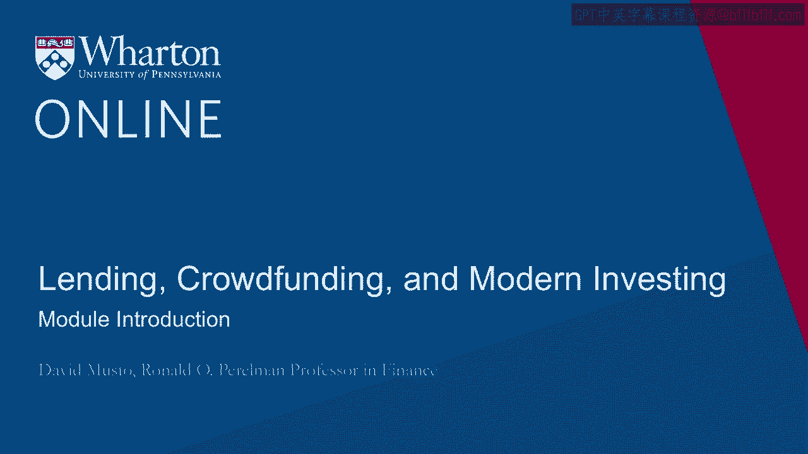
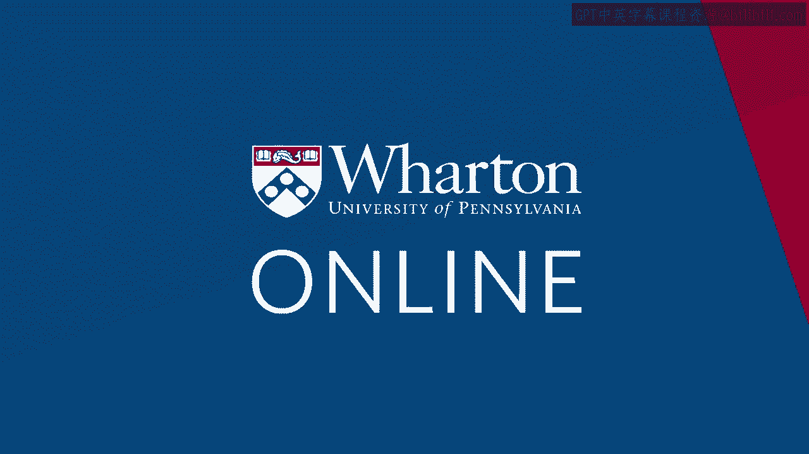

# 沃顿商学院《金融科技（加密货币／区块链／AI）｜wharton-fintech》（中英字幕） - P66：0_模块介绍.zh_en - GPT中英字幕课程资源 - BV1yj411W7Dd

 Hi， I'm David Musto。

 I'm a professor here at the Wharton School。 I'm chair of the finance department。

 and also helping to run our new FinTech Center， here at the school。

 Today's module is going to be about robo-advising。

 The goal of this module is to give you the helicopter view of what it is that robo-advisers。

 are doing。 What do you see if you look under the hood of a robo-advisor， how they add value for。

 the customer， and some of the ways that they can maybe use a big data approach to improve。

 the service they're delivering to the customer。 Thank you。 [BLANK_AUDIO]。

