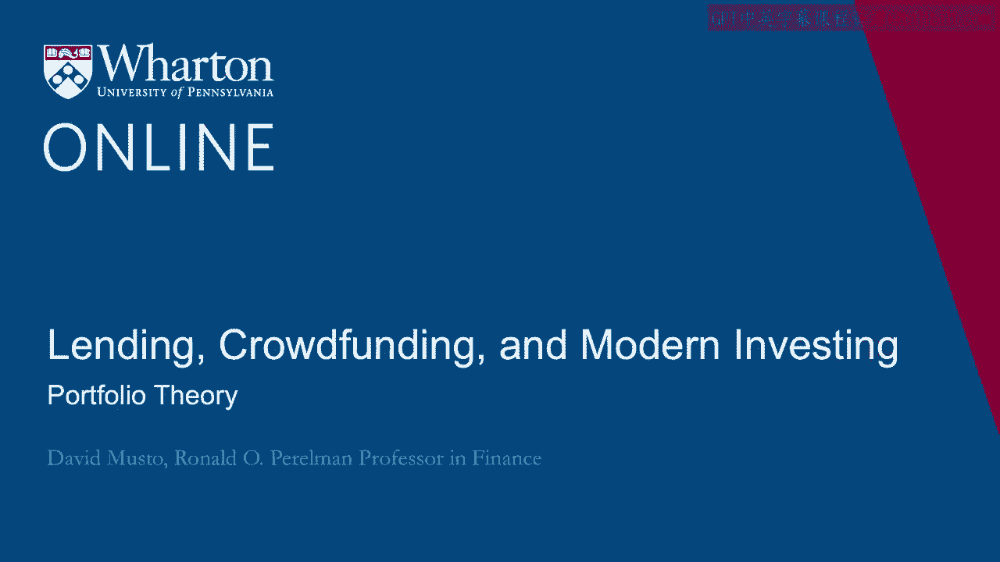
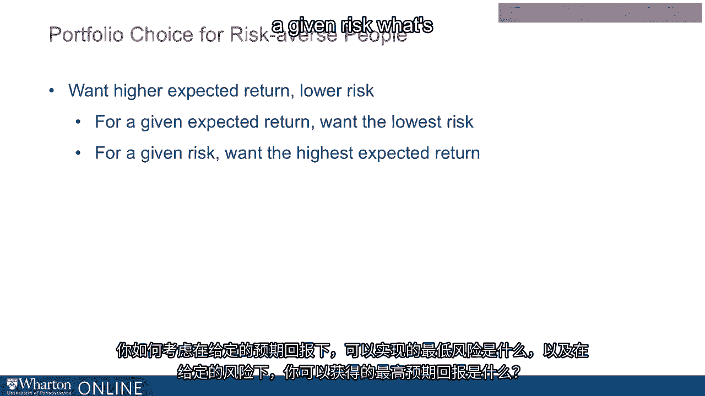

# 沃顿商学院《金融科技（加密货币／区块链／AI）｜wharton-fintech》（中英字幕） - P68：2_投资组合理论.zh_en - GPT中英字幕课程资源 - BV1yj411W7Dd

 I mentioned a moment ago that I'm a professor here at the Wharton School and it's interesting。

 to be a professor of finance because a lot of the founding fathers and mothers of the。

 field are still with us。 And in fact， the original founding father of the field is still with us。

 His name is Harry Markowitz。 He's in his 90s now and he invented。

 essentially invented this whole field of finance and portfolio。

 theory as a graduate student in Chicago back in the early 50s。

 Then he won the Nobel Prize for this work in 1990 and he's still at it。

 I say if you go Google Harry Markowitz， you'll see。

 He's still working in this area and he's working in this area of robo-advising。

 So I want to talk about what it is that Dr。 Markowitz did and how it is essentially what。

 you will find now under the hood of a robo-advising app。

 And his insights from the 50s are exactly the insights we're using today。

 And you'll see they're all about how if you want to invest for an expected return， you're。

 going to have to bear some risk。 You're going to have to bear some risk。

 You'd like to do it without risk， but that's magical thinking。

 We're not going to be doing magical thinking。 Now Harry Potter doesn't have to worry about his retirement plan。

 but we do。 No magical thinking for us。 And when you're investing for a return。

 you have to worry about how much risk you're taking， and what Dr。

 Markowitz showed was how to take the least risk for the expected return that， you are targeting。

 And that is the sort of special sauce of what robo-advising is bringing to the client。

 Not that you're going to get somewhere with no risk or you're even necessarily going to。

 get right where you want because that's the essence of risk that things can happen and。

 you're taking a risk， except that。 But at least you can take the least risk necessary for your expected return goals。

 Okay。 So to understand what Dr。 Markowitz did back in the 50s， he had to start with the sort。

 of fundamental kind of precepts or axioms of economics， especially as they relate to， investing。

 Right。 And there's basically two precepts that I don't think you're going to find are too。

 controversial。 Right。 One of them is simply that people always prefer more to less。 All right。 Okay。

 I don't think I'm going out in a limb there that people prefer more to less。 All right。

 So you've got that。 People prefer more to less。 The other one。

 which is going to give us more of the excitement is that yes， people prefer， more to less。

 but they get a decreasing amount of utility out of the next dollar the more， wealthy they get。

 Right。 So if you have a million bucks， the enjoyment you get out of another dollar， the million。

 and first dollar isn't as much as if you only got a thousand bucks。

 You get a thousand bucks to give another dollar， you get more enjoyment out of that。 All right。

 So you always enjoy another dollar， but you enjoy that extra dollar at a decreasing amount。

 as you have more and more。 So if you were to draw a picture where， you know。

 on this axis is how much money you have， and then on this axis is how much utility。

 how much enjoyment you get out of that money， the line is going to go up。

 but it's going to go up at this， at this decreasing rate。

 That mathematician would say it's a concave function。 Okay。

 Those of you who took economics in college will certainly remember that。 Right。

 This picture of utility curve， which has this curve to it。 Right。 It's curving down， but it never。

 it's never going downwards。 Right。 You never， you've never have so much money that geez。

 if I give me more， actually less， happy。 Right。 It's going up at a decreasing rate。 Okay。

 So just with those two， I think not controversial precepts， let's see what you can get out of， it。

 Okay。 Well， the main thing you get out of it for our purposes here is that people are going to。

 be risk averse。 Right。 Risk averse。 By which I mean that， you know， for。

 they generally speaking are not going to want to， take a risk。 Everything else equal。 Okay。

 So as a thought experiment， imagine someone offered you， hey， I'm giving you a choice。 You can just。

 I can just give you a thousand bucks。 Right。 For sure。 A thousand bucks。 Or we can。

 we can make it a gamble。 Okay。 So a gamble so that I flip a coin and if it comes up heads。

 I'm going to give you 2，000， bucks。 What if it comes up tails， you got nothing。 Okay。

 So it's the same expected value， right？ Either way。

 the expected amount I'm giving you is a thousand bucks。 But with that gamble， right。

 it's either zero or 2，000。 Okay。 So if you're risk averse， you'd say， well。

 just give me a thousand bucks。 Right。 I don't want to take the gamble with the same expectation。

 I just， it just give me a thousand bucks。 Okay。 And you can see that。

 that's going to come straight out of that， that utility curve with， that， with that bend to it。

 right？ That you're going to want just a thousand bucks and not the bet。 Because for the。

 for the simple reason that you， you， you get more out of the first thousand。

 than out of the second thousand， right？ Because you're， it's a decreasing utility。

 more out of the first thousand than the second， thousand。

 So you're really not going to want to take that bet to risk losing the first thousand。

 for the chance of getting the second thousand。 Okay。 You're just。

 you're not going to want to do that。 So that's， that's， we would call that risk averse。 Okay。

 And by the way， we can be even a little more precise about this。

 And maybe we'll get back to this when we talk later about how RoboAdvisor's customized。

 If I want to know how risk averse you are， I can， I can learn about that by asking you。

 questions like this。 I could say， okay。 So you don't。

 between a thousand bucks and this gamble of zero or two thousand， you want， the thousand。 Okay。

 All right。 Well， what if it's not a thousand？ What if it's nine hundred ninety？ All right。

 Do you want nine hundred ninety more than the zero or two thousand？ All right。 You do。

 How about nine eighty？ How about nine seventy？ Right。

 So I could just sort of like go down to the point and say， wait， stop， stop， stop。

 You'd rather you're happy。 You're， you're ambivalent between getting nine hundred seventy bucks or zero and two。

 thousand。 Right。 So there's essentially， there's this difference there。

 This nine seventy is what we would call your certainty equivalent。 Right。 Certainty equivalent。

 That's an economist would call it。 So there's a three percent discount from the thousand that it's actually worth and the。

 nine seventy it's worth to you because of your risk aversion that three percent difference。

 is an important number。 It tells me how tells me how risk averse you are。 Right。

 If you'd said not nine seventy but nine forty right then that's more risk averse and that's。

 information that I can use to customize my portfolio suggestion for you that I'm going。

 to give you something that's a little less risky for your money if you said nine forty。

 versus nine seventy。 So we can get back to that。 So the key point for now is that people are generally going to be risk averse。

 Okay。 So just following up on that thought when you think about choosing a portfolio for risk。

 averse people then one thing you could say right away is that well you know everyone。

 likes more expect a return。 Okay。 But they want less risk okay but one way you could sort of be more formal than that say。

 well okay for a given expect a return for a given expect a return you would want to have。

 the lowest risk okay or putting another way for a given risk you want to have the highest。

 expected return。 Okay。 That's going to be the challenge for a robo advising app。

 How do you think about that？ How do you think about for a given expect a return what would be the lowest risk for。

 which you could achieve that and for a given risk what's the highest expected return you。

 can get。 So in our next lecture we will look at how Dr。

 Markowitz looked at this problem of minimizing， risk for expect a return and how it is that robo advisors are going to bring this to bear。

 for their clients。 Okay。 Okay。

 Okay。 Okay。 Thank you。