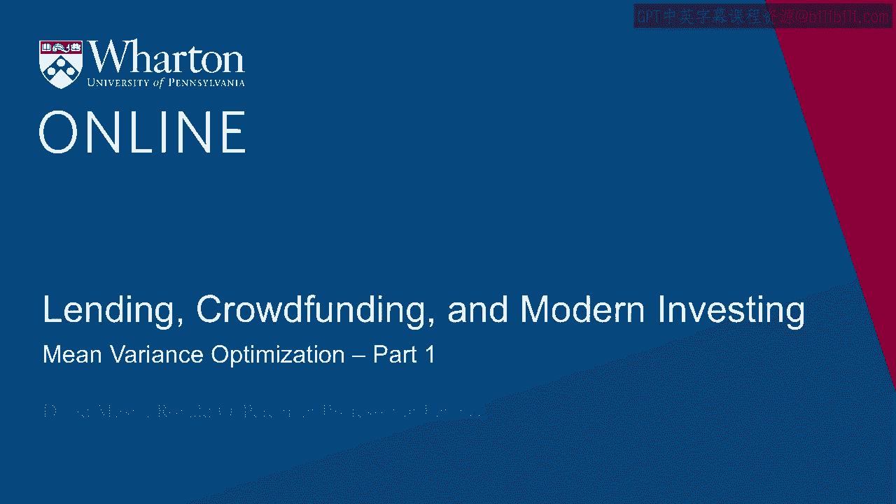
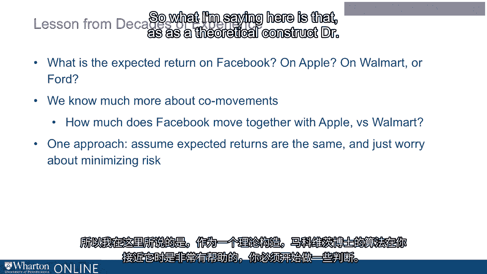

# 沃顿商学院《金融科技（加密货币／区块链／AI）｜wharton-fintech》（中英字幕） - P69：3_均值方差优化(上).zh_en - GPT中英字幕课程资源 - BV1yj411W7Dd

 All right， so let's follow this train of thought。

 to its logical conclusion， right？ So our goal here is fix， expect， to return， minimize risk。

 or fix risk and maximize， expect， to return。 Okay？ So before we get into this， we kind of have。

 to define our terms， okay？ So when I say expect to return， remember， expect return。

 is it's a mathematical concept。 It's a probability weighted average， right？

 If there's a half chance of a return of 3%， and a half chance of a return of 5% then the expected return。

 it's 4%。 Even though， of course， we know 4% isn't going to happen。 It's going to be 3 or 5。

 but expect return is 4。 So that's what I mean by expect to return。

 the mathematical concept of a probability weighted average， okay？ For risk， okay。

 there's different ways you can measure risk， the way that Harry Markowitz measured it。

 and the way that people continue to measure it to today， for the most part。

 is with the mathematical concept， of variance， okay？ Variance is a term of art to a statistician。

 The variance is the expected squared deviation， of the outcome from its expectation， okay？

 So the variance， in our little example there， right， it was 3 or 5。

 So that variance would be defined by 3 or 5 relative to 4， if we had instead 2 or 6， all right？

 2 or 6， well， same expectation， larger variance， right？

 So it's the expected squared deviation from that expected， return， okay？

 So that is a standard measurement of risk。 I don't want to go deep into the math here。

 You can sort of look it up on your own if you're curious， but that's what variance is。

 And then the other term you'll often hear， is not the variance， but the standard deviation， okay？

 And the standard deviation， well， that turns out to be just the square root of the variance， okay？

 So if I'll talk about variance， standard deviation， you're talking about the same basic concept。

 is just that the standard deviation is the square root， of the variance， okay？

 So bear in mind when I'm talking about risk and expect， return， that's what I'll be talking about。

 Risk is variance， expect return is this probability， weighted average of the possible outcomes。

 okay？ So for a given expected return， we're gonna want。

 to minimize variance and for a given variance， we're gonna maximize expected return。

 That's why people refer to this whole sort of body of work。

 on this topic as mean variance optimization， mean variance optimization， okay？

 And the key terminology in this area， is an efficient portfolio， okay？

 We're looking for efficient portfolios。 And when someone says efficient portfolio。

 that means also something very specific。 It means what we've been saying， okay？

 Efficient portfolio is a portfolio with that nice property。

 that of all portfolios with the same expected return， it has the least variance， okay？

 So it's the most appealing from this point of view， of all portfolios with that expected return。

 Or of course the other way around， right？ It for all portfolios with its variance。

 it has the highest expected return， okay？ So that's an efficient portfolio。

 And you can see why people call it an efficient portfolio， because you're efficiently bearing risk。

 right？ You're bearing the risk that you just absolutely。

 has to be born if you want that expect to return， all right？ So that's an efficient portfolio。

 By the way， let me just， if you get confused at this point， so I want to be clear。

 there are two ways， that the idea of efficiency shows up all the time。

 in financial economics and they're not the same idea。 So you have efficient portfolios， okay？

 Which is what I just said。 You also have the concept of an efficient market。

 which I'm sure you've heard about over the years， right？ Our market's efficient。

 And when people say our market's efficient， what they're saying is。

 do markets reflect available information？ Okay， or for another way， is it possible。

 to beat the market by trading on available information？ If it is。

 then you would say markets are not efficient， right？

 That there's information out there that you could use。

 to trade to beat the market so they're not efficient。 That's a different idea， okay？

 That's not something that we're going to be worrying about here， in this module。

 the concept of market efficiency。 It's an important concept， but what we care about here。

 is portfolio efficiency。 That is the brass ring of the Roble advisor。 Okay， so what Dr。

 Markowitz accomplished back in the 50s， and what people have built on over the years is he laid。

 out how mathematically you can identify， these efficient portfolios。 Okay。

 now I'm not going to walk through all the math here。 That's sort of beyond the scope。

 the actual details， of the math would take us a week， right？ And we don't really want。

 we don't have that kind of time。 So let me just tell you what the inputs are here to this。

 the inputs that you need in order to accomplish this。

 And if you're curious about the actual sort of， what's the algorithm。

 then you can certainly go look that up。 It's everywhere on the internet。

 But so let's talk about the inputs here。 The inputs you're going to need to put into your sort。

 of optimizer that's going to run Dr。 Markowitz's algorithm， are going to be number one。

 The expected returns of all of the individual assets， that you are kind of optimizing over。

 all the things， that might go into your portfolio。 You need the expected return of all those things。

 that you might have in your portfolio。 Okay， and then on top of that， for the risk part。

 you're going to need the variance， remember the same idea， the variance of each one of those assets。

 And also， and this is absolutely crucial to the whole thing， what they call the co-variances。

 The co-variances are how much these assets move， with each other。 Okay。

 how much they move with each other。 And if you think about it， that is going to be crucial。

 to risk reduction through buying a lot of assets。 And if I have two assets and they move opposite to each other。

 okay， then I'd rather have both of them at once， than just one of them， right。

 because their risks are going， to cancel each other out somewhat。

 And even if they don't move opposite to each other， as long as they don't move together。

 holding a lot of them at once， generally those individual。

 movements of the individual assets are going， to have a tendency to wash out。

 to wash out on average。 Okay， so those co-variance， the co-movements between the assets。

 are going to be a crucial input into this algorithm。 So you have the expected returns。

 and then the variances， of the assets， but also these co-variances。

 that tell you about how much these things are going， to move with each other。 Okay， so as I say。

 the actual math is a slog。 But coming out of the other side of this math is going。

 to be a portfolio with a lot less risk， than the individual components that went into it。

 And since that was， you know， it's one of those things， that， you know。

 maybe it's obvious once you think about it， but wouldn't we all want to write？

 One of those papers have some result that no one had thought。

 of and then it's obvious once you think about it。 That was an amazing accomplishment of Dr。

 Markowitz， and it is everywhere in the world that he surveys now。

 So if you think about applying this concept， of mean variance optimization， Dr。

 Markowitz's algorithm， in your app， let me just say there's a sort， of a hard way and an easy way。

 I'll talk about the hard way to sketch right now the hard way。

 and then in our next lecture I'll talk about the easy way。 Okay。

 so the hard way is that you take a stand， on what the expected returns are of all the different assets。

 You're putting into your black box here what the expected。

 returns are and all those variances and covariances。

 and you run the program and you calculate these efficient。

 portfolios but of course I'm saying it's hard not because it's hard， to do the math。

 I'm saying it's hard because what you get out of that optimization。

 is only as accurate as what you put into it。 If you really don't know what the expected returns are。

 of the different assets that you are putting， into your black box then you're just totally guessing。

 then you know what the output is only going to be， as good as your guesses。

 Okay and that can be the tough part。 Do you think about well， you know， what might go。

 into this portfolio？ Well， maybe shares of Facebook， maybe shares of Apple。

 maybe shares of Walmart or Ford or maybe shares of an IPO， that just happened yesterday。

 Maybe stocks in other countries， other sorts of assets。 Gold futures， oil futures。

 all sorts of things could go， in to this optimization。 Right？

 And that can be tough to say well what's the expected return。

 of Facebook versus the expected return of Apple versus， the expected return of Ford。 Right。

 that's not so easy。 Okay？ Generally speaking it's going to be a lot easier for you。

 to say something intelligent about not those expected returns， but those co-movements。 Right。

 that's something that you actually can say you can， think about with a lot more accuracy。

 I can kind of understand how Facebook moves with Apple， right？ Or with Google， right？

 I can understand how Facebook might not move so tightly， with Walmart or with Ford。

 And I can go to the data， I can measure those co-movements， with a lot of accuracy。 Okay？

 So when I go into this optimization， it's a little hard to say much about the expected returns。

 It's a lot easier to say things about this co-movement。 So you might take an approach and say look。

 okay， I don't want to put a bunch of guesswork， into this optimization。 So I'm going to say look。

 let's just say， for argument's sake， expected returns are all the same。 But the co-movements。

 those are the things， that I'm going to estimate from the data， and put in the optimization。

 And that is going to give me my optimal portfolio。

 So what I'm saying here is that as a theoretical construct。

 Dr。 Markerwitt's algorithm is very helpful。 When you get close to it， you have。

 to start making some judgment calls。 And sometimes for some practitioners。

 the easiest judgment calls to say look， I'm not going to make wild guesses。

 about expected returns of different stocks。 But I do have lots of information to use。

 about their co-movements。 And that is what I'm going to base my--。

 that's going to be the workhorse of the investment advice， I'm giving my clients。 Okay？

 So that's sort of the hard way。 And then in the next lecture， we'll， talk about the easier way。

 [BLANK_AUDIO]。

