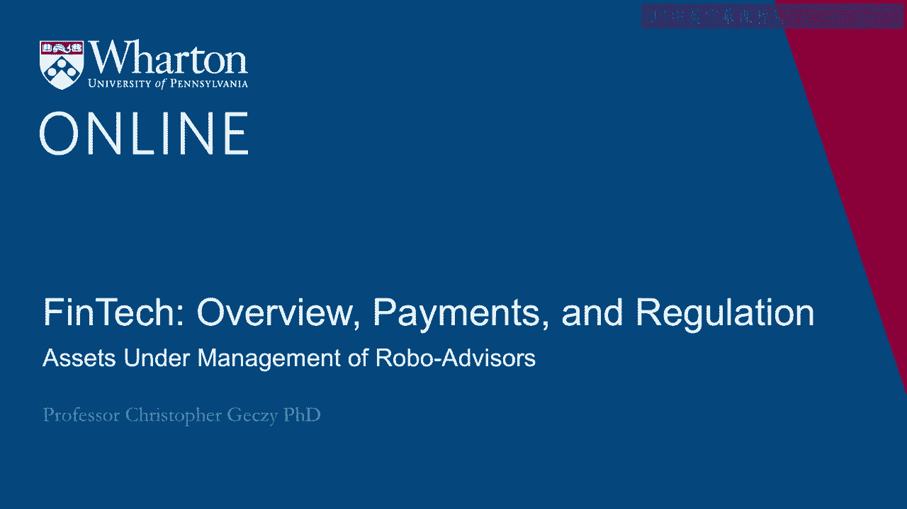
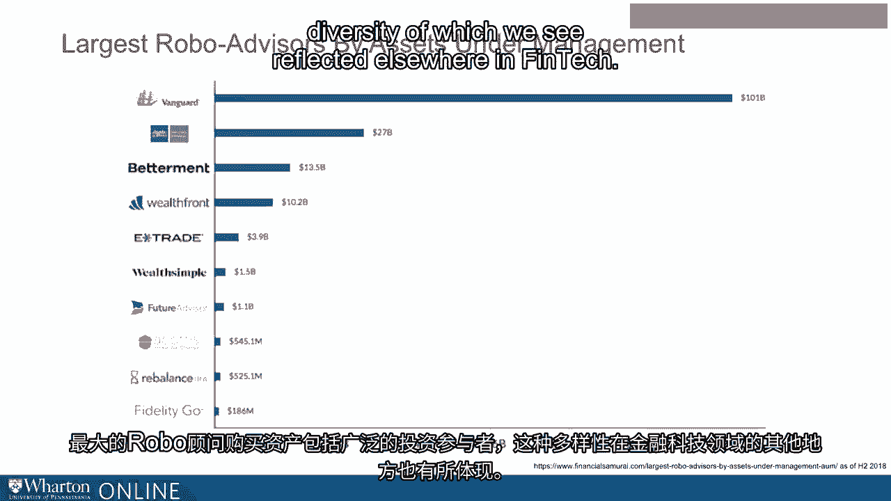
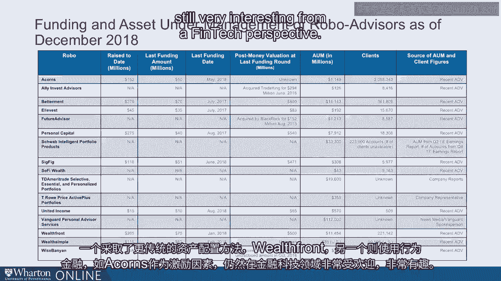

# 沃顿商学院《金融科技（加密货币／区块链／AI）｜wharton-fintech》（中英字幕） - P6：5_机器人投资顾问的资产管理规模.zh_en - GPT中英字幕课程资源 - BV1yj411W7Dd

 Now， as global FinTech funding has increased over the last half decade， albeit with some。

 measure of quarter-by-quarter variability， and as hundreds and hundreds of FinTech companies。

 have received those funds， underlying valuation levels of some of the best-known players。

 has increased a pace。 A number of the ones we've talked about before。

 like Betterment and Wealthfront， along with， others like Personal Capital in the Robo-Advisery space。

 have already gone through late-stage， venture capital rounds going through Series E and Series F with substantial valuations。

 For example， Betterment closed around of about $70 million in mid-2017 with a post-money。

 valuation of approximately $800 million。 It's an eye-popping number。

 What makes it even more eye-popping is the amount of assets on which those underlying。

 fees were presumably calculated。 If you look at the graph in front of you。

 you see that in the summer of 2017， Betterment， might have had something like $10 billion give or take。

 The valuation implied by the flows from fees on $10 billion is really， really very， very。

 rich by normal valuation metrics， even in technology-related areas。 In other words。

 the market must be expecting， presuming efficiency of the market， some rapid。

 expansion of the market and of sales for the firm。 We see similar patterns for Wealthfront。

 which reportedly did around in 2014 at $700 million， recently raising $75 million。

 although the post-money valuation was as of this recording， unavailable。

 Personal capital as well raised something like $40 million recently， having previously。

 raised $75 million in 2016 at a post-money valuation of $500 million at significantly。

 lower levels of assets under management， once again under which fees are presumably calculated。

 in cash flows derived from。 But summarize， it looks like the Robo-advisery space not only is expanding。

 it's hot， and， valuations are following the money。

 So I mentioned just a moment ago that many believe Vanguard is operating in the world's。

 largest Robo at around $115 to $120 billion in assets under management。

 It's interesting to note that something like six months in advance of that level， it reported。

 being at about $100 billion。 If that's the case， then Vanguard must be raising something like $5 billion a month in。

 its Robo-practice。 The top players， as of the second half of 2018。

 have been reported to be Vanguard followed， by Schwab's Intelligent Portfolio Group at $27 billion。

 followed then by Betterment， which， at that point reported $13。

5 billion by Wealthfront over $10 billion， and then E-Trade， Wealth， Simple， Future Advisor。

 A-Courage of Balance and Fidelity。 What we see is a mix of independence。

 again like Betterment and Wealthfront。 So again， we mentioned that some Robos have arrangements with firms。

 For example， Fidelity controls much of Betterment's order flows and earns referral fees， and it's。

 also well known that City owns some proportion of Betterment。

 We also see traditional firms like Vanguard by way of asset managers， buy-side asset managers。

 We see traditional brokerage firms like Schwab， a discount broker， coming in， and we see some。

 interesting disruptors like Acorns， which has a vast customer base as part of it。

 The largest Robo-advisors by assets include a broad cross-section of investment players。

 a cross-section in diversity of which we see reflected elsewhere in FinTech。

 A look at a broad cross-section of Robo-advisors reveals some pretty interesting characteristics。

 For example， if you compare Acorns to Betterment or Future Advisor or the Schwab and Television。

 Portfolio Platform or T-ROW Prices Active Portfolios or Vanguard or Wealthfront's offerings。

 you see different approaches， different numbers and characters of potential clients and different。

 assets under management。 Take， for example， Acorns versus Wealthfront。

 We've already talked about Wealthfront。 Acorns follows what's called a Roundup approach。

 motivated by behavioral finance and investor， psychology。

 focusing on helping customers round up their purchases。 For example。

 if you buy a good-or-service using a linked debit card or credit card for， say， $1。75。

 the service will round up your purchase to $2， take the extra $0。25 and invest。

 it in a Robo-style portfolio。 They reported as of December 2018， approximately $1。

1 billion in assets across over 2 million， clients。 By comparison。

 Wealthfront reported over $11 billion， almost $11。5 billion over 221，000， clients。

 Different approaches， different numbers of clients， one taking a more traditional asset。

 allocation approach， Wealthfront。 Others using behavioral finance like Acorns as a motivator。

 still very popular and still， very interesting from a FinTech perspective。

 Thanks for watching。

