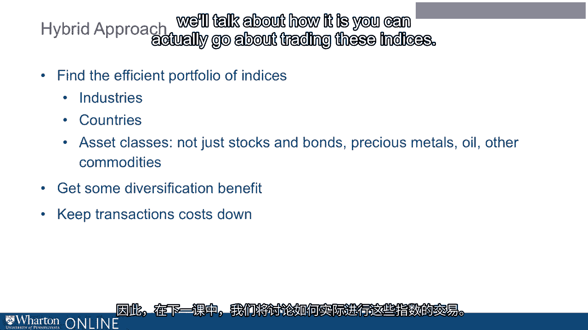

# 沃顿商学院《金融科技（加密货币／区块链／AI）｜wharton-fintech》（中英字幕） - P70：4_均值方差优化(下).zh_en - GPT中英字幕课程资源 - BV1yj411W7Dd

 All right， well we talked about the hard way to accomplish mean variance optimization， and。

 I promised you an easier way， and here's the easier way。 It actually really couldn't be easier。

 The easy way to accomplish mean variance optimization is to just take the value weighted market index。

 to be an efficient portfolio。 So take the value weighted market index such as the S&P 500。

 that's pretty much a value， weighted market index here in the US to be an efficient portfolio。

 Now this might sound like just throwing up your hands like， okay forget it， I'm not going。

 to try to optimize。 But actually there are some good economic reasons to believe that evaluated market index。

 the， broader the index， the better is going to be at least reasonably efficient。

 And so let me just sort of sketch what those reasons are。 Once again， if you want to see more math。

 it's easy to look it up。 I'm just going to sketch it for you here。

 There's one reason to believe that， and this is a long academic literature on this point。

 Reason number one is if you have two efficient portfolios， right， so there's two portfolios。

 each of which has this nice property that it's got the minimum risk for its expector， return。

 And then you combine those portfolios， the combined portfolio is also inefficient portfolio。

 And automatically that works out。 So if， and I know it's a big F here。

 but if everybody in the world holds an efficient， portfolio。

 then everybody's portfolio put together is an efficient portfolio。 Well。

 everybody's portfolio put together is essentially the evaluated market index。

 That's sort of what it is。 It's just all of the assets put together according to their sizes， right？

 So you put all that together。 Well， that is everyone's portfolio put together。

 And so if everyone has a mean， variance， efficient portfolio， then their sum is going to be mean。

 variance， efficient。 Okay， now realize that's sort of the idealized way that economists talk。

 We know that in fact， none of us probably really have a truly mean， variance， efficient， portfolio。

 So that's a bit of a stretch。 But as I say， the thought experiment certainly works out。

 And then another point that you make， and if this is often how it's presented in a finance。

 class here at Wharton， which is that if， here's another， if that's maybe not as big。

 as the previous one。 Because everybody can borrow or lend at the risk free rate。 All right。

 everybody can borrow a land at the risk free rate more or less。

 Then you can show that ultimately it's optimal for everybody to hold risky assets in the。

 same proportional weights and then just lever up or down depending on how risk a verse they。

 are using the risk free rate。 So if you're a very risk averse。

 then you'd put a little bit in the risky assets and a， lot in the risk free rate。

 If you really want risk， then you're going to borrow a lot at the risk free rate。

 You're going to lever up， borrow money at the risk free rate， and then lever way up and。

 put a huge amount of money in the risky assets。 But the point is that you can see that it's optimal in fact for everyone to hold the same。

 portfolio of risky assets in the same proportional weights and then just lever up or down。

 Once again， this is something you can look up。 I'm not going to try to prove that。

 Now it would take way too long。 But for our purposes。

 the point is that if everyone's holding the same assets in the same， weights。

 then everyone's holding once again by that same logic the value weighted market， index。

 They're all holding the value weighted market index just sort of in different amounts。

 But it's always the same relative weights。 So the point is when I say take the value weighted market index to be an efficient portfolio。

 they're actually this is a position that's defensible。

 Both of the arguments I gave obviously are approximate because we know that they're not。

 exactly true statements about people and how they invest。

 But they're approximate and economists learn to live with close enough。

 So we're not saying that the value weighted market index is going to be exactly mean。

 very insufficient， but you can argue that well it could easily be in the neighborhood of， it。

 So that's one reason to take the value weighted market index to be an efficient portfolio。

 Another reason， a very different reason is that an index is generally going to be much。

 cheaper to trade， cheaper to trade than individual assets。 Now when I say this。

 I'm thinking of the work of another famous economist， his name is George。

 Akerloff and he is a professor at Berkeley and he wrote a very famous paper in the 1970s。

 for which he also won the Nobel Prize。 And this is a paper he called The Market for Lemons。

 So take a look， it's one of the most famous papers in all of economics and it's written。

 very clearly。 And what he's saying very clearly in that paper is that when you and I want to trade。

 and you know that I have private information about the thing that we're trading， that is。

 going to make you nervous。 And what he shows in the paper is that he tells this in the context of used cars。

 I've got a car， I drive it around， I know things about it， you know that I know things。

 that you don't know。 And he shows how the market could completely evaporate all due to the fact that you worry。

 about whatever price you might offer for the car， you worry about what would it mean if。

 I were to accept the price that you offered。 What would that mean about what I really know about the car？

 So he's writing about cars but people appreciated that this point applies anywhere。

 It applies in any context where we're trading something where one of us might have private。

 information。 So just take Dr。 Akerloff's point and think about it in the context now of putting on a。

 portfolio that the robo advisor has proposed， right？ If the portfolio of individual stocks。

 then every time you go to buy one of those individual， stocks。

 the person on the other side of the trade is going to wonder why are you buying， this stock？

 Might you know something that I don't know？ Maybe， maybe not。

 The person on the other side has to defend against the possibility that you are trading。

 due to some private information and therefore is going to charge you a transaction's cost。

 It's going to charge you what we call in the profession a bid-ask spread。 Right？ If you're buying。

 he's going to charge you a price higher than you would get if you sold， right？

 That's the bid-ask spread。 So the point is that individual assets。

 especially the more obscure it gets， like the smaller， the company it is。

 the more the other side is going to charge you just to trade the asset。

 So that's what it's like to try to put on a position in individual assets。

 But what if you're trading the whole index？ What if you're trading the whole index at once？

 I'm not buying each of the 500 stocks in the S&P。 I'm just buying the S&P index from somebody else。

 Well now that worry is going to be far smaller。 Okay？ When I'm buying the S&P 500 index from you。

 you're probably worrying a lot less。 What do I know about the whole index that you don't know？

 I might know something。 Right？ I might know something。

 I might know something about the share of the Federal Reserve。

 And maybe I do know something that you don't know about what the market's going。

 And actually here's a fun fact。 Who is George Ackerloff married to？ Janet Yellen。

 Who was the chair of the Federal Reserve？ Right？ How's that for a power couple there？ Right？

 So what George Ackerloff is telling us about trading is， you know， try to trade in a way。

 that the other side can see that you're probably not trading on private information and you're。

 going to get better transactions costs。 Okay？ So trading the index versus the individual assets is going to be cheaper in the long run。

 You're not going to have money going out the window from your portfolio in transactions。

 costs if you're trading the index versus trading individual stocks， like not nearly， as much。 Okay？

 So you can have an optimizer that optimizes over individual assets or you could just take。

 the value weighted index to be your optimal portfolio。 You can also take a middle road here。

 kind of a hybrid approach where your optimizer， is optimizing over individual assets。

 but the assets themselves that it's optimizing， over are index portfolios。 Okay？

 So the SMB could be one of those indices that goes into the optimizer。

 There could be the indices for other countries， right？ One for Canadian stocks。

 one for Mexican stocks， one for Chinese stocks， and you could， have different asset classes。

 one for internet stocks， one for energy， one for cars， and so， on。

 So you have indexes that you're optimizing over， so that way maybe you can get what you。

 feel is a little more diversification benefit than you're getting from just buying the value。

 weighted index of everything， but still when you're putting on the actual trades that the。

 robo-advisor is telling you to make， you are trading at reduced transactions costs that。

 you get from trading the index versus the individual assets。 Okay？

 So in the next lesson we'll talk about how it is that you can actually go about trading。

 these indices。 Okay？ Okay。 So let's go。

 Okay。 So let's go。