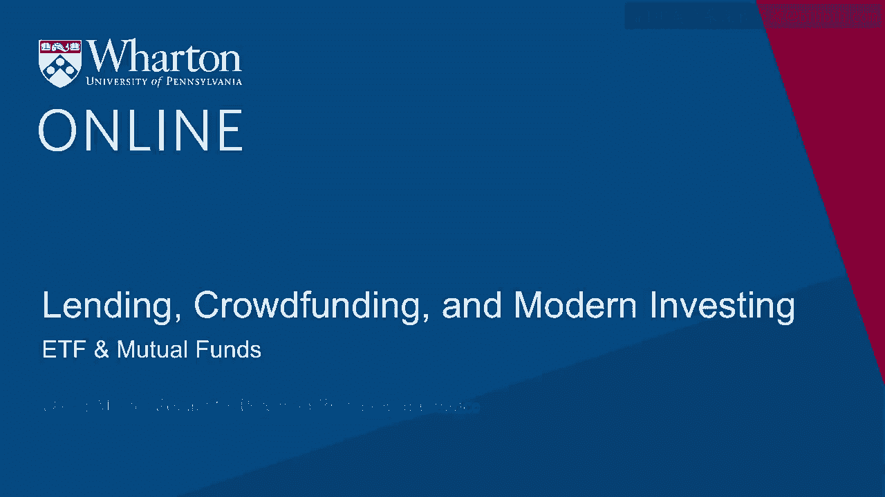
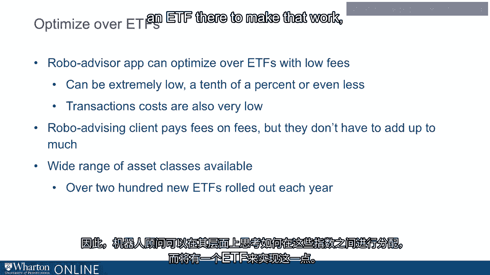

# 沃顿商学院《金融科技（加密货币／区块链／AI）｜wharton-fintech》（中英字幕） - P71：5_交易所交易基金、共同基金.zh_en - GPT中英字幕课程资源 - BV1yj411W7Dd

 Okay， so where are we now？

 So we have just been through the logic of mean variance optimization and we started with。

 the premise of decreasing marginal utility and followed that all the way to the concept。

 of efficient portfolios and talked about how you could sort of do this the hard way。

 or the easy way。 The hard way maybe has more potential to deliver a lot of diversification benefit。

 optimizing， over lots of assets but your output is only as good as your input and you have to bear。

 that in mind。 We talked about the easier approach of just say let's just say the value let's just say。

 the value weighted market index is efficient and just leave it at that and there's some。

 actual justification for taking that point of view or we can take the point of view that。

 well okay it's a good idea to be trading indices because of the problem of information asymmetries。

 right private information raising transactions costs as Dr。 Akaloff showed so if we're going。

 to optimize over individual assets why not have those individual assets be indices and。

 then just optimize over those and so we can still keep our transactions cost down okay。

 so that's where we are and what I want to talk about next is what are these assets that。

 we can optimize over that allow us to diversify across indices and basically there are two。

 types of assets that I want to talk about here number one is going to be your basic open。

 end mutual fund I was called mutual funds you're going to say mutual fund what I mean。

 is an open end to mutual fund which I'll define in a second think about fidelity Magellan that。

 kind of fund okay and the other is going to be an exchange traded fund with these assets。

 are now called ETFs right ETF exchange traded fund okay so those are the two things I want。

 to talk about those really are the main workhorses of the of the robo advisor it's going to be where。

 they're going to be putting your money so let's talk about each of these and and see what。

 they work and and how they're going to be appealing to the robo advisor okay so first mutual funds。

 okay so your open end mutual fund has been around since the 20s okay the 1920s it's a。

 very simple idea right so if I have a mutual fund then I'm managing money and if you want。

 to invest with me okay well you can give me 10，000 bucks to of your money to manage and。

 then I would take your 10，000 bucks I would put it in the funds so now my funds gotten。

 bigger by 10，000 bucks and I got to go put your money to work by buying more buying more。

 shares or whatever it is I'm trading and what do you get you're going to get shares of the。

 fund and at what price are you going to get shares well I'm going to calculate the per。

 share value of my mutual fund so I value the whole portfolio that I'm holding of all。

 the different things value it at the end of the day and come up with a dollar figure divided。

 by the number of shares outstanding of the fund and that ratio is the value per share。

 of the fund and that's the price that you're going to pay okay so that is the that's your。

 classic open end mutual fund people call it open end because your money is going you know。

 right in the fund or coming out of the fund later when you want to get out your investment。

 is directly making the fund bigger or smaller now the mutual funds have been around for a。

 long time now but they this industry has changed tremendously over the past let's say over。

 the past 40 years but especially let's say just in the past 10 years I would say 10 or。

 15 years this industry has changed the most and the change I'm talking about is a transition。

 from a world of active management to a world of passive management so when I say active。

 management that's what it sounds like right that I you give me your money and I am going。

 to actively manage it I'm going to figure out you know which stocks are undervalued I'm。

 going to buy those if they're overvalued I'm going to sell them I'm moving your money around。

 the different possibilities based on my research my diligence that I'm doing and with the goal。

 of giving you an enhanced return I'm going to I'm going to beat the market with my with。

 my analysis and my trading skill okay so that's active management that was sort of the whole。

 world of mutual funds if you go back 40 years but especially recently people have been moving。

 instead into index investment and for two reasons really number one the track record。

 of active managers has not been good on average so in a given year the fraction of active managers。

 that beat the market is is below a half okay most of them don't beat the market okay part。

 of this of course is they charge pretty big fees you might pay one percent per year to。

 your active manager to make his trades whereas if you invested with an index fund they would。

 charge you far less right you put your money just an S&P 500 index fund you're not paying。

 one but I hope you're not paying one percent right I hope you're not because you can get。

 that for less than a tenth of a percent that is these index funds you know they're not。

 doing much labor here they're not doing a lot of research they're not doing all this。

 work they would otherwise charge you for they're also not trading very much right because they're。

 just buying the index and so it's all going to be a lot cheaper and people have been convinced。

 by that logic and money is moving from active management into indexing okay and one thing。

 that means is that these days in the mutual fund space you have a lot of choice there are。

 a lot of different index funds out there so just I say don't take my word for it go take。

 a look at all the offerings at Vanguard Fidelity all the whatever mutual fund family you like。

 take a look you'll see a lot of different choices of index funds country index funds industry。

 index funds socially responsible index funds where they have screens they're screening in。

 or screening out certain kinds of stocks based on some some sense of what is more ethical。

 than than what else lots of index funds that you can choose from these days okay now so。

 that's your open end mutual fund but let me just make a couple points here about open。

 and mutual funds I'm going to contrast with the ETFs in a second okay notice that when。

 you trade with an open and mutual fund you're putting money in the fund so your investment。

 makes the fund trade okay now that can be you know some amount of drain on the fund that。

 people go in and out and going in and out makes the fund trade because that's transactions。

 cost right so there's there's that there's also another thing which is that if you want。

 to invest in an open and fund there's only one time of day that they trade which is the。

 end of the day so if in the middle of the day say hey I want to I think now is the time。

 to get in the market well you can make an order for shares but you're not actually buying。

 shares until the end of the day so whatever happens in the market for the rest of the day。

 you're not getting right you're only getting you're getting in at the end of the day so。

 bear that in mind too and also a given fund family is not necessarily going to be accessible。

 from just any trading platform okay trading platforms can be can be sort of signed up with。

 certain fund families and not other fund families so you want you say you want to put money in。

 some fund well if your platform doesn't have it well that's then it's going to be it's。

 going to be tough not impossible because you can contact the fund family directly and roll。

 you can do it but it's just it's just a bigger hassle and finally a mutual fund is generally。

 going to have a minimum investment you can't very often put just a hundred dollars into。

 an open and fund they'd have a minimum of the bank art I think their minimum is it's。

 three thousand bucks for anything right you got to have three thousand bucks if you don't。

 you're not putting money in one of their funds okay until you can accumulate that much cash。

 all right so that's and that's the world of open and funds now let's think about ETFs。

 right exchange traded funds now as it's as the name indicates these are funds whose shares。

 trade on the exchange okay so they trade on the exchange that means when you buy shares。

 of an ETF you're not you're not putting money in the fund you are just buying shares from。

 somebody else who's selling them okay your your money goes to the seller and you get。

 the shares but the fund itself is sitting there untouched okay your trade is of no consequence。

 direct consequence to the fund itself okay so so you're not making the fund trade now bear。

 in mind there is going to potentially be a transactions cost on the market so maybe it's。

 going to cost you you know a penny a share maybe a few pennies a share to make this trade。

 so there's a transactions cost on the market but you're not making the fund trade itself。

 okay also another difference from the open and fund is because these shares are trading。

 on the exchange you can go in and out whenever the market is open right you can go in or out。

 whenever the market market is open you don't have to just wait till the end of the day right。

 so if you think right now right now I think I like what's happening in the market I'd。

 like this news that came out I think now is the time to trade I can go in right now or。

 if I get worried right now I can get out right now so so you can trade whenever you want。

 and also you can you can in principle just buy or sell one share now that's kind of an。

 odd thing to do in the market I just sort of like a you know it's possible right if if。

 a share cost a hundred bucks you could just buy one share and invest a hundred bucks that。

 is that that's a that's a doable thing where it's not a doable thing you know with Vanguard。

 there you would just simply need three thousand bucks or just not investing at all okay so。

 there's there's no minimum okay and furthermore because it's trading on the exchange you can。

 access it from any brokerage account any brokerage account you can trade stocks trading in exchange。

 and there's no problem if you have a broker account you will be able to trade any any ETF。

 trading in the US okay so if you take a look at what these robo advisors are going to do。

 they're going to focus on the ETFs they're going to focus on the ETFs because you have。

 the whole range of ETFs to choose from you can go in and out whenever ETF ETF fees are。

 even lower than the index funds for the most part they're lower than the index funds offered。

 by open end funds right because ETFs it's actually a little cheaper to run an ETF it's。

 just logistics of it or cheaper than than an actual fund they can charge slightly lower。

 fees so so the robo advisors optimizing over for the most part these these ETFs and even。

 and because the ETF fees are so low right if you if you if you invest the robo advisor you。

 are paying fees on fees right you're paying fee to the robo advisor and you're paying a。

 fee for the investment that they put you in but the fees on the investments they put you。

 in are really low okay so even you add those two things together you're not talking about。

 a lot of you know much per year right you're not talking about for example whole percent。

 per year right because both those fees are pretty low okay and there's just always more。

 ETFs coming out right so the so if the robo advisor wants to optimize over a wide range。

 of possibilities well there are about 200 new ETFs rolled out every year with just every。

 possible kind of sort of combination different sorts of indices that you might want to aim。

 for so the the the robo advisor can can sort of think at its level about how to allocate。

 across these indices and there's going to be an ETF there to to make that to make that。

 work to put that to take that to the basket so this is what you're generally going to see。

 in this space is that we're going to optimize with the robo advisor either you take to just。

 value it index is efficient approach or you take as other approach you're going to optimize。

 over indices and if you look at the ETF space there's an index for everything and so that's。

 a feasible thing to do too。 [BLANK_AUDIO]。

