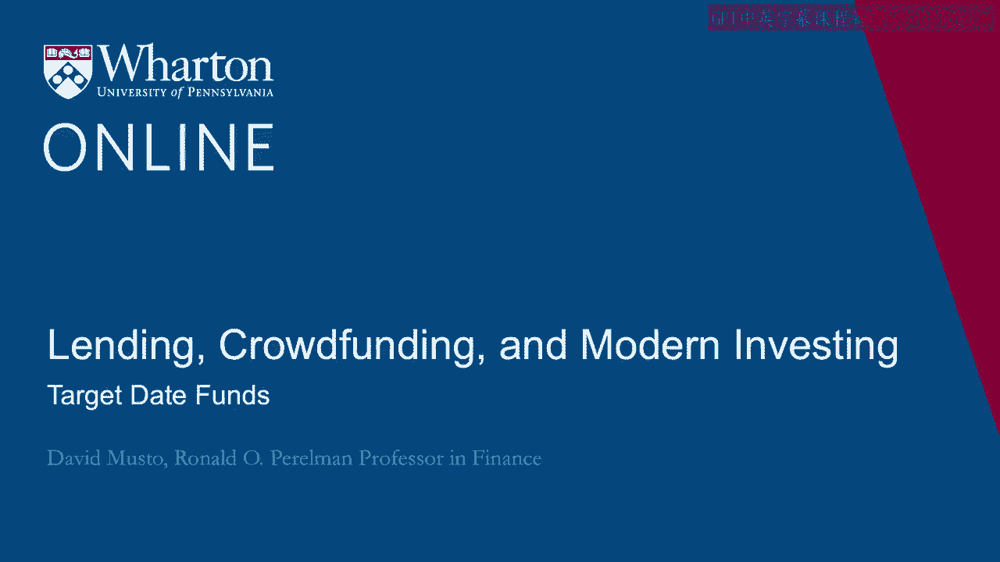
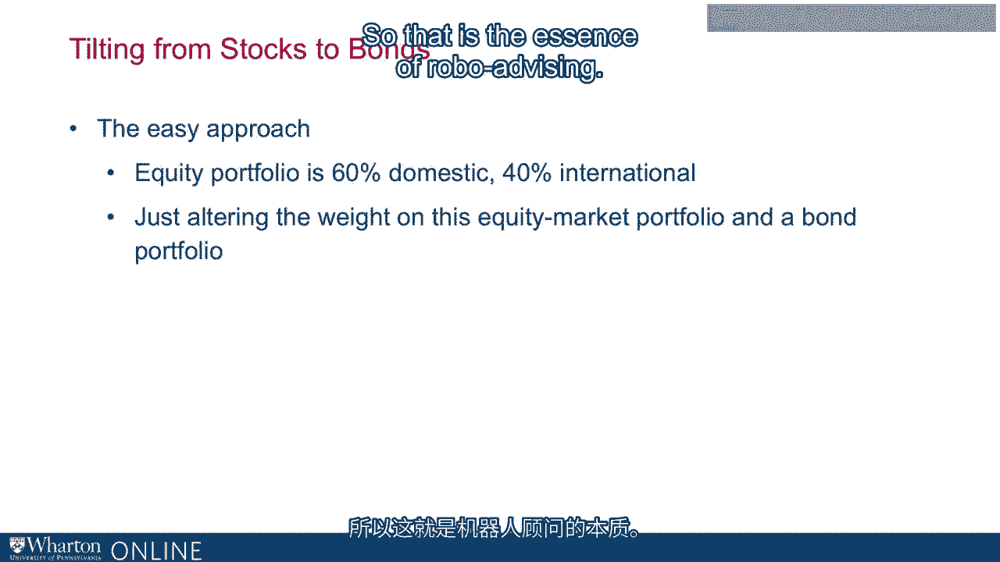

# 沃顿商学院《金融科技（加密货币／区块链／AI）｜wharton-fintech》（中英字幕） - P72：6_目标日期基金.zh_en - GPT中英字幕课程资源 - BV1yj411W7Dd

 A robo-advisor doesn't just pick a portfolio， it picks the portfolio for you。

 It takes information that you provide and turns it into the right portfolio for you。

 We talked earlier about risk aversion and ways that you can measure risk aversion。

 You don't just have to ask somebody， "Well， how risk averse are you？"。

 You can ask them very targeted questions that bring out their risk aversion in a way that。

 that's going to be quantifiable and useful to you。 That's one thing。

 Another thing that's probably going to be the most key customization they do is going to。

 be targeting where you are on the life cycle。 Where are you now relative to when you picture yourself retiring？

 That's going to be one of the most important customizations that they can do。

 There's going to be other things too we can talk about， but this is going to be key here。

 If you think about it， there's going to be a real pattern that you would expect in life。

 cycle investing。 There's a pattern you would expect。

 This has been how people thought about life cycle investing forever as long as people have。

 been saving for retirement， which is that more risk is more appropriate when you're younger。

 when your investment horizon is far off， it's more appropriate to think about taking a。

 lot of risk than when your investment horizon is starting to approach。

 His retirement is starting to be around the corner。 If you go back to the 50s or 60s。

 if you were going to a financial advisor back then， there's。

 a rule of thumb that they love back then。 This is a standard thing they would say to say， "Look。

 you need to be adjusting your risk， to where you are relative to retirement and the rule is always。

 let's take your age and， subtract that from 100 and the result is going to be how much we put in equities。

 If you're 20， then we'll put 80% equities。 But once you're 60， it's only going to be 40% equities。

 We're going to just generally speaking， going to be taking down your equity exposure over。

 your life along that line。 That was just the rule of thumb that people like to follow back then。

 This is still pretty much the conventional wisdom that people follow that over time。

 If you're investing for the long horizon， then you think， "Well， I can put money in。

 something risky。 Yes， it's risky。 It's going to go up and down， but over a long horizon。

 I should expect the ups and downs， to wash out。"， Now。

 I don't want to suggest here that you can count on that if you think about the defined。

 benefit plans we were talking about at the top of this module。

 There's a lot of expectation there of risks evening out over time。

 It didn't quite work out that way。 They didn't even out nearly as much as they'd hoped。

 I don't want to raise people's hopes too much。 You can count on that。

 but it's certainly more reliable at a longer horizon than a shorter， one。 In the long horizon。

 you ramp up the risk。 As the horizon shortens， you lower it。

 This leads me to a product these days that it's not robo-advising， but it's very popular。

 and it gives you a sense of what robo-advisers are doing。 That is target date funds。

 Target date funds。 Target date funds are by far the most popular choice these days for retirement savings。

 This is the basic idea。 The target date fund， what are they doing？

 They are doing essentially what I just said。 When you sign up for。

 you walk into your job and it's the hand you， they send you to the， website saying， "Okay。

 here are the choices。 Click on these things and click on the funds that you like and tell me what percentage。

 you want and which fund and that's where your money is going to go once we start taking。

 out of your paycheck。"， The overwhelming choice these days is the employee will say， "Okay， well。

 when about， when am I going to retire？ If I'm right now starting a job right now， I might think。

 "Oh， I'm probably going to retire， something like 2065。"， Something like that。

 So I would look and I would say， "Oh， there is a 2065 target date fund。 I'll just go with that。

 2065 target date fund。 Just send all my money to the 2065 target date fund and that's it。

 That is a very， very popular choice these days。 One and done。

 I just picked the 2065 fund and I'm all done。 Now， what's going to happen now that I chose that？

 That fund is going to execute that life cycle tilting that I just described。

 When you're way off from retirement as you are now， it's going to put you heavily into。

 equities in a little bit into bonds。 Then over time。

 it's just going to follow a rule by which equity investment goes down。 Bond investment goes up。 Now。

 bear in mind， when you say target date， some people have gotten confused with these， funds。

 They hear target and they think there's a target amount at the end。 If I invest in this。

 I'm going to have enough money to retire in 2065。 That's not quite what they're saying。

 They're targeting that date。 They're following a rebalancing rule that targets that date of 2065。

 but how much you， are going to have then， that's really going to depend on what happens with the market。

 This confusion was a big deal back during the financial crisis。 If you think about in 2008， '09。

 market went way down。 Whatever your target date fund had in equities at that time， well。

 they were exposed to that， return。 If you were sitting and thinking that there was a definite amount of money that you were。

 going to get at retirement and now you see your balance go way down， well， no， there's。

 not a definite amount of money。 It's just they're following a rule。

 That rule is key to your life cycle， but the market is still going to do what it does。

 and you're still going to be exposed to the risk。 To illustrate this。

 let me show you some numbers that I pulled off of Vanguard's website。

 What I did was they have a disclosure which shows all of their target date funds and they。

 show for each target date fund how they have allocated the assets of that fund。

 As you see on this screen here， you have target date funds for 2065。

 That's the furthest out date that you can get a target date fund for and then it's every。

 five years， right？ So 2060， 2055， and so on， all the way down to 2015。

 which would be people who are just， retired， just about to retire or something like that at this point。

 people who thought， they were going to retire in 2015 back when they invested in the fund earlier。

 Then they also have a fund that I've put at the very end here， which is the fund they。

 have for people who are currently retired。 So I've lined them all up and color coded them so you can see the tilting of the assets。

 that I'm talking about。 So in this chart here， you see the dark blue at the bottom。

 That's their allocation to the evaluated US equity portfolio。

 The orange is their allocation to a evaluated international equity portfolio。

 So the blue plus the orange is essentially Vanguard's view of the world market portfolio。

 And you can see that if you're invested 2065 funds， so it means you're a really young person。

 you're just starting your job， you're like 90%， 90% inequities。 A little bit。

 that 10% there in bonds。 And you see it basically stays there for a while until you get to 2040。

 So about 25 years later， it starts to taper you off of the equities and it goes down， down， down。

 down， down， down， down every AC every time as you go from one fund to the， next。

 representing people who are closer and closer to retirement。 As you go left to right here。

 you see that the allocation to that equity market portfolio， is going down， starts at 90。

 ends up all the way at 30。 So it's even a retirement。

 they've still got you in the market a little bit there， right？ So in retirement。

 you're still in the market some， but you're deeply into the fixed income， the bond portion。

 which is the gray and the yellow。 And the blue is basically cash。

 the light blue at the top is basically cash。 So you can see how you can see that life cycle investing there。

 So there is a very simple example of customizing your， customizing your portfolio allocation。

 to where you are in the life cycle。 And let me point out one more thing。

 which is that what's Vanguard doing as they， when， they think about efficient portfolios here。

 you're seeing that sort of easy approach they， mentioned before。

 Remember I said the easiest way to think about mean various efficient portfolios is that。

 the market portfolio of sort of evaluated index of everything is more or less an efficient。

 portfolio and then you sort of lever up and down your investment in that market portfolio。

 Well that's what Vanguard is doing， right？ If you look at that graph that that's exactly what Vanguard is doing。

 Basically this 60， 40 mix of domestic versus international stocks is the market portfolio。

 And all they're doing over time is just you're investing more or less in that market portfolio。

 and then putting the rest essentially in something like the risk free rate in any case， the bond。

 return。 So that is the sort of essence of robo-advising there， a customized portfolio that is taken。

 into account just one key factor which is how close you to retirement and coming up with。

 a customized retirement plan on that basis。 [BLANK_AUDIO]。

