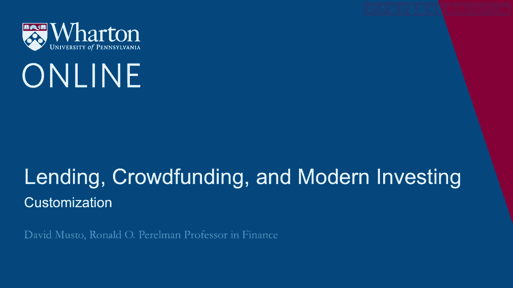
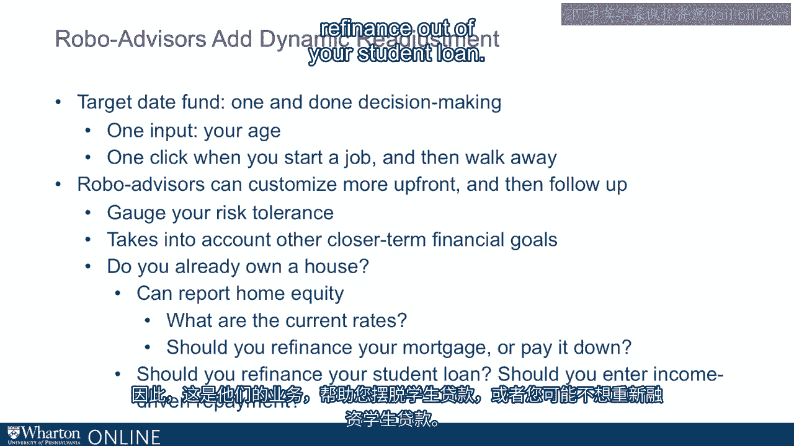
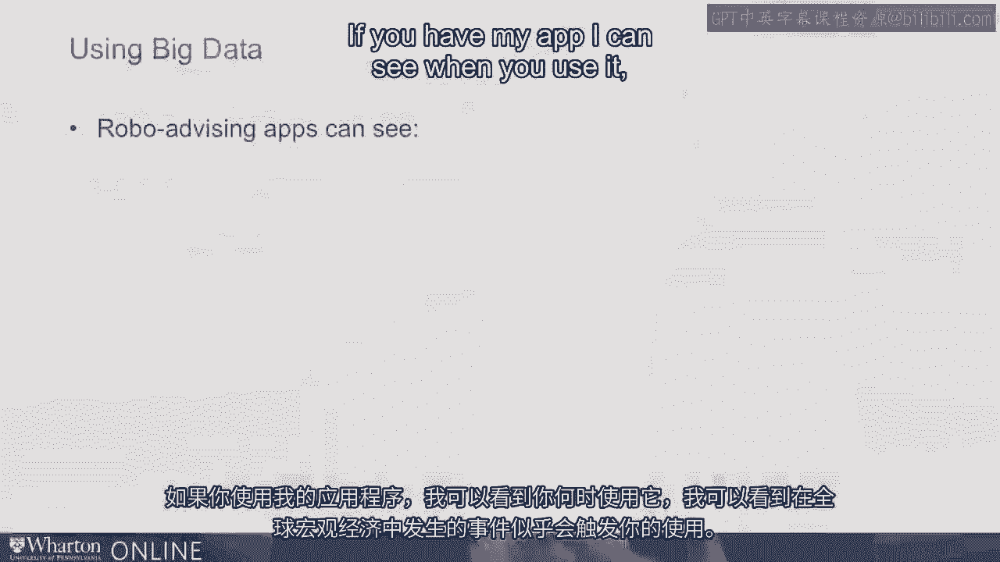
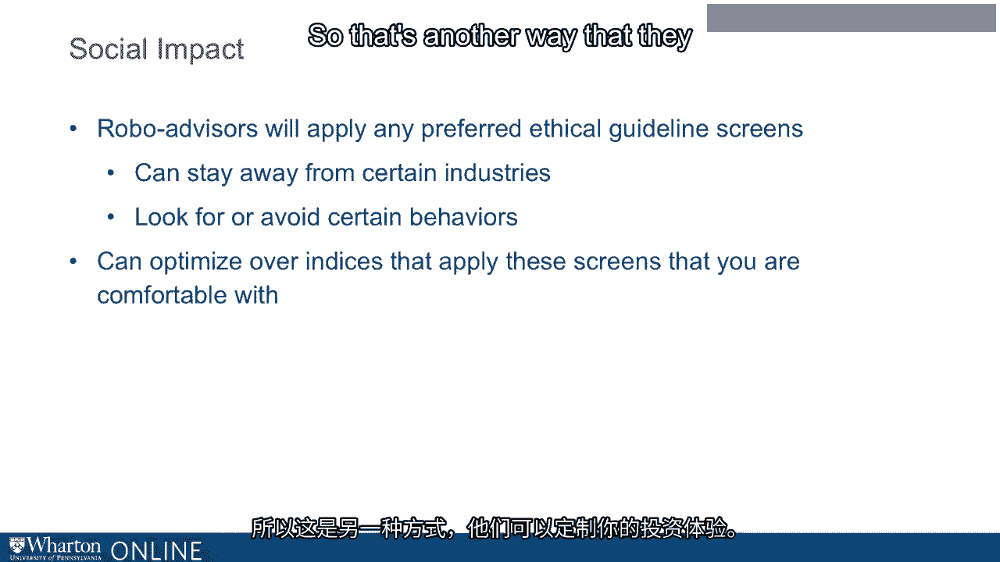

# 沃顿商学院《金融科技（加密货币／区块链／AI）｜wharton-fintech》（中英字幕） - P73：7_定制化.zh_en - GPT中英字幕课程资源 - BV1yj411W7Dd

 Okay， so we saw that target date funds， which are sort of the newest thing and the hottest。

 thing in retirement investing these days are a simple example of customized investment。

 Customized is just one thing， right？ How old are you or how long do you expect it to be until you retire？

 Take that one fact and out of that create an investment plan。

 Robo-advisors obviously can do better than that。 They can find out much more than just your age and they can customize more accurately。

 than that。 We talked about how they could gauge your risk aversion by asking targeted questions and。

 customize your portfolio of that。 And of course， there's plenty of other financial goals that you might have besides retirement。

 You may have the goal of buying a house， right？ You want to have a goal of buying a house and you want to save towards that goal as well。

 And so that's something that can be， you can plan towards that in a very similar fashion。

 Or maybe you already have a house， right？ Maybe you already own a house and that is another source of your wealth。

 your equity in your， house。 Well， that's something that a Robo-advisor can track for you。

 It's not that hard， right？ If I know where your house is。

 I can go to one of Zillow or lots of other sites and grab。

 a sort of an appraisal that moves over time。 It's going to move over time with other transactions in your neighborhood and I can report to you。

 what's happened to your home equity in the past month or so。

 And you can think about how to use that fact。 How to use the fact that you have that money？

 Do you want to take some of that out with a home equity loan？

 What's the rate in the home equity loan？ Well， that's another thing the Robo-advisor can present to you and maybe make a suggestion。

 Okay？ Or how about your mortgage， right？ Could you be refinancing your mortgage now？

 Is that an opportunity these days？ Is it worth it to refinance your mortgage or pay it down？

 What about your student loan？ Okay？ You can refinance your student loan。

 There are companies that will help you with that。 SoFi is that's their line of work helping you refinance out of your student loan。

 Or maybe you don't want to refinance out of your student loan， right？

 If you refinance out of your federal student loan into sofi or something else like that。

 and now you're going to lose your opportunity to enter income driven repayment in the future， if。

 if circumstances should change， right？ You'll miss the opportunity to enter into this program where your payment can be reduced。

 to 10% of your disposable income if bad times hit。 Maybe is it？ How do you think about that？

 How do you think about the lower rate from sofi versus losing the opportunity to， to。

 enter into income driven repayment in a bad circumstance， right？ Those are tricky questions on the。

 on the debt side of your household balance sheet that， a robo advisor can help you think about。

 Okay？ And also， you know， so we talked about just a few things that， you know， that the robo。

 advisor can ask you and bring to bear to your portfolio。

 There's all these other things that they don't have to ask you。 They just have to watch you， right？

 If you're my， if， if you have my app， I can see when you use it。

 Okay？ I can see what kind of events occur in the macro economy in the world that seem to trigger。

 you using it。 I can see where you click。 Okay？ I can see where other people are clicking right now。

 Okay？ So I can， I， I'm learning a lot just， you know， you think you're just looking at your app。

 I'm learning about you constantly。 Okay？ And I can use that in ways that。

 that could help you or maybe， maybe you might think it's， maybe it's not going to help you。

 Maybe you think I'm going to take advantage of you somehow。 Well， I'm not saying they won't。 Okay？

 But that is all potentially useful information that would， that I can potentially bring to。

 bear on the offers I send your way， the reminders I send to you， the suggestions I make， all。

 that can be key to the behavior that I observe in you and the contemporaneous behavior I can。

 see in other people and the decisions that they make。 Okay？ So that is a real opportunity there。

 real scope for a big data approach to， to， to， to， customizing your Robo-Advisor experience。

 And I mentioned social impact， a bit back。 This is。

 you think about the big trends in investing these days。 You know， index funds， there's。

 target aid funds and the other big sort of movement these， days is social impact。

 And this is where this is another area where Robo-advisors are going to， are going to help。

 you put to， put to work whatever ethical guidelines you want to， you want to bring to， bear， right？

 So if there are certain industries that you don't want to be involved in， in this sense， of being。

 being a shareholder， well， that is something you， you， you， there's there， you。

 can articulate what your screens are。 Don't put me in this industry。 Do put me in that industry。

 Look for this behavior。 Avoid that behavior。 This is， this is all bread and butter for the。

 for the Robo-advisor easily pare down the， universe of assets they optimize over。

 make sure that this is a universe that you are， comfortable with and then put that to work。

 So that's another way that they can customize your investing experience。

 [BLANK_AUDIO]。

