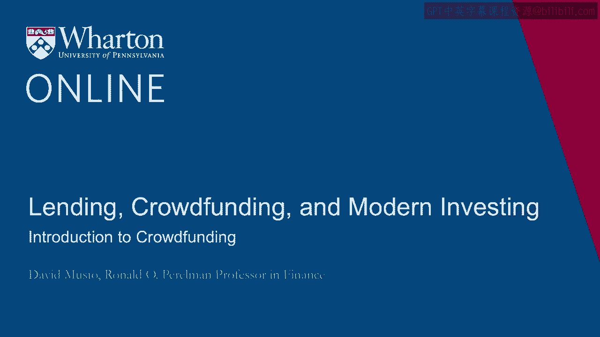
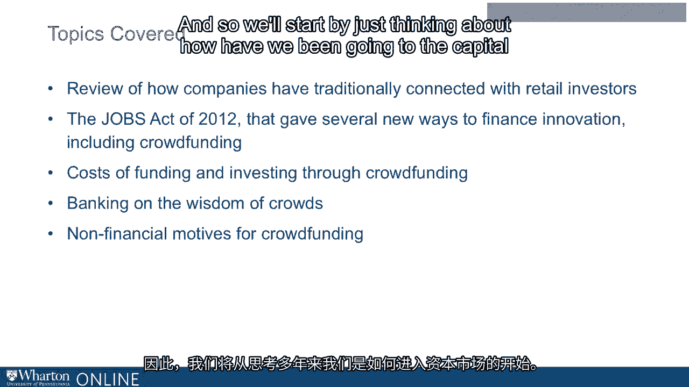

# 沃顿商学院《金融科技（加密货币／区块链／AI）｜wharton-fintech》（中英字幕） - P74：8_群众筹资介绍.zh_en - GPT中英字幕课程资源 - BV1yj411W7Dd

 Hi。 Well， this course covers crowdfunding， which is a very new arrival to America's capital。

 markets。 Crowdfunding started in earnest in spring of 2016， which is just three years。

 ago from where I'm speaking。 And three years would be a short track record for anything。

 any sort of financial market or security。 But for startups， it's a very short track record。 I mean。

 think of anybody you know， someone you knew in school， someone in your neighborhood。

 who quit the day job， started a new company and started working towards a success。 How。

 long did it take for that person to achieve， for their project， to achieve some level of。

 promise that would show the value of what they were investing in？ That probably not， three years。

 right？ Four or five could be ten years， right？ So for crowdfunding， crowdfunding， as I say。

 we've just started crowdfunding。 Three years ago is when the first companies。

 got their money this way。 And so this is a market that's so new that this course isn't。

 going to be thinking so much about， well， what has crowdfunding done for us， right？ It's。

 too early to say what crowdfunding has done for us。 But what we can do is look at what。

 crowdfunding is and see how it might fit in to the whole sort of ecosystem of financing， innovation。

 Okay。 So the focus of this module is not so much on the realized experience， of crowdfunding。

 It's about the promises and also will think a lot about the conceptual， challenges of crowdfunding。

 right？ So it's not only very possible if you're an investor。

 in crowdfunding to lose everything you invested and to just generally have a negative experience。

 right？ That's certainly possible。 It's also possible as far as we know that looking back。

 on these early years， the general experience of investors might be negative， right？ We。

 don't know yet。 And over time， given， you know， sort of the feedback loop of companies。

 going to this market， investors trying it out， having an experience and so on over the， years。

 which could be a lot of years， given the life cycle of a company， crowdfunding。

 is going to find its place in the economy。 Okay。 So coming out of this course， you will have。

 a framework for thinking of the challenges that crowdfunding faces and how you can potentially。

 overcome them either as an entrepreneur or an investor。 Okay。 So we're going to have。

 five sections of this module after this introduction。 First。

 I'm going to briefly review how companies， have traditionally connected with retail investors。 Okay。

 The whole process of tapping the retail， markets has evolved over the years to a very kind of set procedure at this point。

 And I， want to think about what that is and maybe we can think about why it has evolved to what。

 it is。 Okay。 So that'd be the first module。 The second one will look at the act of Congress。

 signed into law by President Obama in 2012， the Jobs Act that gave us crowdfunding and。

 also gave us some similar related vehicles for companies to tap the markets in some new， ways。

 So we'll talk about that。 That'd be the second module， focus on the Jobs Act of， 2012。 Okay。

 And then the third module will be thinking about the costs of funding in， this market。

 Thinking specifically about the cost to you as an investor of going to crowdfunding。

 picking companies to invest in， thinking through just given the limits on how much you can invest。

 and other things， how realistic is it that you could hope for a positive expected return。

 and what are the issues involved there。 Okay。 And then we'll think about the next module。

 is going to really focus on the crowd piece of this and what by which I mean， what can。

 you gain from the sort of wisdom of crowds？ How about， should you expect that to work， for you？

 If I'm investing in crowdfunding， well， there's other people investing too。

 We generally think of markets as sort of aggregating the wisdom of crowds。 Well， is that something。

 that's going to be there for us as an investor in this market？ Well， what are the issues， there？

 Okay。 And then finally， once we've gone through those， all those modules， I think。

 you'll see the importance of non-financial motives for crowdfunding。 The particularly。

 large role in the typical investor's mind of motives other than just the expected return。

 of the investment when we are investing in a crowd funding startup that we see on the， web page。

 So those are going to be the modules that we go through and so we'll start by just。

 thinking about how have we been going to the capital markets over the years。

 Okay。 So that's it。 Thank you。 Thank you。 Thank you。 I appreciate it。 Thank you。 Thank you。

