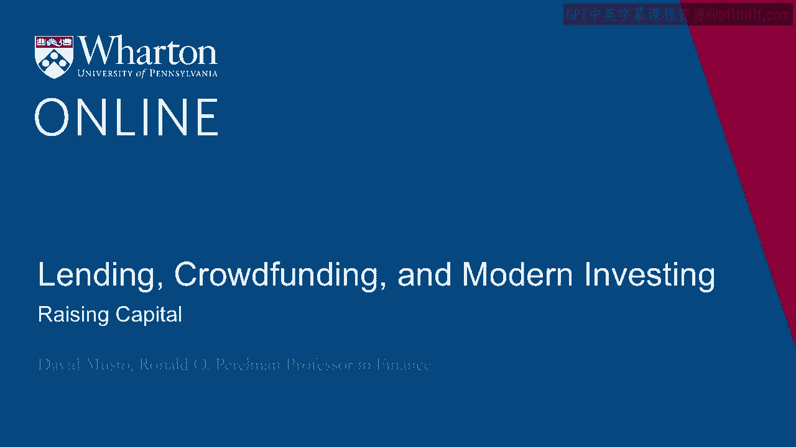
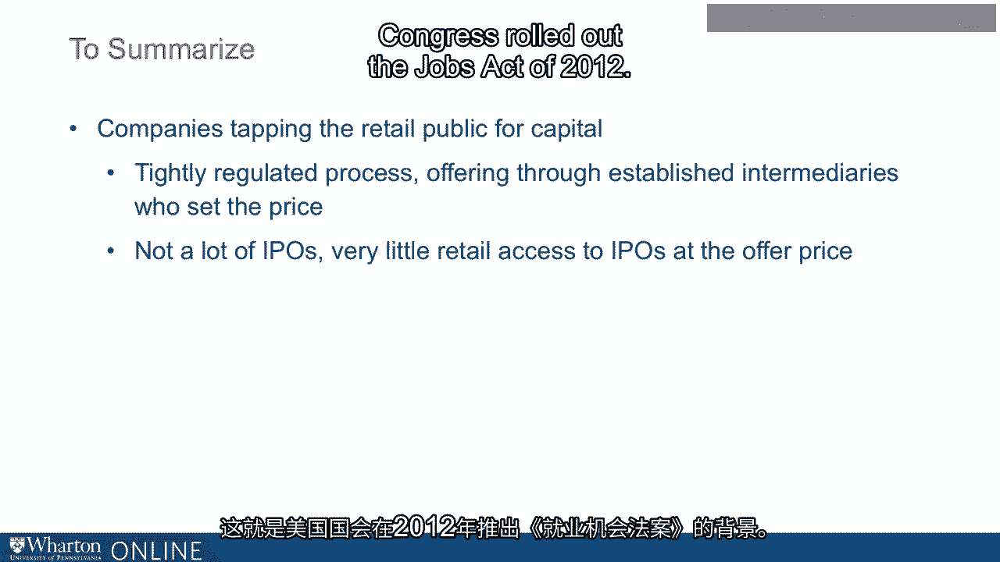

# 沃顿商学院《金融科技（加密货币／区块链／AI）｜wharton-fintech》（中英字幕） - P75：9_筹集资金.zh_en - GPT中英字幕课程资源 - BV1yj411W7Dd

 For anyone investing today， crowd funding is a big change from how companies have traditionally。

 tapped the retail markets。 But for an investor who was investing 100 years ago who somehow got a peek at what we're。

 doing today， some elements of it wouldn't look so surprising。 So the internet would surprise them。

 okay， that's true。 But companies going directly to the retail market with advertisements and with sort。

 of incautious language and celebrity endorsements and then just taking whatever money they could。

 raise that way。 So this was pretty much standard operating procedure if you go back more than 100 years。

 until sort of an accumulation of bad experiences， you know， when a fraud here and there started。

 the regulatory process at the state and then the federal level that has given us the sort。

 of protocol that we follow now for tapping the capital markets。

 When I think about how we go to the capital markets today and how crowd funding compares， to that。

 I think about there's a writer， an English writer also from about 100 years。

 ago who was one thing he said back and I think it was 1929。 He said， and I'm a paraphrase here。

 but before you tear a fence down， make sure you know， why it was there in the first place。

 all right。 Before you tear a fence down， make sure you know why it was there in the first place。

 right。 So crowd funding is tearing the fences down around going to the retail， the retail public。

 and raising money in some ways bringing us back to where we were a long time ago， not。

 in every way and it's careful in some ways， but you know there's a sense in which that's。

 what's going on， right。 So if we want to understand what crowd funding is and you know how to think about this new。

 regulatory environment， this new loosening of regulations on tapping this market， it's。

 worth first seeing what it is we're doing now in the existing regulatory environment to。

 facilitate raising money from the retail public。 Okay， so let's think about the traditional IPO。

 right， initial public offering IPO。 So let's say， let's say you're an entrepreneur and you've been very successful。

 You're so successful that now you're thinking now it's time to go public。 Okay。

 now I'm ready to go out there and sell a piece of my company to the retail investor。 Okay。

 so how do I do this？ Well， the first thing I do is I'm going to engage an underwriter， okay。

 an underwriter。 You know， an underwriter is going to be big investment bank， right。

 think Goldman Sachs， that kind of bank。 I'm going to have probably a little contest among investment banks。

 We call it a Bake Off， right。 You know， like someone's， you know。

 going to try to come up with the best muffin， right。 What's this？ That's what they do。

 They call it a Bake Off in the investment banking world where the different banks come。

 to me and pitch to me how they're going to take my company public， how they think about， my company。

 think about the valuation and so on。 They pitch to me。 I pick one of them and say， okay。

 it's going to be you and me。 We're going to take my company public。

 And notice by the way here that so now I'm engaging a bank that goes to the market all， the time。

 right。 If I engage Goldman， well， Goldman Sachs does a lot of IPOs。

 They've been doing IPOs all year。 You've got a reputation with the capital markets that I don't。

 right。 I'm just a startup。 They haven't yet heard of me probably， but they will。

 And when they hear about me， it's not just me。 It's also Goldman Sachs or whoever the bank is that I choose。

 sticking their neck out for， my reputation， right。

 So we choose a bank with a long track record of doing IPOs and then what happens。

 Now we start the process with the regulators。 So now together with the investment bank。

 we're going to work up a registration statement， a draft registration statement。

 So it's something like a prospectus for an offering， but it's a draft and we send it。

 to the Securities and Exchange Commission and they get the draft and they read it every。

 word by word and they send us back a letter which is going to have bullet points that。

 are going to go on for pages， 50， 60， 70， 80 bullet points about， you know， you say this， here。

 How do you know that？ Back it up。 You know， scale back， take it out。 Every。

 all these claims I want to make， they're holding me to task saying you back this up。

 or you take it out or you scale it back and I respond to all that。 So I see all these bullet points。

 I send a new one。 They look at that。 More bullet points back and forth back。

 Could happen four or five times， right。 So the document that is ultimately going to be presented to the public has gone through。

 this very detailed scrutiny by the regulators。 Okay。 So then finally。

 I submit that document and that's going to be for the world to see。

 It's posted on the website of the Securities and Exchange Commission。 Okay。

 So I post that document and then we choose a price range。 We haven't quite chosen a price yet。

 which was a price range。 We would say we were thinking $14 to $16， you know。

 and maybe give us sort of a sense of， how many shares we're talking about。

 Think maybe $100 million shares， $14 to $16。 So we make that announcement and then we go on the road show。

 Okay。 So now there's a two week period where the executives of my company， me and my lieutenants。

 and also the investment bank and their professionals and other people were all traveling around。

 the country and we're going to go to other countries too， meeting with the big institutional。

 investors where we are pitching our story。 Okay。 And defending the price range that we announced and they are going to bicker with us。

 We said， what do you mean， $14 to $16 and they'll have their own discussion of how that price。

 compares to the price other stocks are already trading at。

 We're going to have a lot of back and forth at the end of every meeting with the investors。

 they're going to express their interest in the offering。 And when they express the interest。

 we're going to write that down in a book。 That's called book building。

 This is called the book building process because at the end of every day， at the end。

 of every pitch， you're going to say you want shares or don't want shares。 How many shares？

 What price？ I write it down and the book just builds and I hope to have a lot more orders in the book。

 than I actually have shares to sell。 We keep doing this， keep going， keep going。

 keep on like two weeks of this。 And then finally， at the end of all that。

 at the close of trading on some day， we say， okay， that's it。

 We are going to price the offering and the price is going， doesn't have to be in that initial。

 range。 It's going to be somewhere around there。 And we choose the price and we place the shares with investors at that price and then。

 the next day it starts trading。 Now one thing to notice here。

 if you're a retail investor and you see a company going， public。

 you see right now the big talk is I'm sitting here is Lyft， right？ You know the ride share service。

 Okay， you're looking at that。 Oh， I love Lyft。 I want shares in the IPO。

 I think this is going great。 Well， you probably won't get shares。 You probably won't。 They。

 you know， their interaction on the road is all with institutional investors。

 That's what they're focusing on。 If you have a brokerage account， you tell your broker， hey。

 get me some shares in that Lyft， IPO。 He might say， well， okay， I'll see what I can do。 All right。

 And probably he'll come back and say， no， no， you're not going to get shares in the IPO。

 If you're a huge customer， if you're a huge customer of that brokerage， then yeah， maybe。

 if you've given a lot of business， okay， you know， this is your lucky day。 I'll give you a gig。

 you 200 shares and like that。 But mostly what they're going to say is just wait till it starts trading。

 You don't， you don't have to get them now。 You can get them when they start trading。 Okay。

 So you can do that。 But let me just say a couple of things about that。 Number one。

 when you see a company go IPO， that offer price that they choose tends to， be a very juicy bargain。

 Okay。 On average across， you know， all IPOs going all the way back to the 60s。

 If you look at every IPO and you do the little thought experiment， what if I invested at。

 every IPO at that offer price they chose and then just held it to the next day， right？

 Just the first day it starts trading， I just sell those shares I got。 All right。

 Just thought experiment， right？ If you， you look at what you would have made would have been on average in one day 18%。

 okay？ The one day return 18% and that's an average across the IPOs。

 So you might look at that and say， oh my gosh， that's great。 It's hard to make 5% today's world。

 This is 18% in one day。 But in fact， your broker is not going to give you the shares when he does give you the shares。

 If you ever does， if you're not a big customer， but he said， you know， I can get you the IPO。

 shares。 This is your lucky day。 I can get you the shares and not only that。

 they're a big bargain because， you know， remember， they said 14 to 16 bucks， well。

 they're pricing it at 12， right？ They've discounted it and I'm going to get you shares at that disk。

 I can get you prices shares at 12。 Well， you know， in that case。

 that one is probably not going up 18%。 Okay， that is the big red flag。 In fact， an IPO world。

 if they price it down from the initial price range， they said 14， to 16。

 but on the big day they decide to price it at 12， that's not going up 18% probably。 On average。

 on average， that means it's probably going to go nowhere in the first day。

 It's the ones they price up， actually， are the ones that really do great。 So okay。

 so you're not going to get you as a retail investor， as a retail investor， you're。

 not going to get in on the IPO at the IPO price。 You can buy it in the aftermarket when it starts trading。

 but actually that tends to， be not a bargain really at all。 In fact。

 it's well established that on average， if you look at stocks that have gone public。

 if you buy them on the aftermarket where they're trading， on average over the next couple， of years。

 their average return is actually kind of below the market， and kind of below， the market。

 IPO sort of underperform once they start trading for a couple of years。 Okay。

 So it's not really that exciting to get in on the IPO in the aftermarket。 Of course。

 you could buy a stock that goes to the moon。 If you bought Google or Facebook or whatever after their IPO。

 boy， that would be terrific， if you held on to those shares。 So obviously。

 in any point you can buy a winner stock， but it's really getting in at the IPO。

 price that is so attractive and as a retail investor， that's not going to happen。 Okay。

 So that's just a sketch there of how we go public。

 There is a lot of regulatory scrutiny with all the documents that you are presenting， to the public。

 You're engaging an underwriter who has tremendous experience and reputation with the capital。

 markets。 So that's what it's like for the issuer's point of view。

 And the retail investors point of view， IPOs are fun to watch， but it's not really something。

 that you're going to participate in。 You can buy it like anyone else。

 You can buy it once it starts trading。 Okay。 So bear that in mind。

 Here's one other interesting fact， which is that the number of IPOs is way down。 It's way down。

 Okay。 What I mean by that is when I started teaching here at the Wharton School， it's the mid-90s。

 Okay。 I've been here since the mid-90s and the mid-90s。

 The number of publicly listed companies was over 7，000。 There's about 7。

200 publicly listed companies in the US。 Okay。 And then I've been going up and up and up and it seemed just natural。

 Well， of course， it's just going to keep going up as the US population grows。

 So naturally you think the number of publicly listed companies would grow。 Okay。

 So the number of publicly listed companies is today half of what it was about 25 years， ago。

 So you think from the retail investors point of view， just the scope of choice。

 Where am I going to put my money？ What are the opportunities out there for me to take a view on some stock to get in on。

 a ground floor to make an exciting investment？ Well， there's half as many stocks as there were。

 And I think about why that might be。 Well， of course。

 it's easier for companies to stay private these days。 Think about Uber。

 So I said Lyft is going public。 Well， Uber isn't and hasn't。 They've been private for a long time。

 You can think of a lot of other companies like them staying private。

 You have a lot of companies also that maybe it was never even their goal to go public these。

 days that their goal is just to get big enough maybe to be a threat to Google or Facebook。

 or Apple or some company like that and then just sell out to them。

 So by the time they're ready to sell， while they sell out to a big company and you never。

 even got your chance because they just sell out to a public company that's over to their。

 going to be a very small part。 So sort of the investment opportunity said has shrunk over the years and this has made。

 life even more difficult for the retail investor to put their money to work in a way that they。

 find interesting or promising or that they enjoy。 So just to summarize what we've said here。

 the status quo of raising money from the capital， market。 So I'm going to go to the retail public。

 I do that through the IPO process in which the retail public really barely plays any role， at all。

 I do this tight scrutiny by the regulators through engaging an underwriter with a big reputation。

 This has worked reasonably well over the years but it's also come way down as a part of the。

 capital markets。 Many fewer IPOs than there used to be。

 Many fewer public listed companies than there used to be。

 And that is the context in which Congress rolled out the Jobs Act of 2012。

 Thank you。 [BLANK_AUDIO]。

