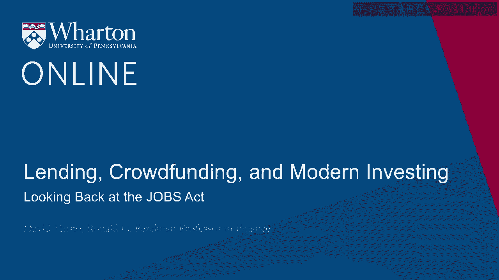
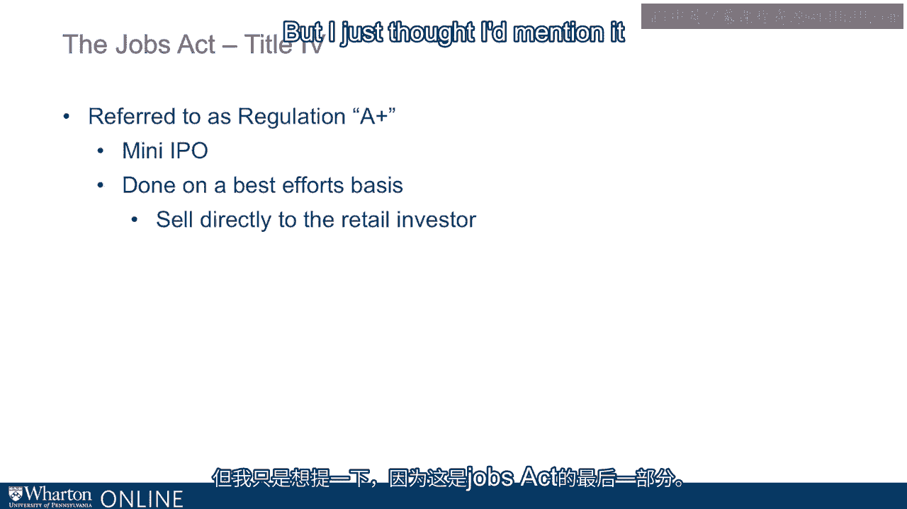

# 沃顿商学院《金融科技（加密货币／区块链／AI）｜wharton-fintech》（中英字幕） - P76：10_回顾就业法案.zh_en - GPT中英字幕课程资源 - BV1yj411W7Dd

 All right， so we owe crowdfunding to the Jobs Act。

 Now the Jobs Act was bipartisan legislation that developed in 2011 and was finally signed。

 into law by President Obama in 2012。 I mean， that's rather a remarkable fact just by itself。

 by the way。 By partisan legislation in an election year， but this was a topic that was much on the。

 minds of people in Congress。 Here we were coming out of the Great Recession。 The darkest moments。

 I suppose， were 2009 into 2010。 The rate of IPOs was very low。

 was almost nonexistent for a while there。 You remember those days。

 you remember Ben Bernanke talking about looking for green shoots。

 like new plants growing up after there's been a forest fire or something like that。

 New signs of new life， the next generation of entrepreneurship rising out of the ashes。

 So that was the context in which Congress was thinking， what can we do？

 What can we do to bring capital into startups， get entrepreneurship going， to jumpstart。 So Jobs。

 with a stand for it， jumpstart our business startups act。 That's how you get jobs。

 Jumpstart our business startups act。 So that was 2012。 But if you look at the Jobs Act。

 there were four titles。 It's really Title III that we really care about here where people talk about crowd funding。

 They're talking about Title III， which people often just call regulation crowdfunding。

 But there's three other titles too。 So let me just sort of sketch what's going on with all the titles。

 And then onwards in this module， focus largely on Title III。 So these different titles。

 as you'll see， are focusing on somewhat different points on the， startup growth curve。

 And they are trying to bring different benefits to different companies。

 Address the concerns that would be most on your mind at those different points。

 And also these titles took effect at different times。 I said Title III took effect in mid-2016。

 The other titles actually kicked in a little earlier than that。 Okay， so Title I。 Title I。

 the phrase people associate with Title I is emerging growth company。 Emerging growth company。

 And the idea of Title I was you've got companies that might want to go public。

 But maybe something's holding them back。 Something's holding them back from going public。

 And can we identify what's holding them back and maybe relax a little bit on the costs or。

 the restrictions that are keeping them from tapping the cap on markets。 Okay。

 so the idea was emerging growth company。 So that's a company that is making less than a billion dollars。

 basically revenue， not profit， revenue， billion dollars。

 That such a company would be called an emerging growth company。 And if they wanted to go public。

 they could do it in a less onerous way， a way that might。

 be a little less costly or intimidating to them。 And that's maybe that's why they're not doing it。

 So one of the big pieces of it， and this is really caught on， is a confidential review， process。

 Okay， so the idea is， I mentioned in the previous section that if I'm going to go public， I。

 submit this draft statement and then the SEC reads it very carefully。

 And then they give me all these bullets and I got to respond to that， go back and forth。

 back and forth。 Well， if I'm an emerging growth company， I still have to do all that。

 but it's all confidential。 So the public doesn't see any of that。

 It doesn't see any of that unless and until I decide that let's do it， let's go public。

 So in other words， I could go through that whole process， which takes months。 All right。

 takes months。 And then at the end of that process， I then decide， well， okay。

 do I want to do this or， not？ Do I want to go public or not？ I might think， well。

 given the feedback I'm getting from the SEC， or maybe just given。

 what's happened elsewhere in the markets for several months， because several months is， a long time。

 I'm thinking back to last year， I'm thinking back to 2018。 Well。

 mid 2018 was gangbusters in the stock market。 Lots of IPOs， everyone's going to market。 Late 2018。

 you may remember the market just fell off a cliff。 Everything stopped。 It was high volatility。

 So you could have started the process mid 2018 thinking， okay， this is great。 Let's get going。

 And then you get to the November or so， wait a second， let's stomp on the brakes and not， do it。

 And if you did， the public would never even know that you started the process。

 It's all confidential。 And so you don't have these sort of embarrassment， essentially。

 of starting something that you， then stop。 And also。

 you don't have to disclose all that confidential information。 Think about Lyft， right？ Well。

 when Lyft， when people could see the Lyft's financials， they learned quite a lot。

 of things they didn't already know， right？ And Uber hasn't done that， right？ We know about Lyft。

 We don't know about Uber， right？ Because Lyft is going public。 So you can decide not to go public。

 you can sort of， in some sense， fail privately in， this process。 And of course。

 you could always just pick it up and do it some other time， okay？

 So that has really caught on as a way to go public。 And by the way， so originally。

 this business of confidential filing was only for the emerging， growth companies。

 that piece of Title I has now been expanded by the Trump administration。

 to essentially all companies， right？ So anybody can now do this。

 Anyone can do this sort of confidential first step。 Okay。 There are also other pieces to Title I。

 other sort of costs and frictions that people complain， about in the IPO process。 So， you know。

 well， it's very cumbersome to have audited financials going way back。 Well， from Title I。

 you only need two years and not three。 You don't have to disclose as much about your compensation。

 You don't have to do what's called say on pay for a few years。 Say on pay， you may know。

 came out of the Dodd-Frank bill。 Say on pay is where a company has to disclose。

 Here's what we're paying， here's what we're paying our top people。

 They put it out there and then the investors can vote yes or no。 I should say， yes or no。

 If you vote no， if investors ultimately vote no， they can still pay that。 It's embarrassing。

 but they can still pay it。 So say on pay is more to sort of a poll of their investors。

 It's embarrassing to lose the poll， but it doesn't directly mean you can't pay them。

 But that's still a big deal to some companies like to do say on pay。

 They're perfectly happy with their compensation and they know that the public will like it。 Others。

 of course， not so。 Anyhow， so you're exempt from say on pay for a few years and there are some other things。

 like that。 One of the big things people talk about， and this is going to sound tiny， but it ends。

 up being huge， coming out of Worldcom and Enron， right， sticking back to the Sarbanes。

 Oxley bill that came out of that set of disasters， right， in the early like 2001-2002。

 Coming out of that， from that point onwards， companies had to have an auditor， have an auditor。

 attest to the strength of your internal controls over financial reporting。 Right？

 That might sound very inside baseball， right， having an auditor attest to the quality of。

 your internal controls over financial reporting。 Well， when you think about Enron Worldcom， I mean。

 just look back， you know， read those， ways you can see， well， that was the problem， right？

 So it's very difficult to be confident that a company has good controls。

 It's very expensive to do that。 And they're coming to say that， well， companies that will say， well。

 that right there， the， expense of that auditing of our internal controls is so high。

 that right there is enough not， to go public。 So， companies are exempt for a bit from that。

 but eventually， yes， you do have to do that。 I mean， eventually you grow the。

 eventually you do have to show the world that you have， controls over your financial reporting。

 Okay。 So that's Title I。 Title I is all about making it easier to go IPO。

 identifying some of the frictions that， keep people back from doing that and trying to ease them。

 at least for a bit。 So they'll go public。 Title II of the Jobs Act is not about making it easier to go public。

 but about making it， easier to stay private。 Okay。 So for Title II， what it's saying is that， okay。

 so there's a regulation called Regulation， D。 And Regulation D is sort of one of the sort of a go-to regulation for companies that want。

 to stay private and want to raise money privately without going public。 Okay。 So， historically。

 they've enjoyed this exemption from having to sort of go public under Regulation， D。

 which allows them to raise money， right？ So they can do that。 They can raise money from friends。

 They can raise money from friends of friends。 They can raise money from people that they've been referred to。

 Okay。 But what they can't do， what they can't do is bring in money by advertising， all right？

 Or what the SEC calls general solicitation。 Okay。 You couldn't do that。

 You couldn't just put an ad in the paper or say， you know， come， you know， call this number。

 if you're interested in investing in our company， right？ You couldn't advertise。 Okay。

 So that is the big development title too， is that I can bring in money from outside investors。

 that I bring in simply by advertising。 And of course， in these days， you do that on the internet。

 So you can do that， but there's a catch。 Okay。 So basically， this is crowdfunding。

 Title two is a flavor of crowdfunding。 I'm putting myself out there on the internet。

 I'm describing the company。 I'm telling you how you can invest and then you can invest， right？

 Sounds like crowdfunding。 But there's a twist here， which is that it's only for rich people。

 All right。 When I say rich people， what I mean is to be an investor in a title to crowdfunding。

 you have to have either number one， a million dollars， not counting your house。

 You have to have a million dollars。 Or if you don't have a million dollars。

 you have to have made at least $200，000 for the， last two years。 Okay。 So if you。

 if you satisfy those， those sort of wealth income requirements， then the SEC。

 would call you an accredited investor， an accredited investor。

 And now you can invest in that startup。 And by the way。

 the burden of proof essentially that you are accredited investor is on the， company。

 So I can't just just say， oh， by the way， are you rich？ Oh， yeah， I'm rich。 Right。 So okay， great。

 Well， then you can buy my securities。 No。 It's I have to have a process in place to verify that you really have that you really have。

 that kind of money。 So what you see now is there some internet portals that facilitate， you know。

 crowdfunding。 But if you look closely， you'll see they're only doing title two crowdfunding where in。

 order to invest through that portal， you have to go through a process that they oversee where。

 you verify， you know， tax returns， that kind of thing， you verify that you have the income。

 or wealth to be an accredited investor。 And once they've sort of they've taken care of that piece。

 then the startups can go to， that website and they know that， well。

 the website has done that vetting for them。 And now they can raise money from those investors legally while staying private。

 Okay。 So， so title two is a flavor of crowdfunding， but just remember title two is is crowdfunding。

 for rich people。 Okay。 And that brings us title three， which is crowdfunding for everybody。 Okay。

 So title three says that I can raise money from from anybody。 But now relative to title two。

 there are there are there are some restrictions that， we're going to have to live under。 So yes。

 I could raise money from anybody， but people are going to be limited in how much。

 they can invest and that limit is going to be a function of their of their wealth or income。

 And also I'm going to be limited in how much money I can raise。 Okay。 So， I mean。

 to think about title three， bear in mind that the regulators， the regulators， care about， you know。

 all investors， right， but they particularly care about investors， of limited means， right？

 That's what this whole accredited investor thing is all about。 They love your wealthy enough。

 you make enough money。 Yeah， you know， you're， it's two things。 Number one， maybe you're a more。

 you're a more a student investor， of course， maybe not。 But also， you know。

 you've got money to lose and it's not， you know， we're not as concerned。

 there as we are for the investors of more limited means。

 They're the ones that we want to be careful about， you know， not getting， not getting ripped。

 off or at least not not investing to an extent， not not losing a very damaging amount of money。

 in this market。 Okay。 So， if I go， so the restrictions from the entrepreneur side。

 I can raise over any 12-month， period up to a million dollars。 That's it， a million dollars。 Okay。

 I can raise a million dollars。 And when I go to this market。

 I don't have anything like the stringent， you know， auditing， expenses and， and。

 and regulated review that we saw with the traditional IPO process。 So if I， if I go to this market。

 if I'm raising only up to $100，000， then all I need is a company。

 official to sort of sign off on the documents。 A company official， like， I could just sign off on。

 you know， the just my disclosures being， accurate。 Okay。 If I want to go up to half a million。

 now I need to have my information reviewed by a， public accountant。

 Now review is the term of art here。 Review and audit are two different things， right？ Our review is。

 is， is less costly， far fewer， you sort of professional hours than an audit。

 So I'd have to have it reviewed by a public accountant， but I don't have to have an audit。

 Now once I'm over half a million bucks， then if this is my first time， then I don't， I。

 still just have it reviewed。 But if it's my second time going to the crowdfunding market。

 now I'm going to have to pay for an， audit。 Okay。 So as you can see， we're trying to。

 because we're not raising much money here， we're only， raising， you know， up to a million bucks。

 And so you kind of have to be careful about how expensive you're going to make it to go。

 to this market。 And so that's sort of the idea here that， that don't， we're not。

 we're not making the， entrepreneur spend a tremendous amount of professional hours if they're not raising that much money。

 Okay。 So that is the entrepreneur side on the investor side。 As I said。

 they are going to be limited， limited in how much they can invest depending on， on。

 their wealth and income。 Right。 So basically what it boils down to is that if you make up to a hundred thousand bucks。

 then you are limited to the greater of two thousand bucks a year that you can invest。

 or five percent your income。 Okay。 So， so that's， that's the idea。 So， you know。

 if I'm making just almost a hundred thousand bucks and I can invest， you， know。

 almost five thousand bucks， all put together， an all crowd， all title three crowdfunding。

 investment all put together。 Once I'm over a hundred thousand。

 now it is ten percent of my income up to a hundred， thousand bucks。 Okay。 So， so even there， I'm。

 I'm limited。 Yeah。 As you can see， yes， I might lose all my money that I invest in crowdfunding。

 but I'm not， going to lose more than ten percent of my， of my， of my income。 Okay。 So。

 and also I should add that when you， when you invest in this market as an investor。

 you are actually limited in your ability to sell。 So， in， in over the next year， I can't sell my。

 whenever I bought a crowd funding to anybody， else。 So it's not。

 this could be no liquidity for a year。 Okay。 So there's one more title that I mentioned of the jobs act。

 which is title four。 And title four is what people often refer to as reg A plus。 Okay。

 Reg A plus because there has been a reg A for many years。 Reg A plus is just a bit of a twist on it。

 Reg A plus really isn't what anyone would call crowd funding。 Reg A plus is。

 is a way that a company can do essentially an IPO， but just on a smaller， scale。 So。

 you're doing an IPO， but there's， there's somewhat lighter disclosure requirements。

 some other lighter requirements， and you're doing it at a smaller size。

 So it's a way to allow a company to do an IPO， maybe in， you know， in a slightly earlier。

 moment than the otherwise would end and at a smaller size。 So， this， this。

 this really hasn't taken off so much the way that the regulators hoped， it would。

 There's only been a few of these and the performance hasn't really been that great。 And it's。

 as I say， it's not really， I wouldn't call it crowd funding。

 It's really got more of the flavor of a typical IPO。

 Maybe the one piece that's kind of like crowd funding is that this， these are done on what。

 we call a best efforts basis， which is not the usual way an IPO is done。 Usually。

 if I take my company IPO， I hire an underwriter and ultimately what happens， is the。

 the underwriter buys the shares from the issuer and then places those shares with， the public。

 A best efforts IPO is where the underwriter doesn't do any of that。

 They just sort of provide a conduit for the retail public or anyone or institutional investors。

 whoever it is to buy shares of the IPO and then at the end of that process， you know。

 the issuer has sold whatever shares people showed up to buy。 So that's a best efforts IPO。

 You tend not to see those for the major companies。 You see those for， you know。

 the relatively smaller sketchy， maybe you call them companies， would do a best efforts IPO。

 And so in the right， in this title four， reg A plus space， that's also what you're going， to see。

 The retail investor does have better access to these， to these IPOs than the typical IPO。

 They show up and buy shares。 They can probably do it。

 So maybe that's got some of the little flavor of， of crowdfunding。 But for the most part， no。

 this is just， this is just a regular IPO。 It hasn't really taken off either。

 But I just thought I'd mention it because， you know， it's the last piece of the Jobs Act。

 Going forward， my focus here is going to be on， on， on the Title III crowdfunding。 So that's it。

 That's the job act。 One， two， three， and four。 And that's what's given us this， you know， this。

 this new world of companies going directly， to the retail markets to， to fund their。

 to fund their startups。 So。 And that's really what we're going to be doing。

 We're going to be doing it。 So we're going to be doing it。 And then we're going to be doing it。

