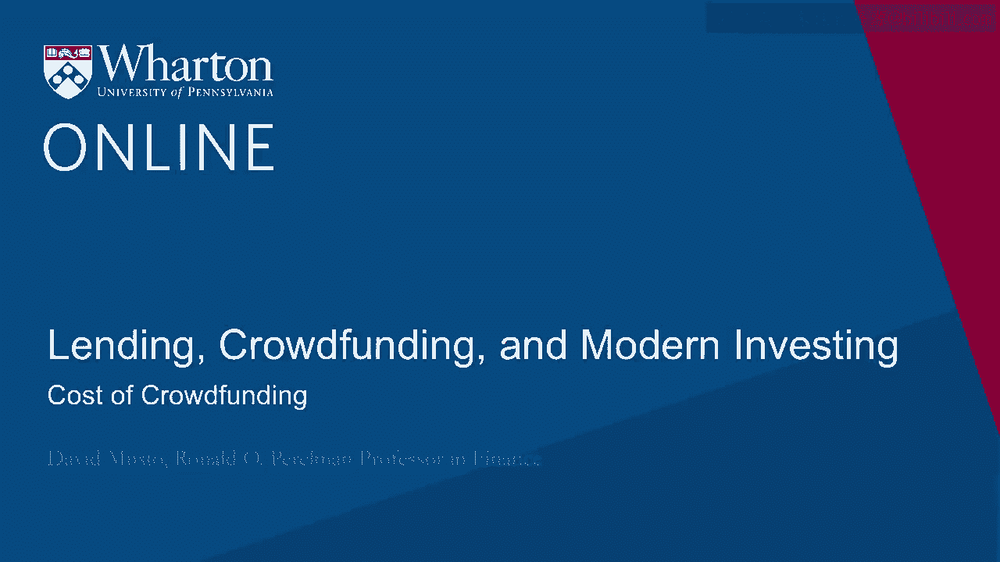
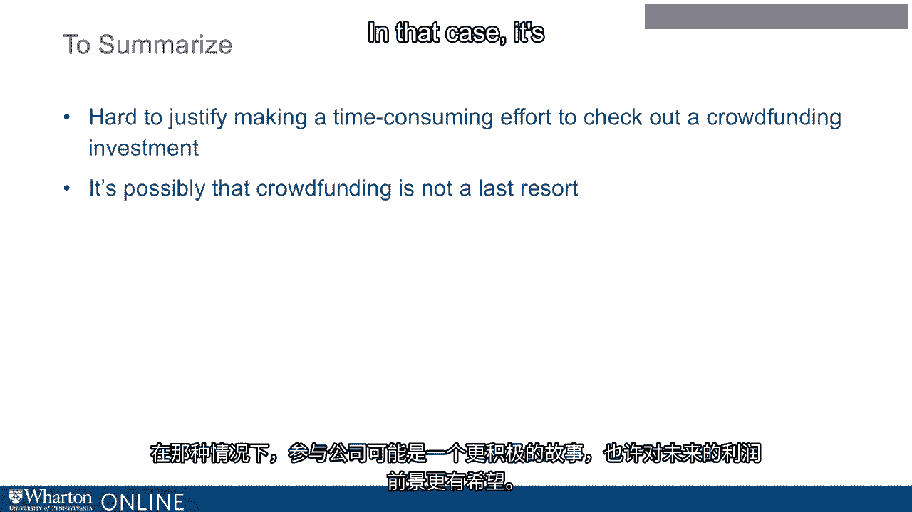
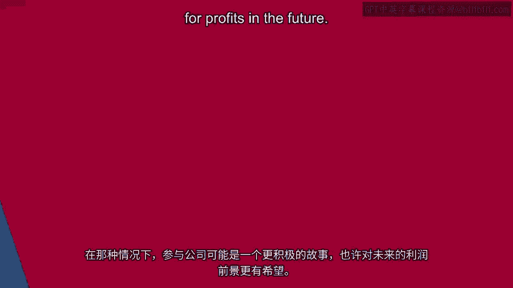

# 沃顿商学院《金融科技（加密货币／区块链／AI）｜wharton-fintech》（中英字幕） - P77：11_群众筹资的成本.zh_en - GPT中英字幕课程资源 - BV1yj411W7Dd

 Okay， so in this section， I want to think about what does it cost to go to this crowdfunding。

 market？ What does it cost from the entrepreneurs' point of view and particularly what does it。

 cost from the investors' point of view？ Okay， so first from the entrepreneurs' point of view。

 think about how much -- what am I， talking about when I think about going to this market and raising up to a million bucks。

 right？ So， any time you do an offering， even with the kind of reduced demands on this market relative。

 to the traditional IPO， you're still talking about some considerable professional time you're。

 going to have to pay for。 And while it's -- you can't really put an exact number on it。

 if you look around， people， generally think of this as being maybe about 100 hours of lawyer time and accountant time。

 So they're about to -- let's use the number 100， right？

 So think about just like one lawyer and one accountant putting in one longish week， there， you go。

 You've just made your way to 100 hours， right？ So it's not really at all a crazy amount of time to work on your offering。

 right？ So 100 hours， if they're charging you 500 bucks an hour total， and that's really probably。

 what you're thinking of， something like 500 bucks an hour， now you're talking about $50，000， right？

 You just spent $50，000 just on the professionals just to go out there and list your offering。

 and hopefully people will invest， okay？ So that's 50，000 bucks。 Now think about it。

 if you're raising a million bucks， which is all you can raise max， that， is 5%， right？ So 50。

000 bucks， 5% of a million。 So you're spending off the top 5% of the million bucks。

 so minimum professional costs of like， 5%， and then on top of that。

 on top of the money you're paying out to those professionals。

 you also pay the internet portal that you list on， right？ Those guys， how do they make money， right？

 You know， they're intermediating your offering， but then they're going to take a piece of it。

 And there was an SEC study that came out in early 2017 looking at all of the Title III。

 offerings from the first in May 2016 through the end of 2016， and they found a median fee， of 5%。

 All right？ And if you look at the We Funder portal， which is the most active， they document is。

 the most active of the Title III portals， they'll tell you that they charge a fee of up to， 7%。

 Okay。 So you've got at least 5% of professional costs that you're paying， and now you're paying。

 a median 5%， could be high or could be 7% to the portal also for the listing。 Of course。

 that's going to be proportional to how much you actually bring in。 But you're talking about。

 you know， absolute minimum， 10% kind of out the window in costs， to raise this money。 Okay。

 So just bear that in mind。 And that doesn't， of course。

 even add in the just the cost of the campaign itself， right？ You're going to make a video。

 There's going to be other advertising material you've got to put together。

 There's all the expensive your own time that you're dedicating to this offering as opposed。

 to actually working on your startup and time everyone else involved。 So it's expensive。

 This is a lot of this sort of just effort， hours， dollars that you are putting into this， offering。

 So that's expensive。 Okay。 But now let's look at it from the point of view of the investors。

 If you are thinking of investing in this space。 So let's just think。

 let's just work through a little simple example just once again， just。

 go back to the envelope sense of what it costs to investing crowdfunding。

 So let's say you make a hundred thousand。 Okay。 Make a hundred thousand bucks。

 So I just told you that if you make a hundred thousand bucks， you get to invest 10% of that。

 in crowd funding over a year。 So you've got 10，000 bucks to play with in investing in crowd funding。

 So let's say like most investors you think， well， you know， I'm not going to put it all， in one。

 I'm going to spread it around a little bit。 Okay。 So I'm going， I think I'm going to take my 10，000。

 I'm going to divide that five ways。 I expect I'm going to make $2。

000 investments over the course of the year。 So I'm just going to watch， you know， the web pages and。

 you know， see the offerings across， the screen。 And then once in a while。

 I'm going to see something that sounds， that sounds， you know， like a possibility。

 And then I'm going to check it out。 And if it checks out， then okay。

 then they're going to get one of my $2，000 investments。 Okay。 By the way。

 just looking at the We Funder page yesterday as I was， I was putting this together。

 And what did I see？ Well， I saw here， they list， they sort of put。

 they kind of headline the ones that are getting， a lot of traction。

 And so here's the first ones that I saw， just to give you a sense of what you're looking， at。

 So I saw Mr。 B&B。 That was the first one。 It's described themselves as the largest gay travel community in the world。

 Okay。 So that's that。 You can invest in this sort of travel service。 Right。

 There's one called Liquid Piston。 All right。 Where they say they're developing sort of a new internal combustion engine。

 All right。 And then there's one called Medford Brewing Company。 What do they do？ Well。

 they make beer。 Okay。 And they once them awards。 Right。 And then there's My Swim Pro。

 What's My Swim Pro？ Well， this is a this is an app that you have on your on your your Apple Watch that you have。

 on you while you swim。 And it gives you it gives you feedback。

 And and I guess optimizes your swimming。 So this is you see things like that。

 And one of those might say， okay， all right， I can see that。 And then you think， well， okay， sure。

 they get my 2000 bucks or not。 Okay。 So you're at that point。 You finally see one。 Yes。

 I I think I sent some potential here。 But like any other investor。

 I feel like I have to check it out。 Okay。 So let's think about checking it out if and and what that would cost you。

 Right。 Okay。 So you're going to check it out。 And so you're going to be spending some time。

 you know， looking at this， figuring out， you know。

 doing your diligence is this really a positive NPV way to spend your money as。

 we would say here in our finance classes at Wharton。 So so you can check it out。

 That's going to take you some time。 What's it going to cost you？ Well。

 to sort of ballpark what's going to cost you。 Let's think of it this way。

 So we assume that you made a hundred thousand bucks a year， a hundred thousand bucks a year。

 That's about 50 bucks an hour that you're making。 So let's think about billing you billing your own time at 50 bucks an hour since that's that's。

 what you make。 Okay。 And let's say， you know， you know。

 you've you've picked something that you have some comfort， with already。

 If you're thinking about that that brewery， then you know， you like beer and you know。

 maybe you've maybe you've made your own beer at some point， you've sourced beer ingredients， you've。

 you know， you maybe have some some experience at the restaurant world， whatever， you got。

 You have some base of knowledge you're building on。

 So let's say it's not going to take you that long to check it out。

 So how about how about one day is it'll take you one day， one work day instead of doing， any work。

 instead of going outside， whatever it is。 You know。

 you're just going to stay in spend one work day checking this out。 So one work day。

 so about eight hours， eight hours， 50 bucks an hour。 You're talking about 400 bucks， right？

 Eight times 50 about 400 bucks。 Okay。 So it's going to cost you 400 bucks。

 sort of maybe not cash out of your pocket because。

 you're just sort of you're talking about your own time here， but about 400 bucks opportunity。

 cost of checking this out。 So you spend 400 bucks and then there's some chance at the end of that that it will check。

 out and you will invest。 What's the chance that it will check out？ Well， of course。

 you don't really know for sure what's the chance this is going to check， out。 But let's just say。

 you know， just so we can keep going with our back of the envelope calculation。

 let's say you put up a 50% chance that at the end of the day that whatever you learn。

 during that day is going to tell you， yeah， go ahead， go ahead and do it。 It's worth it。 Okay。

 So if you think about it， if you're spending 400 bucks to check out an investment of 2000， bucks。

 then and there's only a half chance that you're actually going to make the investment。

 once you've done your homework， then if you think about it， the expected profit on this， investment。

 the expected return on that 2000 bucks over and above whatever else you could。

 have done with that 2000 bucks is going to have to be 800 bucks， right？ 800， right？

 Because you know， you're spending 400， it's only a half chance you're going to make the， investment。

 So if you're additional on making the investment， you'd have to expect， you know， X&T， that。

 that's going to be at least 800 bucks to offset the 400 that you are spending， you know， whether。

 you end up investing or not。 Okay。 So， so you think about it， I could take that 2000 bucks。

 just put it in the market。 Okay。 So I could have done that and that's basically no transactions cost at all。

 just put it in， the market。 So this is going to have to be 800 bucks sort of over and above what I would have made。

 that's putting in the market。 And of course， 800 bucks on 2000 is 40%， right？

 And we're not saying you need to make that 40% all in one year， but you need to think。

 of that 40% sort of above， you know， above market return as eventually happening over。

 the course of your investment。 Okay。 And I don't know。

 does that sound realistic that after a day of your scrutiny that the， conditional expect to return。

 you know， conditional on surviving a one day of scrutiny for you， is， is that high？

 Not only is it's positive， but it's that positive， right？ And bear in mind。

 if the chance that that the company survives your scrutiny is less， than a half， then it's going。

 then the conditional profit conditional on passing your scrutiny， is going to have to be even。

 even higher than that 800 bucks， right？ So， you know。

 as that probability goes down and down and down of the company actually， you know。

 surviving your screen， of course， eventually gets to the point where it， look。

 it's just not worth it to spend 400 bucks because it's doing the scrutiny because the。

 chance that the expected profit is so high as to justify that 400 bucks as the probability。

 goes down， down， down is going to start to， it's just going to start being ridiculous。 Like。

 that's just not going， that's just not realistic that that， that this， this spending。

 that 400 bucks is going to pay off。 Okay。 So， an alternative would be， well， don't， right？

 Don't make so costly in investment， in diligence to check out a $2，000 investment， right？ Don't。

 don't， you know， spend all that money。 Just rely instead on your， just your own sense， right？

 That you're， you're going to stick to something that you know a whole lot about， right？ So， okay。

 I'll invest in a， in a brewery， but you know， only if I really know a lot about， breweries。

 I really think that just sort of， you know， by reading the description and just， you know。

 doing a small amount of work， I can figure out if this is a positive investment， or not。 And。

 you know， don't invest in that new combustion engine unless you're， you know， an auto mechanic。

 or someone who really knows about internal combustion engines， don't even bother going。

 there unless you really know a lot so much that you can make this kind of investment。

 without making a big， expensive commitment of your own time。 Okay。 So， so you could do that。

 You could certainly invest that way if you want to， but I think it's worth asking yourself。

 you know， do you really think that the expected return on that is going to be positive， right？

 You really think that could be， but bear in mind that there's a couple headwinds to worry。

 about here， right？ So， number one， you know， when you invest in the public markets。

 if I want to invest in， you know， Tesla， I want to invest in Tesla， well。

 the price of Tesla in the public markets， is it's a market price。

 It is sort of an equilibrium where supply and demand meet。 People are trading Tesla all the time。

 people who are bearish on Tesla， people are bullish， on Tesla， people can short sell。

 people can buy it， all that， all those pressures up and， down sort of meet at this market price。 So。

 it's a sense in which it is， it is， it is， it is the product of all these market pressures。

 you know， it's given us this price。 Whereas， if I'm looking at this crowdfunding site， well。

 there's a price there， that's not， a， that's not a market price。 That's just what they're asking。

 right？ It's not the， it's not the equilibrium result of pressures from people who are positive or。

 negative。 It's just the number that they came up with， right？ So， I don't have that。

 that fallback that you have in the public markets that， you know。

 even if I don't know what I'm doing， right， if I don't， I'm by Tesla， I don't really know， about。

 you know， all those， all those product lines that， that， that， that Tesla produces。 I could。

 I could really not know anything about the， the， the business and yet I'm paying a， price that。

 because the market price is a sense in which I'm not， I'm not getting ripped， off， right？

 This is a price that， that in some sense the market has agreed is the right price for Tesla。 Okay。

 So， so that's not what's happening when I'm investing， you know， in， in this private market。

 I'm just paying the price that they quoted。 Is it， is it， does it make sense or not？ Well。

 I don't know， I just need to， I figure that out myself。 And then also bear in mind in crowdfunding。

 you have to keep asking yourself， you know， is crowdfunding like a last resort for these companies。

 right？ Or put another way， if I were them， is this the first place I would look for funding， right？

 Probably， probably it isn't the first place I would look， probably the first place would。

 be sort of family and friends， right？ And then if I can't raise money from family and friends。

 they're tapped out。 I just don't have， you know， wealthy family or friends。

 So that's not really an option。 Well， now I want to go， you know， I might go to a bank。

 I might see if there's， is there a venture capitalist？ I can get interested in this， right？

 So I would， I would go those routes， going to the crowdfunding site and all those expenses。

 that we talked about， about going to crowdfunding。 Well， you know， it's， it's， it， in many cases。

 it'd be kind of hard to believe that this， is， that would be the first place I'd go。

 So there's a sense in which this， what you see in the crowdfunding site， in many cases。

 is sort of picked over， right？ These are， this， some extent， the companies that were。

 that couldn't be funded some other， way。 That's the case then， you know， that's， that's， you know。

 potential concern point for you， as， as an investor。 So really， if you think that's。

 it's already been picked over like that， that could be， such a high concern that you'd say， well。

 look， I'm just not going to put my money in， this unless I can really believe a story in which this isn't the last resort。

 right？ So that's where you would be asking yourself， geez， you know， why might craft a lot of money。

 in the crowdfunding not be a last resort？ Well， one story that， that。

 that you'll hear and you might ask yourself， does this apply， in this case or not。

 is that I'm going to the crowdfunding market as， as a proof of， concept， right？

 I'm going to the crowdfunding market before going to the venture capitalist so I can show。

 them look at the potential demand that's going to be for my product， right？ I have， you know。

 it's with the gay travel club， right？ So I， I think I could make the case to the venture capitalist。

 but I bet I can get a better， deal if I can first go to the， go to， we funder。

 see what I get for investment there， and then， I can go to the venture capitalist and I can say see。

 And probably that travel club is going to do that because as you see， they were the top。

 listed one and what we funded they're probably doing quite well and that probably is an asset。

 for them。 And now， they then go to venture capitalist， right？ So there you can see， you know， it's。

 it's， this， they， there's， there's a very plausible。

 story in which this is not last resort financing or it can also be that sort of similar idea。

 I go to the crowd funder site in order to get shareholders who will then be customers， right？

 So very often people are shareholders and company will sort of tilt towards patronizing。

 that company。 I experienced kind of， there's an extreme version of this when I was a kid。

 I remember our， our stove stopped working and， and we were talking in a family， well。

 we should buy a GE stove to replace it because we own shares in GE。 We didn't own many。

 but we own some shares in GE。 And I remember thinking of the time， geez。

 I don't think a whole lot of this is going， to come back to us through our shares。

 but we did buy a GE stove， which then didn't really， work that well。 But that was。

 that was an example there， right？ Of just， you know， shareholders becoming customers。 Well。

 that's going to be， of course， much more meaningful in the context of crowd funding。

 You think about the brewery， right？ That， you know， I'm a customer。

 I buy shares in the brewery and now I go to a bar， they've， got that beer。 Yeah， I'm buying it。

 I'm going to buy it。 I'm going to buy it for my friends。 Hey， you know， try some of my beers。

 See what you think， right？ So there's another reason why I might go to crowd funding first before going to。

 going， to the venture capitalist。 They look， I've got these guys who were， you know， they bought in。

 They're going to be customers and evangelists for the product， right？

 So if you can convince yourself that's a story like that， that， that's a play here， then。

 that might give you some comfort that this isn't just sort of the picked over leavings， from the。

 you know， more professional part of the finance industry。

 This is in fact a prologue to going there and that could be a situation where we're investing。

 could make some positive sense。 Okay， so just to summarize here。

 I think the main thing you see is that it's hard to。

 it's hard to justify just sort of in a back envelope sense making much of an effort to。

 check out a crowd funding and faster， right？ The limits are just so low that you don't have to put。

 you know， too much of a value， on your time to get to the point where， geez， that's， you know。

 I just， I just cannot believe， that that cost could be justified in the actual prospects of the。

 of the company going forward。 Okay， but it could be。

 it could be another story at work where crowd funding is serving。

 a purpose that's then going to play a role later when the company approaches such investors。

 later in that case。

 That's the more， that's the more positive story for getting involved in the company and。

 maybe a better， better sort of prognosis for profits in the future。 [BLANK_AUDIO]。

