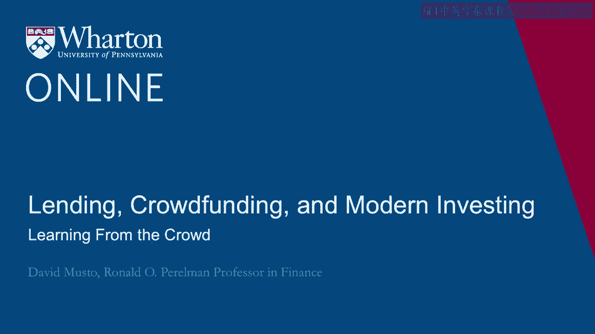
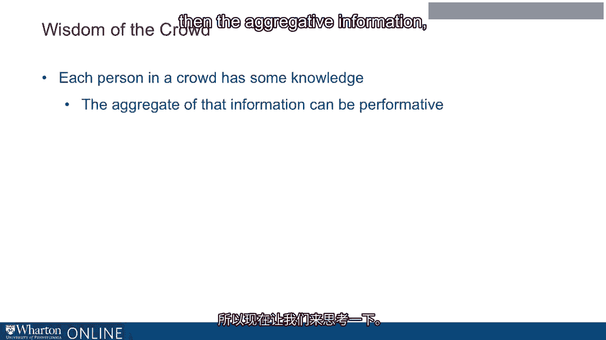
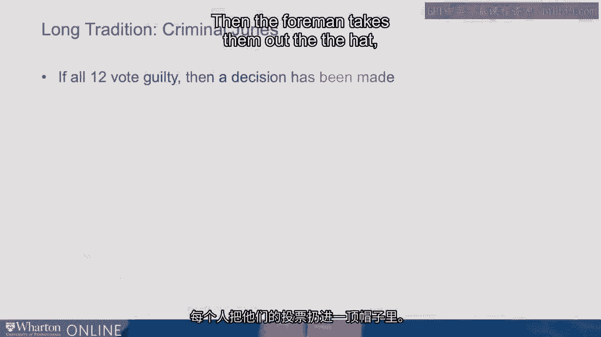
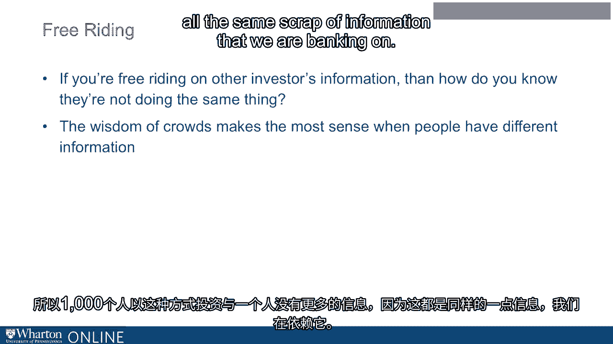

# 沃顿商学院《金融科技（加密货币／区块链／AI）｜wharton-fintech》（中英字幕） - P78：12_从群众中学习.zh_en - GPT中英字幕课程资源 - BV1yj411W7Dd

 Okay， so crowdfunding is not just raising money from the crowd。

 It's also in some sense potentially learning from the crowd。 If I'm investing in crowdfunding。

 I can potentially learn about the value of an investment from。

 the demand coming in from other investors。 We talked about how the price that I'm paying is not a market set price。

 It's just an issue worth set price。 They just put that price of $10 or a share or whatever it is。

 They put it out there。 You like it or not。 So how do I learn about whether $10 is a reasonable price？

 Well， okay， I'm going to have to find out some other way。

 And one of those ways is to observe the demand coming in from other people。

 So the issuers help you learn in a potentially beneficial way from the crowd by setting a， minimum。

 Okay， so you look at the offerings on a crowdfunding website。 You'll see they've got a maximum。

 but they've got a minimum too。 And the minimum helps you in the sense that you could say， "Okay。

 well， I'll put $2，000， in this company。"， They've set a minimum of $50，000。

 So if they don't get at least $50，000 in investment from everyone put together， the whole thing。

 is going to be called off。 I'll just get my $2，000 back。 So I know that when I say I'm investing $2。

000， I'm not actually investing $2，000 unless， there's that much other demand。

 And so that gives me potentially a little confidence。 There are little hopes that， "Well， okay。

 maybe I got it wrong。 Okay， maybe this isn't such a great idea。 Okay。

 How wrong could I be if there's this total of $50，000 coming in from other people？"。

 I've got sort of the crowd， at least some kind of crowd on my side if we cross that $50，000。

 threshold。 And if we don't， well， then I just get my money back。

 So the investment simply never happens。 So this is an example of at least banking on or hoping for the wisdom of the crowd。

 right？ Each person in a crowd knows something。 And if you could just put together all those different things that the people in the crowd。

 know， then if you aggregate all their information。

 then that aggregate of information could actually。

 be quite informative。 So let's think about this now。 This is not a new idea。 It's an old idea。

 right？ That there's the sort of wisdom of the crowds and sort of collectively， decisions in general。

 made by a crowd are better informed than the decisions made by any one person in the crowd。

 This is a question that economists have thought about a lot。

 And let me just give you a sense of how economists think about this。

 And I think the best context for me to think about this is actually outside of the financial。

 markets and in the judicial world。 So here's what I mean by this。

 Imagine you find yourself on a jury。 You got jury duty。

 And so you go down to the courthouse and then by the end of the day， you're on a jury for。

 a criminal trial。 So it's 12 people， 12 jurors for a criminal trial。

 And so you sit through the trial and you see all the evidence and all the testimony。

 And then finally， closing statements， jurors are charged。

 They go to the jury room and now finally they start discussing the case with each other。

 So they discuss the case with each other and then at the end of the discussion， then they， say， OK。

 well， how about we have a vote？ They have a vote。 And then think of the vote happening this way。

 that you're going to do it by a secret， ballot。 You can do the votes different ways。

 but let's say you're going to do it by a secret ballot。

 So everyone's going to write down on a piece of paper guilty or not guilty。

 Everyone tosses their vote into a hat。 And then the foreman takes them out of the hat， reads them。

 accounts them up。

 And then if all 12 of you have voted guilty， well， then that's it。 That's what it means。

 That's for a jury to convict。 All 12 of you have voted guilty。 That's what it takes。

 So let's say you're sitting there， you've discussed it， and you have a sort of a more。

 than a reasonable doubt， right？ More than a reasonable doubt about the defendant's guilt。

 So you think the reason that the threshold of is here， but you have more doubt than that。 OK？

 And so you think， well， OK， I have more doubt than just beyond a reasonable doubt。

 And so I guess that means I should vote not guilty。 OK。 And I would say， just personally。

 I think yes， that does mean you should vote not guilty。 OK？

 But let's think about how you might think through this problem， right？

 And this is sort of the way economists have thought about this and maybe worried a bit。

 about the sort of the collective wisdom of a group of jurors。 You might look at it this way that。

 look， OK， I could vote not guilty。 Maybe， you know， in some sense。

 that's the right vote because I have that much doubt。 But suppose I vote guilty。 OK。

 suppose I vote guilty。 Well， my vote of guilty does not actually convict the defendant unless all 11 other people。

 also vote guilty。 OK。 Now， if you tell me that-- I have some doubts about this case， right？

 But now if you tell me that all 11 other people think this defendant is guilty beyond。

 a reasonable doubt， and of course， I know that they know things that I don't know。

 They come from different walks of life。 They have different perspectives。

 And they maybe have their own ways of judging the credibility of witnesses and all that。

 So they know things that I don't know。 Of course， I know things they don't know。

 But there's 11 of them in one of me。 And so if all 11 of them think this person's guilty beyond a reasonable doubt。

 well， that's， kind of contains information for me。 That's going to lower my own doubt。

 And maybe it lowers my own doubt to the point where actually I don't have much doubt anymore。

 And now I should now give it that much doubt。 I think guilty is the right vote。

 So what I'm saying is when I'm thinking should I vote guilty or not guilty， I might be thinking。

 well， maybe I should vote guilty。 Like my doubts， maybe I should vote guilty。

 Because the only situation in which it actually matters that I voted guilty or that actually。

 convicts the person， well， that's the state of the world。 Well。

 all of them and other people think the person is guilty beyond a reasonable doubt。

 And if that many people think that， well， then I think that too。

 So that kind of thinking could cause me to sort of disregard my own doubts and then vote。

 guilty when really by rights， the right vote should be not guilty for me。

 So this is not a financial market here， but the point here is that the criminal justice。

 system depends on this idea that when you have these 12 jurors that there's sort of。

 a wisdom of crowds here that， well， we need all 12 people to think this is--。

 guilty beyond a reasonable doubt。 That's what it takes to convict a person。 But in that context。

 if all 11 other people are really sincerely voting， guilty only if， that's sincerely they think。

 then to the 12th person it could be totally rational。 I'm not saying this is ethical。

 but totally rational to just go ahead and vote guilty。

 So it's not at all clear that the criminal justice system is really aggregating information。

 quite the way we would think it is。 And I say， just put this out to your own kind of experienced introspection。

 I mean， you've seen criminal trials。 Do you think that the outcome of criminal trials is really such that all 12 people really。

 thought this was a guilty beyond a reasonable doubt or maybe there's some of this kind of。

 free-riding going on here。 Some people are just voting guilty thinking， well， you know。

 if everyone else thinks guilty， well， then I'm going to think guilty too。

 So I'll vote guilty even when I really ought to vote not guilty。 So OK。

 so that's of course different context， but it helps us think about this idea of banking。

 on the wisdom of crowds in this context。 So for sure。

 it's a comfort when I'm thinking about putting 2，000 bucks in that， well， I。

 only actually make the investment if enough other people have also picked this investment。

 But if I am just sort of free-riding here on other people's information， then how do。

 I know they're not doing the same thing？ How do I know that everyone。

 that there's really no one here who has too much of information。

 about this and everyone's just hoping someone else knows more than they do。

 And maybe we're all crowd-funding， wisdom of crowds makes the most sense when different。

 people know different things， you're bringing different bits of information to bear on whether。

 this is a good idea。 Well， maybe there are situations where that's really true。

 Maybe there's other situations where basically we're all， it's really， we all kind of know。

 the same thing， which isn't very much。 And so everyone doing the same thing doesn't really mean that much。

 They're not investing for different reasons。 We're all investing for the same sort of sketchy reason。

 And so there's no more information in a thousand people investing that way than one person。

 because it's all the same scrap of information that we are banking on。

 So just to summarize this point， you do have some of this wisdom of crowds going for you。

 in the crowd-funding context。 But I think you want to think about a little bit about whether it's realistic in a situation。

 you're looking at that the fact that other people are investing is telling you things。

 that you don't already know， or could it instead be a situation where everyone is hoping that。

 somebody knows something。 And they think there's a wisdom of crowds and crossing a threshold when in fact there。

 isn't。 [BLANK_AUDIO]。

