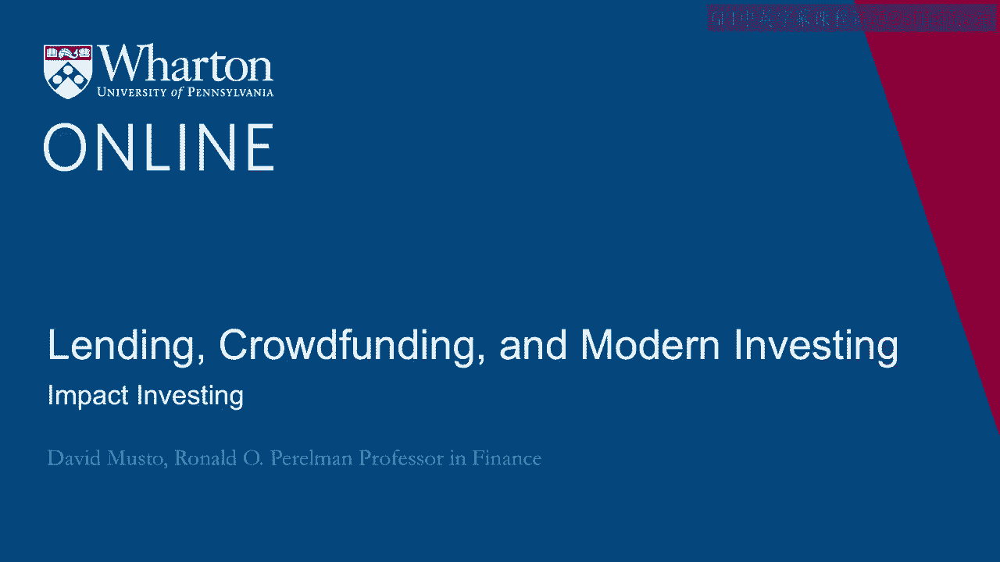
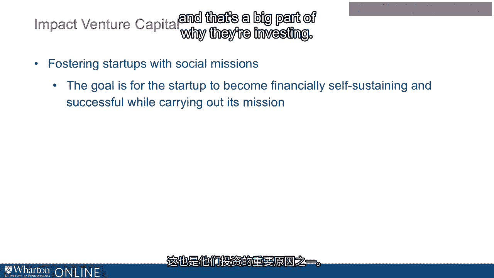
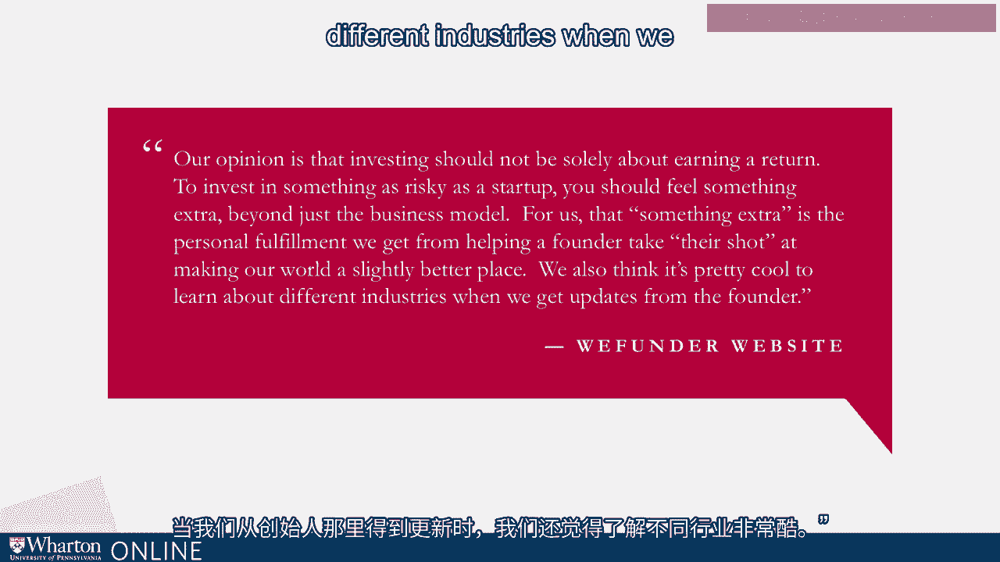
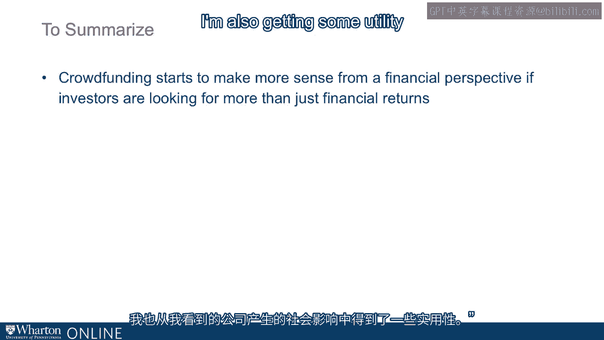

# 沃顿商学院《金融科技（加密货币／区块链／AI）｜wharton-fintech》（中英字幕） - P79：13_影响力投资.zh_en - GPT中英字幕课程资源 - BV1yj411W7Dd

 Okay， well， given what we have discussed about the prospects for a crowdfunding investment。

 to be a positive expected return investment and how there's challenges there， maybe not。

 prohibitive challenges， but there certainly are challenges， it's possible that a better。

 way to look at crowdfunding is that when people invest， it's not just about the expected return。

 it's not all about what's the expected profit here and am I making money here relative to。

 just putting it in the market。 If you think about it。

 it doesn't have to be just all about the money。 If I'm investing in a crowdfunding site。

 maybe I see someone's trying to do something， I think， okay， I like that you're trying to do that。

 I'm going to help you try to do that。 I'll give you some money， I'd love to get it back。

 I'd love to get a return， but really， I just like that you're trying to make a go with that and I'll throw something your way to see if。

 I can be helpful， okay， so I could be doing that and also my goals here could be in the social。

 impact of this startup。 So I see the startup and I like what I think your company can do for society。

 that it's going to throw off benefits for society from my point of view and I like the idea of。

 making that happen。 So I like the idea that this is a company that they've got a goal of making money。

 and making money will be good， but making money in some sense is a virtue of them becoming。

 profitable is that this means they can become a self-sustaining company that's throwing off this。

 impact， they get them to the point where their cash flows allow them to operate in perpetuity。

 and then they will generate this social benefit that I see as the big virtue， right。 So this has。

 become actually a big part of investing in this country and around the world， people call it impact。

 investing， impact investing。 That's a phrase that doesn't go back， the actual phrase impact。

 investing only goes back about a dozen years， the concept goes back maybe a little further than that。

 but the idea of impact investing is so I'm investing。

 I'm investing dollars and I want to get a return， but I also have some other goal in mind and I'm investing in companies that have explicitly stated。

 as their purpose that they are interested not only in the financial return， but also in this other。

 goal that they view as a social benefit。 So if I like what they are pushing as a social benefit。

 then I say， okay， I'm going to invest with you and not just be looking for dollars。

 but also be looking， for that social impact， right。 So if you look around the economy these days。

 you see this impact， investing playing out in the public capital markets where I might invest in a company because I like。

 what they do or I might invest a company because I don't like what they do， but I'm going to use my。

 votes， right， I get votes with the shares and I'm going to use my votes， I'm going to use my other。

 influence as an investor to push the company in the direction that I think is the more socially。

 beneficial direction for them to go。 So you get that in the public capital markets。

 but you also get that， in the startup market too。 So you have these days。

 you have venture capital funds that are all about， impact， everything they do。

 they're looking for companies that yes have profit potential。

 they definitely want the company to become self-sustaining。

 but they also have this social benefit goal， in mind and that is a big part of why they're investing。

 So it could be a company that's。

 where the product itself is the impact， right。 So they're producing a new kind of stove to use。

 in developing worlds that don't pollute so much or maybe they're producing a regular。

 just commodity product like coffee beans， but the way they source the coffee， the way they pay。

 for the people picking the coffee beans is sort of trying to ensure that they get a decent wage。

 So it could be the product， it could be the process， but whatever it is。

 they've got a social impact that， they are angling for and that's part of why you're investing。

 So it just， not only could that be part of what's going on in the crowdfunding world。

 in fact if you look at， the websites of the crowdfunding portals。

 you'll see that they really specifically， sort of articulate this kind of goal as something that they see as a virtue of crowdfunding。

 So， here's a quote， I'm just going to read you a quote， I got this off the We Funder website。

 this is on the website as of just yesterday， it says that says， "Our opinion is that investing。

 should not be solely about earning a return to invest in something as risky as a startup you。

 should feel something extra beyond just the business model。

 For us that something extra is the personal， fulfillment we get from helping a founder take their shot at making a world a slightly better place。

 We also think it's pretty cool to learn about different industries when we get updates from。

 the founder， right？ So they're adding they're not just the sort of impact investing idea and giving。

 someone their shot， but also once you invest in the company， you can sort of just have a window。

 onto being an entrepreneur， right？ You might want to be an entrepreneur yourself， okay？ That's。

 you know， maybe you want to quit the day job and do that， but before you do that， why not sort of。

 follow some companies from the ground up， hopefully， hopefully they go up from the ground and they。

 you will get the updates， you will hear from the， hear from the founder and see what happens and。

 maybe that would guide you on your own， on your own journey。 By the way， so just a couple thoughts。

 about if you want to be an impact investor， there are a couple guides that you can use to。

 help you direct your money to such companies if that is your goal。 There's two sorts of。

 designations a company can have that you could look for that I would look for as impact investor。

 One is， the one question to ask is， is this company a B Corp？ What's a B Corp？ A B Corp。

 is a corporation that has been designated a B Corp by a private outfit called B Lab。

 and B Lab is all about impact investing and a company applies to B Lab to be a B Corp。

 and then B Lab studies all the practices， how they pay their workers， what's their， do they pollute。

 what's their corporate governance structure， all the different things you might be thinking about。

 If you score high enough on their scorecard， then you're a B Corp and there's thousands of B Corp。

 now。 If you look on the crowd funding websites， you'll see plenty of companies will proudly say。

 we are a B Corp。 That's one thing to look for， and not just that they've been vetted by B Lab。

 but they're also， B Lab follows up， they follow up。 You tell them how to， judge。

 how to measure your impact against a benchmark and they do that and they will drop you if you。

 don't， if you don't come through。 So besides B Corp， you also have benefit corps。 A benefit。

 Corp is， that's actually a legal designation。 You register as a benefit Corp with the state when。

 you incorporate， and what it means to register as a benefit Corp is that you articulate what exactly。

 your impact goal is。 And most states will also make you not just articulate what it is， but also。

 spell out how your progress against that goal can be measured。 They will also make you designate。

 a director on your board to be in charge of that impact goal， and you're also going to be liable to。

 your investors。 Investors could even sue you over not pursuing your impact goal。 So they've made a。

 real legal commitment to pursuing their impact goal。 And that's， as opposed to B Corp， that has。

 been got a stamp of approval from a private outfit。

 A benefit Corp has actually legally exposed themselves。

 to damages if they don't follow through on their impact goal。 So those are two things to look for。

 B Corp and then also benefit Corp。 So just to summarize， this piece， so crowdfunding。

 it can be hard to justify sometimes crowdfunding investment on just a purely financial basis that。

 I'm putting $2，000 in。 But my expected return is enough。 More than $2，000 to justify the expense。

 of making the investment。 Yeah， maybe。 But that can be a hard story to tell。

 Maybe it's better to look， at it as I'm getting some enjoyment here out of helping someone start a company that I think is a。

 neat idea。 I'm also getting some utility out of the social impact that I see the company have。

 We also see WeFunder tosses in this third idea that I'm learning about being an entrepreneur。

 by following this investment once I'm involved。 And when you put those things together， maybe that。

 helps us explain why some people put money into crowdfunding when just from a pure financial。

 point of view， it could be a hard thing to pencil out。 [ Silence ]。

