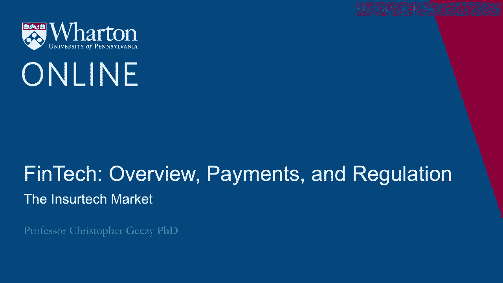
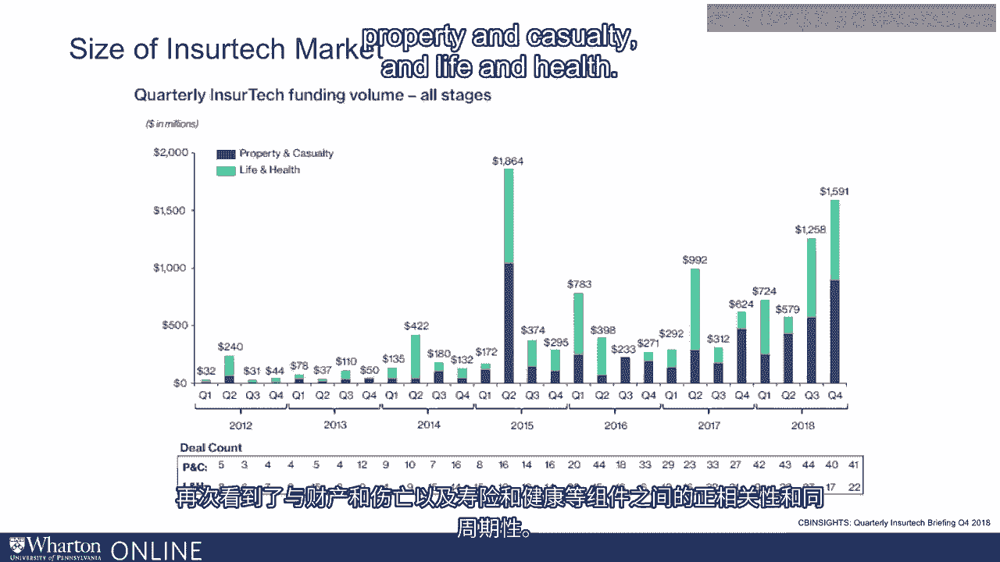

# 沃顿商学院《金融科技（加密货币／区块链／AI）｜wharton-fintech》（中英字幕） - P7：6_保险科技市场.zh_en - GPT中英字幕课程资源 - BV1yj411W7Dd

 Now， any treatment of FinTech would be remiss if we didn't include areas besides Robos， although。

 of course， those are often the kinds of FinTech players that people pay attention to。

 One example is the growing InsureTech market， a market where both for property casualty。

 life and health and other insurances， including financial product insurances， like variable。

 annuities， we're seeing increased deal flow coming in。 For example。

 the CB Insights Quarterly InsureTech briefing from the last quarter of 2018 shows。

 dramatic increases recently in both silos， namely life and health and property and casualty。

 having grown from just five years ago。 In other words， we see about $1。

6 billion having been funded in InsureTech in the fourth， quarter of 2018。 A recent peak。

 the most recent before that was just under $2 billion in the second quarter， of 2015。 Once again。

 we see pro-cyclicality and we see correlation across components like property。

 and casualty and life and health。

 Thanks。 [BLANK_AUDIO]。

