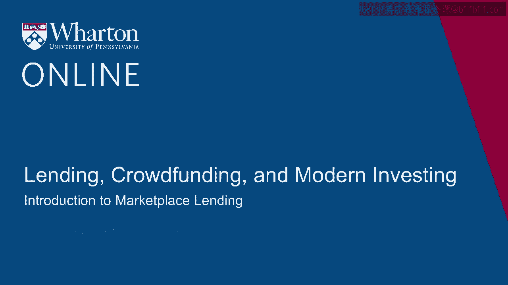
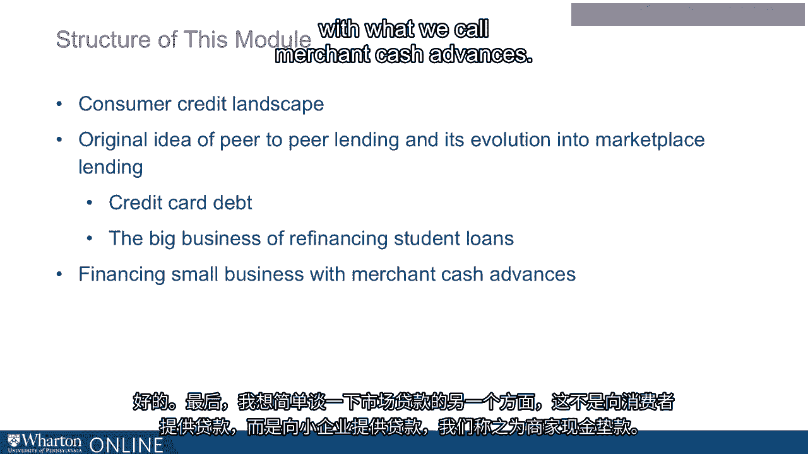

# 沃顿商学院《金融科技（加密货币／区块链／AI）｜wharton-fintech》（中英字幕） - P80：14_市场贷款介绍.zh_en - GPT中英字幕课程资源 - BV1yj411W7Dd

 Hi， well， the next few sessions cover what we used to call peer-to-peer lending。

 That name， peer-to-peer lending， is kind of falling out of use。

 What you'll hear more and more in its place is marketplace lending。

 That name change reflects the industry's pivot since its early days。 I want to say early days。

 I'm only talking about 2006， but back then， when people talked， about peer-to-peer lending。

 it was all about using the Internet to take out the middleman。 To take out the middleman。

 The idea was that you have some people who， for reasons coming up in their lives， need。

 to borrow some money right now。 Others find themselves a little extra cash。

 Wouldn't it be nice if the people with a little extra cash would loan to the people， who need it？

 The goal of this peer-to-peer platform was just to allow those people to find each other。

 find the terms on which they could transact with each other， and then process it going， forward。

 move the money one direction， and then when people can pay it back， then move， the money back。

 That was sort of the idea。 They used the Internet to match up people who were just naturally at this moment in their。

 lives， lenders or naturally borrowers。 That was the original idea。 What's happened over the years。

 and we'll talk about this， is that the platform has gone。

 from that sort of passive role or just let people find each other to a very active role。

 of essentially making the real decision， making the real credit granting decision。

 You have a potential borrower shows up with financial information。 Now。

 it's really the Internet platform itself that makes all the decision about whether that。

 person gets money， how much， and on what terms。 The providers of funds really is not the retail public anymore。

 Now it's big institutional investors。 People look at that。

 They don't really think of it as peer-to-peer lending。 It's not really what's going on。

 so they've come to call it marketplace lending。 That's really the term that you'll see in the press。

 First， I want to just cover the landscape of consumer credit。

 All the different kinds of consumer credit that are big parts of the economy。

 What are the kind of pain points you could call them in these different types of consumer。

 credit and how those open up opportunities for the FinTech lenders for marketplace lending。

 So it's covered the landscape and then we'll talk about peer-to-peer lending。

 The original idea of it， how it worked， what came up， and then how it evolved to what we， see now。

 There's going to be two flavors of it that we're going to talk about。

 One is really aimed at helping people get out of their credit card debt， to help them。

 shift out of credit card debt into new debt that is going to be a little less onerous。

 The other major piece of it is going to be student loans。 A student loan。

 we'll see some numbers in a moment here。 Student loans have grown to be the big financial issue of our days and you'll see how FinTech。

 has entered the consumer， the student loan market with products that help people refinance。

 their way out of their student loans and once again does something maybe with a slightly。

 lower interest rate。 Though there's going to be a caveat there that we're going to want to focus on。

 And finally， I want to say just a few words about another aspect of marketplace lending。

 which isn't lending to consumers， it's lending to small business with what we call merchant。

 cash advances。 [BLANK_AUDIO]。

