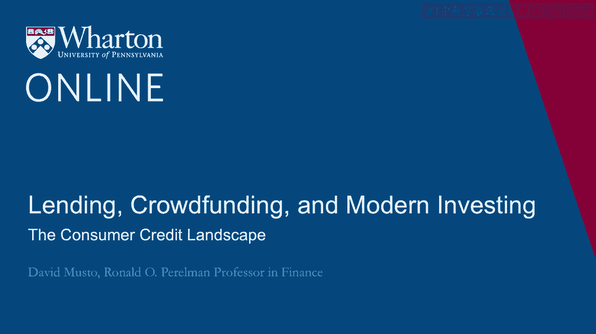
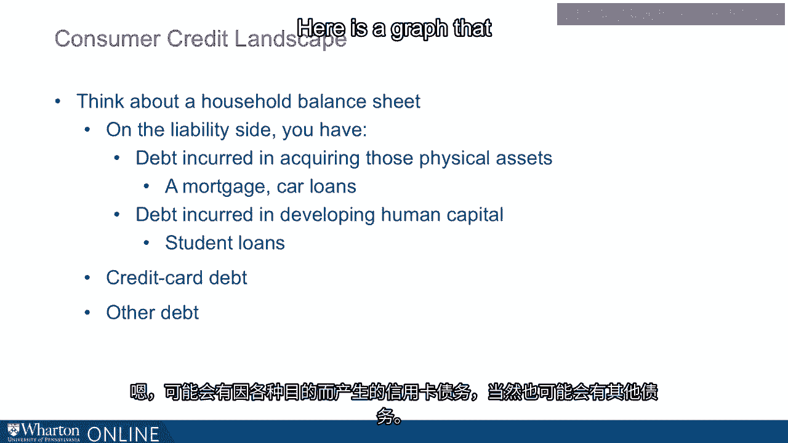
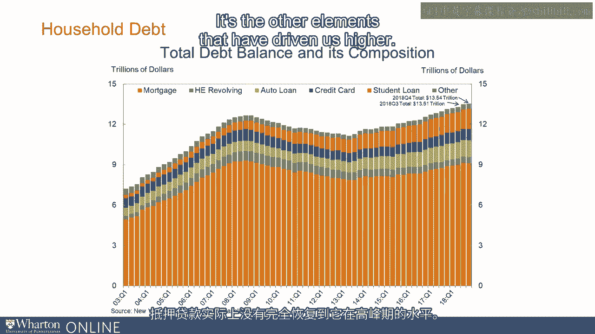
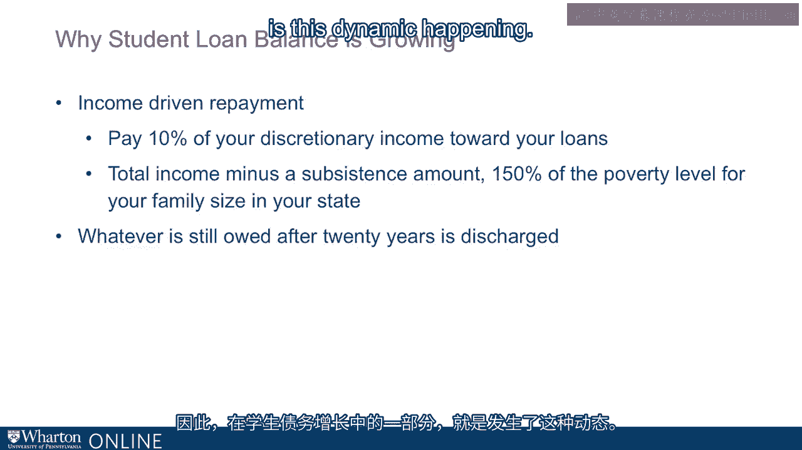
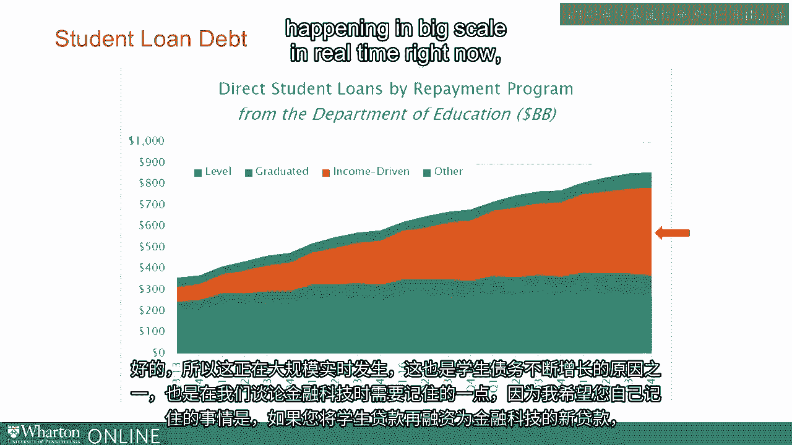
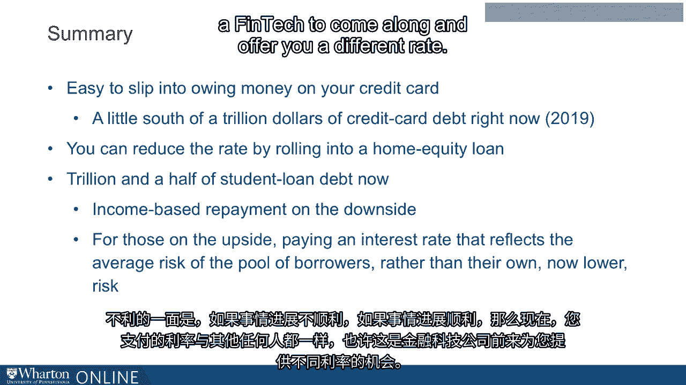
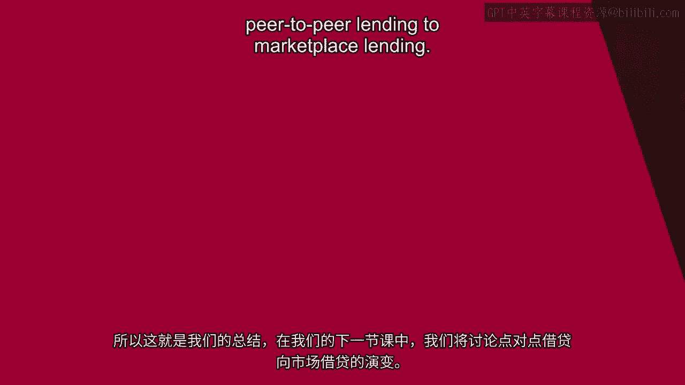

# 沃顿商学院《金融科技（加密货币／区块链／AI）｜wharton-fintech》（中英字幕） - P81：15_消费者信贷格局.zh_en - GPT中英字幕课程资源 - BV1yj411W7Dd

 Okay， so let's talk about the consumer credit landscape， just to sort of get us started。

 So first， just think about a household balance sheet。 Okay， household balance sheet。

 liabilities and assets。 If you look at the assets of typical household， what are you going to see？

 Well， you've got the physical assets。 You've got usually you've got a house。

 and you probably have a car， maybe a couple cars。 Well now if you're lucky。

 you've got a boat and you've got a vacation home， lots of things， you might see。 But typically。

 what do you think about a house and one or two cars？ Okay， you've got those physical assets。

 And then you've got some financial assets， your retirement savings， you've got your 401k。

 or other sorts of retirement savings， maybe you've got some other investments you've got， going。

 You'll see those assets as well。 And then of course。

 you've got another asset of the household is going to be the human capital。 All right。

 the skills and experience that members of the household have acquired， which are。

 going to be valuable for them going forward， you know， giving them the possibility to， you， know。

 add value and make money in years to come。 Right， so those are the assets you're going to see。

 What about the liabilities？ Well， okay， now you're going to see in the liability side。

 you're going to see the debt， that was incurred in acquiring those assets， right？

 So you have a house， well you have the mortgage that helped you buy the house and you have， cars。

 Well， very often you have car loans that helped you buy the cars。 And then for that human capital。

 well， there are the student loans， all right？ That's， you know。

 you have student loans that you took out to pay the tuition so that you， could go to school。

 get the degree， get the training and now have that human capital， right？ So you have that too。

 And what else are you going to see？ Well， there can be credit card debt that you occurred， you know。

 for whatever purpose。 And of course， there could be some other debt too。

 There is a graph that I got off the website of the Federal Reserve Bank of New York。 Okay。

 now this is actually a great website for you guys to look at in your spare time。

 They've got consumer credit sort of slice and dice every way， sort of quantities and interest。

 rates and delinquency， all the different sort of statistics， warning signs and so on。

 You might be interested in。 I just picked off here their summary chart showing just total household debt evolving。

 over time。 All right， so you look at this graph here， we're seeing household debt in the US total。

 household debt evolving from the beginning of 2003 all the way to the end of 2018。

 So every bar here is a quarter and then so the total height of the bar is all household。

 debt and then the different colors are the different types of household debt。

 You see the orange is the biggest， that's your mortgage debt and then you've also got。

 home equity lines。 You've got car loans， you've got credit card debt。

 you've got your student debt and then， then finally one sort of catch all for the other。

 which is where by the way all the FinTech， lending is going to show up or a lot of it。

 So you look at this graph， you see， well one thing， of course you see the big picture there。

 you can see which looks very gentle here， it wasn't gentle when it happened， it was。

 the financial crisis， right？ You can see the ramp up a consumer debt through like '09 or so and then it comes off。

 Why is it coming off？ Well of course you can see mortgages go up and come down。

 A lot of that would be of course foreclosures and other problems like that and you see， so。

 you see consumer debt come up， go down and then it is recovering and it's now actually。

 higher than it was at the peak of the crisis。 But if you look closely you see that the mortgage debt。

 it's the biggest part of it but it's， not because of mortgage debt that we are now in a situation of more debt than we had。

 at the peak of the crisis。 The mortgage debt has not actually recovered all the way to where it was at its peak。

 It's the other elements that are driving that have driven us higher。

 And here's a graph， let me just walk you through what's on this。

 On this graph all I've done is I've taken all the non-mortgage parts of consumer credit。

 and graphed them separately here。 So this is just each line here。

 it's just taken that same graph before and now I'm graphing， the everything but the mortgage debt。

 So you see this one line showing us the home equity loans and then the car loans， credit， cards。

 student loans and everything else。 And let me just pull out what I think are the key trends to notice in this graph。

 So one thing you'll notice here is that credit card debt came off a bit after the peak and。

 it's come back。 Right about now at where it was at the maximum is when people were taken down their cards。

 to deal with the crisis in like '09 or so。 So it came off and then it's come up。 Okay。

 not a whole lot of movement there。 Home equity lines have fallen off a lot。

 They're almost down to like half of what they were borrowing under home equity lines。

 And then you'll see what's really taken off here is student loans and car loans。 Now student loans。

 look at that student loan line， that purple line there。

 Just notice how much it's gone up and almost in a straight line。

 In 2003 you're looking at about a quarter trillion dollars total of student loans。 Okay。

 And of 2018， one and a half trillion dollars of student loans。

 Or the sixfold increase over those years。 That's an enormous increase。 That's really the， as I say。

 the major consumer credit story of our time。 So student loans have gone up a lot and you can see also the other。

 look at the red line， there。 Car loans。 Car loans have really taken off too。

 Car loans are about half a trillion more than they were when they bottomed out about six。

 years before。 Okay。 And also notice the other， does this catch all sort of other term that actually has been。

 trending up over the past five or six years as the home equity lines have gone down。

 And so now there's about $410 billion of this other which is something we want to keep our。

 eye on here。 So okay。 So every sort of consumer credit is ripe for disruption by FinTech。 Mortgages。

 You know， mortgages now the largest mortgage lender in the country is Quicken。 Right？ Quicken。

 You know， that grew out of helping you with your taxes。 Right？ Well。

 Quicken is now the largest mortgage lender。 And there's other FinTechs that focus on car loans as you see car loans have taken off。

 But we're going to focus here because we're thinking about marketplace lending， period。

 of period lending。 This is really about the unsecured， uncolateralized part of the market。

 So not borrowing to buy a house， borrowing to buy a car。

 It's loans that are not secured by anything in particular。

 And the main elements of consumer credit that that's going to mean is the credit card debt。

 and the student loans。 Okay？ And of course， this other category is going to come up。 Okay。

 So credit cards。 Okay。 Think about credit cards。 Think about credit cards。 Where do they come from？

 Credit cards entered our economy like 50， 60 years ago。 Originally， all about convenience。

 That's maybe why you got a card in the first place。 Just convenience。

 You run up charges during the month。 Pay at the end of the month。

 But even if you got it for convenience at some point， you know， hit a rough patch。

 And it's just not a good time to pay that whole balance if you don't have to。 And of course。

 you don't have to。 You could just pay some of the balance。 And now you're borrowing。

 Now you're borrowing on your card。 And you're paying the rate that maybe didn't even think much about when you took out the。

 card。 What rate would they charge you if you started running a balance？ But now you're paying it。

 Right？ And that could be a big number。 You could be talking about 15。

 16 up to 20 percent that you're paying now for that loan。

 that you've taken out by not paying your full balance。 Okay？

 So you're paying a big interest rate on this loan。 It's not a collateralized loan。

 The credit card company has no claim on any particular collateral there。

 And that's of course that's part of why they're charging you a big rate。

 So now you're now you've hit a rough patch。 You're borrowing on your card。 You're paying a big rate。

 What can you do about it？ How can you lower your interest rate？

 Well of course to some extent you can move your balance to another card or another company。

 wants your balance and so they'll give you a lower rate that can happen。 And of course that happens。

 People do that。 If that's not so feasible， another thing people have often done is take out a home equity。

 line。 There's home equity lines we just saw on that graph。 So home equity line。

 Now you are taking out a new loan which is basically a second mortgage on your house。

 coming in second after your first mortgage。 And you can get a nice interest rate that way。

 Why you're getting a nice interest rate？ You're getting a nice interest rate because you've pledged your house。

 You've pledged your house。 You've given a claim on your house to this new lender。

 That's why they're willing to give you a low rate。

 But on of course the other side of that coin is now you have increased the risk of foreclosure。

 losing your house and foreclosure if things go bad。

 And when things did go bad in the crisis that's of course exactly what happened。

 So he locks people call home equity line a credit。

 He locks are a way to refinance at your credit card debt at a lower rate but with that risk。

 So bear that in mind we'll get back to that and let's just think about student loan debt。

 for a second here。 So student loan debt has gone way up。

 To some extent this is you can see there's a perspective on which that's good news。

 People are borrowing to build their human capital。

 The human capital is going to be valuable to them， help them make money down the road。 But even so。

 even though there's a sense in which it's good news obviously that gigantic。

 ramp up in debt does flag that something's not going to plan。

 People are borrowing money that they have trouble then paying off and this is going to。

 cause trouble down the road。 Now why is the student loan balance growing so much？

 Well there's a subtle point here。 You might think well student loan balance goes up because people keep borrowing and of。

 course that's part of it。 But an actual in some sense bigger part of why it just keeps going up and up and up is。

 that when students， when graduates hit a rough patch with their student loan they can these。

 days take advantage of what's called income driven repayment。 Income driven repayment。

 I'm just going to sketch this if you want to learn more about it。

 Go to the Department of Education website they'll walk you through the whole thing。

 Let me just sketch what income driven repayment is。

 What it is is that if you're having trouble paying your student loan you can have your。

 monthly payment reduced to a number which is basically 10% of your disposable income。

 Where they take your total income and they subtract out a subsistence amount of income。

 which is essentially 150% of the poverty level。 They remove that from your income。

 Look at what's left and they say okay 10% of that will now be your payment。

 So you can have it reduced to 10% of this discretionary income。

 But okay so your payment is reduced but in fact there's no real forgiveness here at this， point。

 If the payment you're making is not covering the interest that you owe then the interest。

 you didn't pay is going to be added to what you still owe。

 So in fact your balance could be going up。 It could be going up while you are on income driven repayment。

 It could keep going up and ultimately what happens with that。

 Well what happens is that if you stick with it to 20 years， right， out to 20 years then。

 at 20 years whatever you still owe is going to be discharged。

 Be discharged at that point so you don't owe it anymore。

 So you balance and grow over time and eventually there's a discharge。

 So part of what we're seeing in this growth in student debt is this dynamic happening。

 Let me just show you one more graph from the Department of Education website。

 This is showing you over just a 5。5 year period。 Over a 5。

5 year period it's showing you with the different colors the different repayment。

 programs that graduates are in。 And the green that you see in this graph is the total number of dollars in just regular。

 fixed payment repayment program。 The purple is people making what's called graduated payments where they are scheduled。

 to go up over time。 And the orange， the orange is this income driven repayment。

 This is showing you the total number of dollars in income driven repayment。 And notice just over 5。

5 years how much that's gone up。 Just 5。5 years it's gone up by a few hundred billion dollars。

 So this is happening at big scale in real time right now and it's part of why a student。

 debt keeps going up。 It's also something to bear in mind when we get to talking about the FinTech because the。

 thing I want you to bear in mind for yourself is that if you refinance out of your student。

 loan into a new loan from a FinTech you cannot do income driven repayment anymore。

 It's only for the people who still have their original federal student loan。 Okay。

 So bear that in mind and just bear another thing in mind which is that when you take out。

 a student loan in the first place you and everyone else who took out a student loan at。

 the same time are paying the same rate。 Okay。 So think about this past this school year that's just wrapping up here at the University of。

 Pennsylvania or wrapping up the 2018-19 school year。

 Well if you took out a student loan for the 2018-19 school year then your interest rate。

 was well I can tell you that if you were an undergrad your interest rate was 5。05% and。

 if you were a graduate student it was 6。6%。 I know that。

 How do I know that because everybody got the same rate and that rate is calculated off。

 of treasury rates。 They follow a formula。 They say okay when the treasury sold 10 year securities in May what was the yield at which。

 they sold those 10 year treasuries。 In May 2018 that yield was 3%。 Okay。 So okay 3%。

 We sold 10 year treasuries at 3%。 Okay so what we're going to do is for the undergrad loans we're going to add 2。

05%， to that number so now that's 5。05。 And for the grad students they're going to add 3。6%。

 That's how they get to 6。6。 So they calculated off the treasury rates everybody gets the same rate。

 There's no risk based price。 They're not going to look at you and say well I'm a little more worried about you than the。

 other person so I'm going to charge you more。 No。 Everyone pays the same rate。

 So once you're coming out of grad school everyone borrowed at the same rate but now they're clearly。

 not the same risk。 Some people got juicy jobs with great salaries。

 Some people are still having trouble and lenders can look at that and say okay that's。

 as interesting。 We got everyone's paying the same rate but some of these are clearly better credits than。

 others。 And that is going to be the opportunity that the FinTechs are going to be feasting on here。

 So okay so just to summarize so far what have we said？

 You ever said that number one it's easy to slip into owing money on your credit card。

 And right now if you look back at that graph it's a little just under about trillion dollars。

 of credit card debt and those people are very often looking for ways to refinance out of， it。

 And you could do the home equity line but as we talked about that can be worrisome to go， that path。

 And now there's also a trillion and a half of student loan debt now。

 If you have a federal student loan you have access to these income driven repayment on。

 the downside if things don't work out so well。 If things do work out well well now you're paying the same interest rate as someone as。

 anyone else and maybe that's an opportunity for a FinTech to come along and offer you。

 a different rate。

 So that's our summary and in our next session we'll talk about the evolution of peer-to-peer。

 lending to marketplace lending。 [BLANK_AUDIO]。

