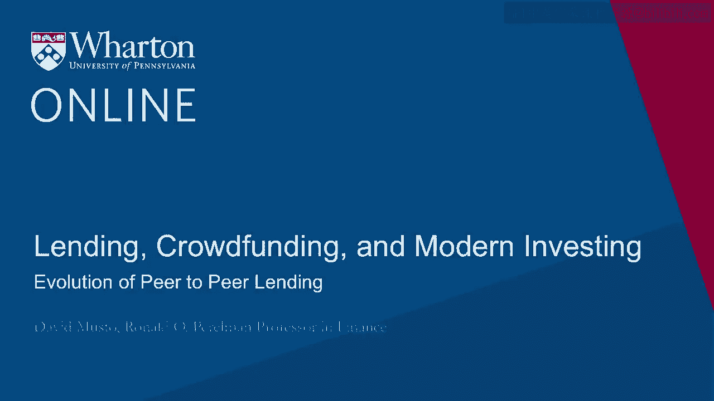
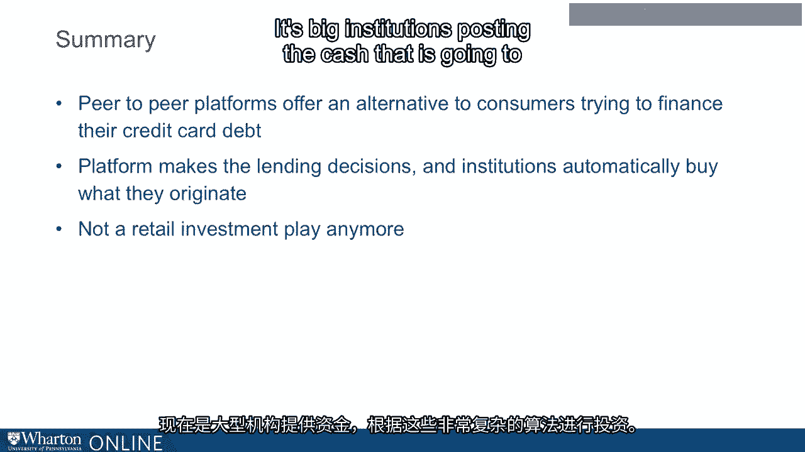

# 沃顿商学院《金融科技（加密货币／区块链／AI）｜wharton-fintech》（中英字幕） - P82：16_点对点贷款的演变.zh_en - GPT中英字幕课程资源 - BV1yj411W7Dd

 All right， so what I want to do now is talk about the evolution of peer-to-peer lending。

 from its early days back in 2006 to what we see now and how it's really -- it's a business。

 plan that's really pivoted from one thing to another， which is why， as I mentioned， the。

 name is changing。 Okay， so the original idea was peer-to-peer lending， right？

 You have some people who have money that they want to just put to work for a bit and some。

 people who are in a situation where they need to borrow， let them find each other， let them。

 discover the terms on which each side is happy on the transaction and the platform， the Internet。

 platform is just going to help them make this happen， right？

 And the big platforms in those days are the same as today。 The lenders to look for here。

 if you want to browse the Internet， it would be lending， club and prosper marketplace。 I mean。

 there are plenty of others。 I don't mean to -- you know， say they're somehow better than the others。

 but they've been there， since the beginning and they have pivoted along with the rest of this industry towards。

 marketplace lending。 Okay， so you were there to facilitate the discovery of the borrowers and lenders with。

 the sort of idea was they're all retail， they're just all just people， consumers living their。

 lives who either have money to put to work or they need some money right now。 Okay。

 so how would this work？ Well， you have borrowers。 The borrowers。

 if you wanted to borrow in this marketplace， you'd have to provide some， financial information。

 some standardized financial information that they would need from you。

 So you would provide that for people to look at。 You could post a picture and some people did of yourself。

 maybe you and your family， and， you would say， "Well， here's how much I want to borrow。"。

 And here is the most I'm willing to pay。 And the term of the loan would be pretty much fixed。

 It would just be， well， maybe on a three-year loan or five-year loan， so that would be pretty。

 much standardized。 And why would you go to this market？ Well。

 then and now the main reason people go to borrow in this market is their credit， card debt。

 All right， they've run up a balance on their card。

 They're paying that big rate that you'd see in the fine print on your credit card statement。

 They're paying that big rate and they want to refinance into something more manageable。 Okay。

 so that's about 80% of the borrower。 There's some other reasons， but that's the big one。

 And they could get the home equity line。 They could go that route。 Maybe some of them already have。

 And of course， maybe the others are thinking， "Well， I don't want to risk my house like that。

 I don't want to ramp up the risk of foreclosure， especially after we've seen that with our。

 own eyes so much 10 years ago。"， So okay， so they're trying to meet up each other and find the rate at which they're willing。

 to transact。 And let me just sketch just for a moment here how economists would look at this problem。

 of trying to find the rate at which we could transact。

 There's a fundamental problem that lending institutions everywhere encounter every day。

 And to an economist， the term of art for this problem is what they call credit rationing。

 That credit rationing。 Let me just give you just without any numbers or figures just how to think about this problem。

 The problem of credit rationing and how it can be sort of a barrier to finalizing transaction。

 on this sort of marketplace。 Here's the basic idea。 Let's say we're thinking。

 "Maybe you're going to loan to me。"， Maybe you're going to loan to me。

 But the problem that you're going to encounter is that we both know that I know things about。

 my risk that you don't know。 I know things about my job， my health， my plans。

 all sorts of other things， my investments， whatever it is。

 I know things about my risk that would be difficult or maybe even impossible。

 for you to figure out for yourself。 So the issue is that if I -- let's say I put a high probability on the outcome where I。

 go bust， all right， that I just -- I can't pay you back。

 I privately know that that's a high probability。 You know it's possible， right？

 But I happen to know that that actually -- I put a high probability on that。

 Now let's say you offer me -- offered a loan to me at a high interest rate。

 Well if I look at that loan at a high interest rate， I might look at that and say， "Well。

 you know what？ It's -- I'm paper it's a high interest rate， but in fact， you know。

 if I put a high probability， on not repaying the loan。

 then it doesn't really seem like such a high interest rate。

 to me because I put a big probability on paying you back zero， right， or something small， right？

 A high interest rate to me to someone who privately knows his risk is high might not seem so big。

 might not seem so onerous to me because I see that big chance of not paying you back。

 Whereas someone who -- who views -- who privately knows that he's low risk， then puts a very。

 high chance on repaying the loan。 And so if it's a high interest rate loan。

 that person looks at it as very expensive。 I expect to repay this loan and， you know。

 paying you back whatever， you know， 15， 20%， whatever it is you said to me that that's expensive。

 right？ So the issue is that if you loan -- if you offered to loan to me at a low interest rate。

 then I would accept that whether I'm low risk or high risk， okay， but the higher the interest。

 rate that you offer， the more likely it is that the guy who privately knows he's low risk。

 is going to drop out and say， "Oh， forget it。"， But the guy who privately knows that he's high risk is still going to accept it。

 So as you increase the interest rate that you offer， the average risk of the person who。

 would accept that offer is going up， okay？ And so whereas you might think that， you know。

 if we're trying to find a rate to transact， there's got to be some -- there's got to be some rate that -- that -- which we can agree。

 the problem is that you might only be willing to go so far with the interest rate that。

 you'll offer because you know that if you go above that rate， then the effect of going。

 above that rate on the expected risk of the person who would accept that rate is just too， high。

 And so you're willing to go so far but not above that in the rate that you'll offer me。

 And that's why people talk about credit rationing because normally in any market you think， well。

 you know， if there's excess demand to buy something at some price， then the price。

 is going to go up to make supply equal demand。 But in the lending market。

 if there's excess demand to lend at this rate， that doesn't mean， that the price is going to change。

 There's only so much -- people are only going to raise the rate so much。

 They're not going to go higher than that because of this negative effect of the rate that you。

 offer on the kind of -- the risk of the kind of person who would accept it。

 So you get that kind of problem playing out in this market and it makes it hard to transact。

 efficiently。 But people tried， right？ So that's how this market started。 So in the original days。

 right， if I wanted to borrow， I'd say I want to borrow this much， at a rate no higher than this。

 And then the lenders would say， well， I'm willing to loan， you know， whatever。

 Each one might sell a hundred bucks， two hundred bucks， whatever。 And at a rate no lower than this。

 And so you have a bunch of people making bids to lend and then you have this -- you have。

 the borrower saying how much he wants to borrow。 And if everyone who wants to loan adds up to the amount that the person wants to borrow。

 then that's it。 You've got a transaction and they set the interest rate at the market clearing rate and they say。

 that's it。 Okay， you guys have a loan。 So the lenders supply the cash。

 the borrower gets the cash and then the idea is the borrower， then ultimately pays back the loan。

 And this is all -- this is all intermediated by the platform。 Okay。 So that started and it's this。

 you know， there was some of this in a small scale。 Of course。

 it didn't help very much that this started in 2006 and then very soon， well。

 we were in the recession， which naturally didn't help the repayment capability of the people。

 who had borrowed。 So what happened over the next few years is that the lending platform got kind of more。

 and more involved in the decision。 So they would start -- the lending platform would make its own credit risk evaluation and。

 then set a floor on the interest rate for this particular borrower。 And then after that。

 then the lending platform would start just sort of， you know， just not， just putting a floor on it。

 but just say， okay， this guy， we've looked at the credit， we've。

 looked at the financials for this person， the interest rate is going to be 10 percent or。

 12 percent or 8 percent， whatever it is。 They would set the rate and then as an investor。

 you're not really bidding anymore。 You're just saying， okay， okay。

 I'll take some of that or I won't， right？ I'll buy a hundred bucks of that loan or I won't。

 And so -- and then over the years， the platform has gotten more and more and more involved。

 in setting the terms of the transaction and the role of the investors， the lenders has。

 gotten more and more kind of passive， just， okay， yeah， it can't me in on that or no， leave me out。

 So that has evolved and evolved and evolved over time whereas -- so when you get to today， by now。

 about 95 percent of all lending on this platform is by not retail investors。

 but just institutional investors who just post a bunch of capital and they say， okay， you know。

 prosper or lending club。 Here's， you know， let's say， you know， 10 million bucks。

 We want this 10 million bucks to just go to borrowers who show up on your platform and。

 we'll just automatically -- we'll just automatically buy， you know， whatever loans you approve。

 within this -- within this or that risk category。 And the platforms themselves have greatly ramped up their ability to do this risk evaluation。

 with kind of this big data machine learning approach， right？ So they've got all this data now。

 These days， if you want to borrow on lending club， you supply all sorts of financial information。

 They can browse all around your bank account and all sorts of other things and they've。

 got these algorithms they've developed for， you know， looking around your bank account。

 and your other financials and coming up with the risk score。

 And this has gotten -- they've gotten very good at this。 And one thing they've noticed is that the。

 you know， back in the early days， you might， think， well。

 we don't need the lending platform to give us a risk score。

 We already have what's called the FICO score， right？ Everyone has a FICO score。

 The FICO score is a score developed by the Fair Isaac Company and the FICO scores are， everywhere。

 You've probably seen your FICO score， probably used your FICO score when you bought a house。

 or a car。 So we have FICO scores。 Why don't they just use the FICO score？ Well。

 they can do much better than the FICO score。 Over the years。

 the correlation between the score that the lending platforms come up with。

 and the FICO scores has gone down， down， down， down， down。

 And the lender's credit scores actually now do a lot better in this context of predicting。

 the outcome of these loans。 And if you talk to these lenders in this peer-to-peer or marketplace lending space。

 when， and you， ask them， you know， well， what kind of。

 what's the sort of social benefit of what you guys， are doing？ Well。

 they don't have various things they'll bring up。 But one thing that comes up a lot is what they refer to as the invisible prime borrower。

 the invisible prime borrower。 What they mean by that， and let me show you some graphs here。

 And I'll walk you through them。 What they mean by invisible prime is that if you look at all the people who are currently。

 rated subprime due to their FICO's， right？ And there's different cutoffs。

 But one popular cutoff when you think about， you know， is your FICO score too low， it would， be 680。

 If your FICO score is below 680， many people would say， well， you're a subprime。

 You're a subprime borrower。 You know， that FICO score， which is calculated from your credit report。

 is below 680 your， subprime。 And what the people at Lending Club and Prosper and so on will say as well。

 okay， we can look， at that population of people below 680 and we can find good credits。

 We can find people who really are prime， even though their credit score says otherwise。

 and we're willing to loan to them at rates that reflect our belief that they really are， prime。

 So here's a couple graphs here。 I got off of a paper written by some economists at the Federal Reserve Bank of Philadelphia。

 They got the data from Lending Club。 And if you look at these graphs here。

 let's look at the one on the left。 This is showing you looking， what they're saying here is， look。

 looking just at those， people with FICO is below 680。

 And we look at that group of people and we put them into risk categories based on our。

 algorithm from A risk， which are the best risks to the G risk， which are the worst risks。

 Look at the A risks of， and this is， remember， this is only from those people who have subprime。

 FICO's。 Those people， we do find these A risks in that population and their chance of default is。

 over the course of the， over two years is just 5%， right？ 5%。 Well。

 that's a very low chance of default。 That's a prime borrower。 And we found that borrower in that。

 in what everyone else would call subprime。 Of course。

 we find some very high risks in that category too。 Looking at the G risks。

 they have a chance of default over 35%。 That's very high， right？ So， yes。

 there are high risks there。 But look， we can find the low risks。

 And look at the graph on the right-hand side。 Here。

 what they're doing is they are within each of their risk categories， or A through， G。

 that's lending club's risk categories， within each of them。

 They're showing you the performance of those accounts that they put in those A through。

 G buckets broken down into， broken out by what was their FICO score。 So if you look at。

 on the very left， the bars above A， this is showing you that when they， call you an A risk。

 that you have a low probability default whether your FICO was below 680， which， is the blue bars。

 or above 750， which is the purple bars。 Yes， the people with worse FICO's are in fact doing a little worse X post。

 but still， all， of them are doing well as far as the risk of the mortgage。 So basically。

 they're showing you that as you sort people by our credit risks， we are。

 capturing the lion's share of the actual variation in how risky people really are。

 And the FICO score on top of that isn't telling you very much。 So they've developed an algorithm。

 Of course， they're looking at things your FICO score can't look at， right？

 Your FICO score is calculated off your credit report。

 They are calculating this off of all sorts of stuff that the FICO score cannot be calculated。

 off of。 Your bank account statement isn't on your credit report， all sorts of things that they can。

 see are not on your credit report。 So that's this big data coming through for them。

 allowing them to make credit decisions， which are far more informed。

 So that's the credit decision and the source of the funds。 As I say。

 institutional investors just post cash and that cash is what's used to fund the， loans。

 You also have loans that are securitized， which means that you have a big bundle of lending。

 club or prosper loans which are all put into， which are all pooled together。

 And then they issue securities backed by that pool of loans。 Just of course。

 we had all sorts of securitization going into the financial crisis。

 And they can't always necessarily work out that well。

 But that can be a great source of funds in a way that institutional investors can buy。

 these prosper loan backed bonds and invest in those。

 Now one thing people often say about this market and it's true is that this current business。

 model hasn't been tested by a big downturn。 So we'll see。

 We'll see what happens when the economy turns south to the performance of these loans。

 It's going to be a test。 And maybe they pass that test。 Maybe they don't。 That's yet to be seen。

 So to summarize we have so far these peer-to-peer platforms， they're offering an alternative to。

 consumers， an alternative way to refinance out of your credit card debt。

 You already had HELOCs that can give you a nice rate but there's a risk to that。

 You can go to this other platform instead。 Maybe you can borrow at a better rate。

 The platforms have very accurate credit scoring algorithms that can find that invisible prime。

 borrower and bring to that person the kind of rate that they've in some sense earned with。

 their management or finances that the platform can see with all the browsing around they do。

 And this really isn't a retail investment play anymore。 That's really not the way this works。

 It's not peers loaning the peers anymore。 It's big institutions posting the cash that is going to be invested based on these very。

 sophisticated algorithms。 So that's the peer-to-peer lending and the next thing we're talking about in the next。

 module is going to be the student loans。 [BLANK_AUDIO]。

